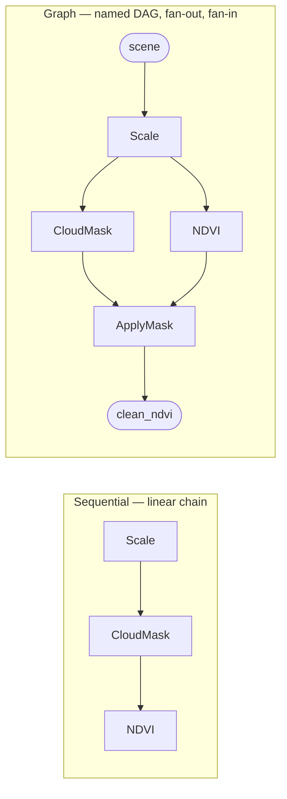

# geotoolz

[](https://github.com/jejjohnson/geotoolz/actions/workflows/ci.yml)
[](https://github.com/jejjohnson/geotoolz/actions/workflows/lint.yml)
[](https://github.com/jejjohnson/geotoolz/actions/workflows/typecheck.yml)
[](https://github.com/jejjohnson/geotoolz/actions/workflows/pages.yml)
[](https://opensource.org/licenses/MIT)

> **Compose remote-sensing pipelines like you compose functions.**
> Sentinel-2 to NDVI in three small operators, the same code shape as your unit tests.



## Monorepo layout

This repository is a [uv workspace](https://docs.astral.sh/uv/concepts/workspaces/)
shipping three packages (same structure as
[pipekit](https://github.com/jejjohnson/pipekit)):

| Package | Import | What it is |
|---------|--------|------------|
| [`geotoolz`](packages/geotoolz) | `geotoolz` | The RS operator families documented on this page |
| [`geotoolz-patcher`](packages/geotoolz-patcher) | `geopatcher` | Four-axis Patcher framework: split fields into patches, run operators, stitch back |
| [`geotoolz-catalog`](packages/geotoolz-catalog) | `geocatalog` | Queryable spatiotemporal index over geospatial files (GeoSlice → loaders) |

Import names are unchanged from the pre-monorepo repos — only the
distribution names carry the `geotoolz-` prefix. Install what you need:
`pip install geotoolz` / `geotoolz-patcher` / `geotoolz-catalog`
(pre-PyPI: `uv sync --all-packages` in a clone, or git+ URLs with
`subdirectory=packages/<name>`).

## What is it

`geotoolz` is a small algebra of **Operators** for remote-sensing rasters.
Each operator is a typed function from one carrier (a `GeoTensor`) to
another; pipelines are just `Sequential` chains or `Graph` DAGs of those
operators. The composition core lives in [`pipekit`](https://github.com/jejjohnson/pipekit);
`geotoolz` adds the RS-specific operator families (radiometry, indices,
cloud masking, compositing, …) on top.

The 30-second pitch:

- **One protocol.** Every step — a band-math index, a cloud mask, a write
  to COG — is an `Operator` with `_apply` + `get_config`.
- **Two composition shapes.** `Sequential` for linear chains, `Graph` for
  branches and fan-in. Both are themselves `Operator`s, so they nest.
- **Carrier-agnostic.** The algebra runs on `GeoTensor` in production
  and on scalars or ndarrays in tests. Same code, smaller fixtures.
- **Round-trips to YAML.** `get_config()` lets pipelines serialise for
  Hydra-zen, audit, and reproducibility.

> **Status:** pre-alpha (`0.0.x`). The composition core (`Operator`,
> `Sequential`, `Graph`, `Branch`, `Switch`, plus the v0.1 idiom library)
> is stable enough to build on. The domain-operator surface (radiometry,
> indices, cloud, compositing, …) is landing module-by-module — names and
> defaults will move before `0.1`. Pin a commit if you depend on it.

## A working snippet

```python
import geotoolz as gz
from geotoolz import Operator, Sequential


class Scale(Operator):
    """Multiply DN by a scale factor — toy radiometric correction."""

    def __init__(self, *, scale: float = 1e-4) -> None:
        self.scale = scale

    def _apply(self, gt):
        return gt.array_as_geotensor(gt.values * self.scale)

    def get_config(self):
        return {"scale": self.scale}


class NDVI(Operator):
    """(NIR - Red) / (NIR + Red + eps)."""

    def __init__(self, *, nir_idx: int = 3, red_idx: int = 2, eps: float = 1e-10) -> None:
        self.nir_idx, self.red_idx, self.eps = nir_idx, red_idx, eps

    def _apply(self, gt):
        a = gt.values
        nir, red = a[self.nir_idx], a[self.red_idx]
        return gt.array_as_geotensor((nir - red) / (nir + red + self.eps))

    def get_config(self):
        return {"nir_idx": self.nir_idx, "red_idx": self.red_idx, "eps": self.eps}


pipeline = Sequential([Scale(scale=1e-4), NDVI(nir_idx=7, red_idx=3)])
ndvi = pipeline(sentinel2_geotensor)  # GeoTensor in, GeoTensor out
```

The same shape with the `|` pipe operator: `Scale(scale=1e-4) | NDVI(nir_idx=7, red_idx=3)`.

## Install

Not yet on PyPI. `geotoolz` depends on [`pipekit`](https://github.com/jejjohnson/pipekit)
(also pre-PyPI), so use `uv` — it reads the git source declared in
`pyproject.toml`:

```bash
git clone https://github.com/jejjohnson/geotoolz.git
cd geotoolz
make install        # uv sync --all-groups + pre-commit hooks
```

One-shot from GitHub:

```bash
uv pip install "git+https://github.com/jejjohnson/geotoolz@main"
```

Optional extras: `[hydra]` (YAML round-trip via hydra-zen), `[patch]`
(pulls in [`geopatcher`](https://github.com/jejjohnson/geopatcher) for
sliding-window inference).

## Dev

```bash
make install     # uv sync --all-groups + pre-commit hooks
make test        # uv run pytest -v
make lint        # uv run --group lint ruff check .
make format      # ruff format + ruff check --fix
make typecheck   # uv run --group typecheck ty check src/geotoolz
make docs-serve  # local MkDocs server
```

Pre-commit checklist (mirrors CI):

```bash
uv run pytest -v
uv run --group lint ruff check .
uv run --group lint ruff format --check .
uv run --group typecheck ty check src/geotoolz
```

## Next steps

- **Docs site:** [concepts](docs/concepts.md), [quickstart](docs/quickstart.md),
  [recipes](docs/recipes/).
- **End-to-end Lake Tahoe notebook (cross-repo):**
  [`geocatalog/docs/notebooks/end_to_end_lake_tahoe.ipynb`](https://github.com/jejjohnson/geocatalog/blob/main/docs/notebooks/end_to_end_lake_tahoe.ipynb)
  — the canonical multi-repo flow (catalog → patch → operate).
- **Operator-composition slice for this repo:**
  [`docs/notebooks/operators_lake_tahoe.ipynb`](docs/notebooks/operators_lake_tahoe.ipynb).

## License

MIT — see [LICENSE](LICENSE).
