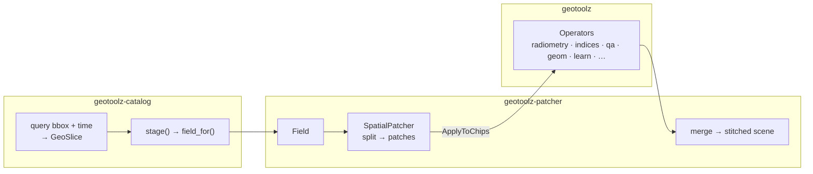

# geotoolz — the geostack

[](https://github.com/jejjohnson/geotoolz/actions/workflows/ci.yml)
[](https://github.com/jejjohnson/geotoolz/actions/workflows/lint.yml)
[](https://github.com/jejjohnson/geotoolz/actions/workflows/typecheck.yml)
[](https://github.com/jejjohnson/geotoolz/actions/workflows/pages.yml)
[](https://opensource.org/licenses/MIT)

> **Find the data, cut it to size, compute on it — one composable stack.**
> A [uv workspace](https://docs.astral.sh/uv/concepts/workspaces/) of three
> packages that interlock end-to-end, with the Operator / Sequential / Graph
> composition core supplied by [pipekit](https://github.com/jejjohnson/pipekit).



## The packages

| Package (dist) | Import | One-liner | Docs |
|---|---|---|---|
| [`geotoolz`](packages/geotoolz) | `geotoolz` | Carrier-preserving `pipekit.Operator` families for remote-sensing rasters — Sentinel-2 to NDVI in three small operators | [Operators →](https://jejjohnson.github.io/geotoolz/) |
| [`geotoolz-patcher`](packages/geotoolz-patcher) | `geopatcher` | Four-axis Patcher (Geometry × Sampler × Window × Aggregation): split a field into patches, run an operator per patch, stitch back | [Patcher →](https://jejjohnson.github.io/geotoolz/patcher/) |
| [`geotoolz-catalog`](packages/geotoolz-catalog) | `geocatalog` | Queryable spatiotemporal index over geospatial files: STAC/CMR discovery → GeoParquet catalog → `GeoSlice` → loaders | [Catalog →](https://jejjohnson.github.io/geotoolz/catalog/) |

Import names are unchanged from the pre-monorepo repos — only the
distribution names carry the `geotoolz-` prefix.

## How they interlock

The stack is glued by small, deliberate seams (see
[The geostack](https://jejjohnson.github.io/geotoolz/geostack/) for the
full tour):

- **`GeoSlice`** — the frozen `(bounds, interval, resolution, crs)` request
  that catalogs produce and loaders consume, with opt-in exact grid
  alignment for co-registration.
- **`staging.field_for`** — staged catalog rows become `geopatcher`
  `Field`s, so a query drops straight into `SpatialPatcher.split`.
- **`patch_ops`** — `GridSampler → ApplyToChips → Stitch` puts the patcher
  inside an operator `Sequential` for tile-predict-stitch inference; the
  label-aware samplers emit the same `Patch` carrier for training draws.
- **Coregistration operators** — `geotoolz.geom.coregister` ops are the
  intended coreg callables for `geopatcher.MatchedField`, aligning
  multi-source patches found by the catalog's matchup engine.
- **One obstore pool** — all three packages soft-import a shared pooled
  HTTP/2 client for cloud reads.

```python
import geocatalog as gc, geopatcher as gp, geotoolz as gz
from geotoolz.patch_ops import ApplyToChips, GridSampler, Stitch

cat    = gc.from_stac_search("https://planetarycomputer.microsoft.com/api/stac/v1",
                             collections=["sentinel-2-l2a"], bbox=aoi, datetime="2024-06")
field  = gc.staging.field_for(gc.staging.stage(cat, dest="./cache"))[0]

patcher = gp.SpatialPatcher(geometry=gp.SpatialRectangular(size=(256, 256)),
                            sampler=gp.SpatialRegularStride(step=(192, 192)),
                            window=gp.SpatialHann(), aggregation=gp.SpatialOverlapAdd())
ndvi    = gz.Sequential([gz.DNToReflectance(scale=1e-4), gz.NDVI(nir_idx=3, red_idx=2)])

scene = gz.Sequential([GridSampler(patcher), ApplyToChips(ndvi),
                       Stitch(gp.SpatialOverlapAdd(), domain=field.domain)])(field)
```

The end-to-end Lake Tahoe tutorial runs this flow for real:
[catalog notebook](https://jejjohnson.github.io/geotoolz/catalog/notebooks/end_to_end_lake_tahoe/) ·
[patcher notebook](https://jejjohnson.github.io/geotoolz/patcher/notebooks/patcher_lake_tahoe/) ·
[operators notebook](https://jejjohnson.github.io/geotoolz/notebooks/operators_lake_tahoe/).

## Install

```bash
pip install geotoolz                      # operators only
pip install 'geotoolz[patch]'             # + patcher (geopatcher)
pip install geotoolz-catalog              # catalog only
pip install 'geotoolz-catalog[patch]'     # catalog + patcher bridge
```

Pre-PyPI, install from a clone or via git URLs with
`subdirectory=packages/<name>`:

```bash
git clone https://github.com/jejjohnson/geotoolz && cd geotoolz
uv sync --all-packages --all-groups --all-extras
```

## Development

```bash
make install              # uv sync (all packages, groups, extras) + hooks
make test                 # fast tier across all three packages
make lint                 # ruff check .  (entire repo)
make format               # ruff format + ruff check --fix
make typecheck            # ty per package
make docs-serve           # the unified docs site, locally
```

Each package keeps its own tests, pytest markers, and coverage gates —
run from the package directory (`cd packages/geotoolz-patcher && uv run
pytest`). Releases are cut per package by release-please
(`geotoolz-vX.Y.Z`, `geotoolz-patcher-vX.Y.Z`, `geotoolz-catalog-vX.Y.Z`).

## License

MIT — see [LICENSE](LICENSE).
