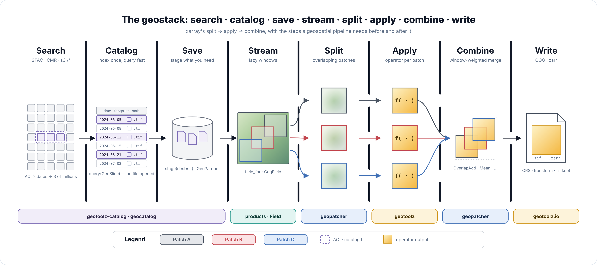
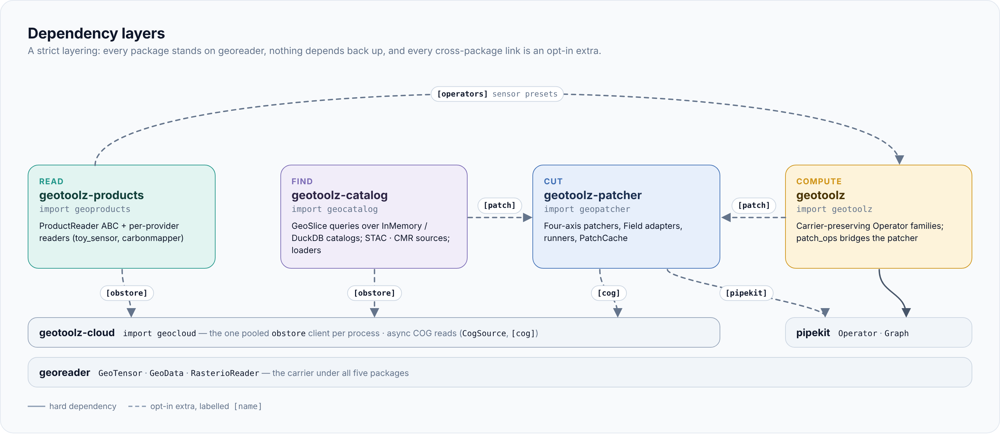

# geotoolz — the geostack

[](https://github.com/jejjohnson/geotoolz/actions/workflows/ci.yml)
[](https://github.com/jejjohnson/geotoolz/actions/workflows/lint.yml)
[](https://github.com/jejjohnson/geotoolz/actions/workflows/typecheck.yml)
[](https://github.com/jejjohnson/geotoolz/actions/workflows/pages.yml)
[](https://opensource.org/licenses/MIT)

> **Find the data, read it, cut it to size, compute on it — one composable stack.**
> A [uv workspace](https://docs.astral.sh/uv/concepts/workspaces/) of four
> packages that interlock end-to-end, with the Operator / Sequential / Graph
> composition core supplied by [pipekit](https://github.com/jejjohnson/pipekit).

<p align="center"></p>

## Where it comes from

If you have used xarray, you know **split → apply → combine**: group the
data, run a function on each group, glue the results back together. A
geospatial pipeline is the same idea with more steps on either side.
Before you can split a scene you have to **search** an archive for it,
**catalog** what you found so the next question is a query rather than a
crawl, **save** (stage) only the files that matter, and **stream** them as
lazy windows because the scene does not fit in memory. After you combine,
you **write** a georeferenced result. Every step belongs to one package
(the band under the figure), and neighbouring steps hand one another
typed objects rather than file paths.

## 30-second pitch

Earth-observation work is the same four moves every time: **find** the
scenes that cover your area and dates, **read** each mission's product
format, **cut** a scene too big for memory into patches, and **compute**
on every patch before stitching the result back. Most codebases rebuild
that loop per project, so each step is hard-wired to the next.

The geostack gives each move its own package and one small seam between
neighbours. A `GeoSlice` (bounds × time × resolution × CRS) is the request
every catalog answers. A georeader `GeoTensor` is the array every reader
returns and every operator takes — it keeps its CRS, transform and band
names through the whole pipeline. A `Patch` is what the patcher hands an
operator. Because operators are plain `pipekit` objects, the patcher
itself becomes an operator: *tile → predict → stitch* is one more
`Sequential`, typed and YAML-serialisable like the rest.

<p align="center"></p>

## The packages

| Package (dist) | Import | One-liner | Docs |
|---|---|---|---|
| [`geotoolz`](packages/geotoolz) | `geotoolz` | Carrier-preserving `pipekit.Operator` families for remote-sensing rasters — Sentinel-2 to NDVI in three small operators | [Operators →](https://jejjohnson.github.io/geotoolz/) |
| [`geotoolz-patcher`](packages/geotoolz-patcher) | `geopatcher` | Four-axis Patcher (Geometry × Sampler × Window × Aggregation): split a field into patches, run an operator per patch, stitch back | [Patcher →](https://jejjohnson.github.io/geotoolz/patcher/) |
| [`geotoolz-catalog`](packages/geotoolz-catalog) | `geocatalog` | Queryable spatiotemporal index over geospatial files: STAC/CMR discovery → GeoParquet catalog → `GeoSlice` → loaders | [Catalog →](https://jejjohnson.github.io/geotoolz/catalog/) |
| [`geotoolz-cloud`](packages/geotoolz-cloud) | `geocloud` | Cloud object storage for the stack: one process-wide obstore client pool and batched, async Cloud-Optimized GeoTIFF reads | [Cloud →](https://jejjohnson.github.io/geotoolz/cloud/) |
| [`geotoolz-products`](packages/geotoolz-products) | `geoproducts` | Readers for Earth-observation data products — the `ProductReader` ABC, mission readers such as GOES-R ABI and Himawari AHI, and provider clients such as Carbon Mapper — each returning a georeader `GeoTensor` | [Products →](https://jejjohnson.github.io/geotoolz/products/) |

Import names are unchanged from the pre-monorepo repos — only the
distribution names carry the `geotoolz-` prefix. The dependency graph is
a strict layering: solid arrows are hard dependencies, dotted arrows are
opt-in extras, and nothing points back up.

<p align="center"></p>

## Quickstart — catalog → patcher → operators

Summer-2024 NDVI over Lake Tahoe: discover Sentinel-2 L2A on the Planetary
Computer, mosaic the red and near-infrared bands onto one grid, and run
NDVI tile-by-tile with feathered seams. Every binding is typed and every
array is annotated with its shape.

```python
import numpy as np
import pandas as pd
import planetary_computer
import pystac_client
from georeader.geotensor import GeoTensor

import geocatalog as gc
import geopatcher as gp
import geotoolz as gz
from geotoolz.patch_ops import ApplyToChips, GridSampler, MergePatches

client: pystac_client.Client = pystac_client.Client.open(
    "https://planetarycomputer.microsoft.com/api/stac/v1",
    modifier=planetary_computer.sign_inplace,
)
aoi: gc.GeoSlice = gc.GeoSlice(
    bounds=(-120.25, 38.85, -119.85, 39.30),              # Lake Tahoe, lon/lat
    interval=pd.Interval(pd.Timestamp("2024-06-01"), pd.Timestamp("2024-09-30"), closed="both"),
    resolution=(0.0001, 0.0001),                          # ≈ 10 m → grid (H, W) = (4500, 4000)
    crs="EPSG:4326",
)

# 1 · find — one catalog per band, staged to local disk
bands: dict[str, gc.GeoCatalog] = {
    band: gc.staging.stage(
        gc.sources.from_stac_search(client, collections=["sentinel-2-l2a"], bounds=aoi.bounds,
                            datetime="2024-06-01/2024-09-30", asset_key=band),
        dest="./cache",
    )
    for band in ("B04", "B08")
}

# 2 · read — mosaic each band onto the AOI grid, stack red + NIR
red: gp.RasterField = gc.patch.field_for(bands["B04"].query(aoi), aoi)   # (1, 4500, 4000) uint16
nir: gp.RasterField = gc.patch.field_for(bands["B08"].query(aoi), aoi)   # (1, 4500, 4000) uint16
scene: GeoTensor = gz.StackBands()([red.reader, nir.reader])         # (2, 4500, 4000) uint16

# 3 · cut + compute — 256² tiles, 64 px overlap, Hann-feathered seams
patcher: gp.SpatialPatcher = gp.SpatialPatcher(
    geometry=gp.spatial.geometry.Rectangular(size=(256, 256)),
    sampler=gp.spatial.sampler.RegularStride(step=(192, 192)),
    window=gp.spatial.window.Hann(),
    aggregation=gp.spatial.aggregation.OverlapAdd(),
)
ndvi: gz.Sequential = gz.DNToReflectance(scale=1e-4) | gz.NDVI(red=0, nir=1)  # (2, h, w) → (h, w)
tiled: gz.Sequential = gz.Sequential([
    GridSampler(patcher=patcher),                        # field → list[Patch]       (2, 256, 256) each
    ApplyToChips(operator=ndvi),                         # list[Patch] → list[Patch] (256, 256) each
    MergePatches(aggregation=gp.spatial.aggregation.OverlapAdd(),
                 domain=scene.isel({"band": slice(0, 1)})),  # one-band output grid
])
result: np.ndarray = tiled(gp.RasterField(scene))       # (1, 4500, 4000) float64 · NaN = no data
```

> **Note.** `MergePatches` sizes its output from `domain`, so a
> band-collapsing operator (NDVI: 2 bands → 1) needs a one-band domain;
> passing the two-band `scene` would broadcast NDVI onto both bands.

The end-to-end Lake Tahoe tutorial runs this flow for real:
[catalog notebook](https://jejjohnson.github.io/geotoolz/catalog/notebooks/end_to_end_lake_tahoe/) ·
[patcher notebook](https://jejjohnson.github.io/geotoolz/patcher/notebooks/patcher_lake_tahoe/) ·
[operators notebook](https://jejjohnson.github.io/geotoolz/notebooks/operators_lake_tahoe/).

## Advanced — all four packages: methane screening with labels

A training-data and screening pass over the Permian Basin. Carbon Mapper
(**geoproducts**) supplies the known methane sources; the catalog
(**geocatalog**) finds the Sentinel-2 SWIR scenes; the patcher
(**geopatcher**) tiles them; a **geotoolz** SWIR-ratio retrieval runs per
tile; and the known sources are rasterized onto the very same grid as
labels. The output is an aligned `(score, labels)` pair, ready to
threshold, evaluate or train on.

<p align="center"></p>

```python
import numpy as np
import pandas as pd
import planetary_computer
import pyproj
import pystac_client
from georeader.geotensor import GeoTensor

import geocatalog as gc
import geopatcher as gp
import geotoolz as gz
from geoproducts import carbonmapper as cm
from geotoolz.patch_ops import ApplyToChips, GridSampler, MergePatches

bbox_lonlat: tuple[float, float, float, float] = (-104.2, 31.9, -103.9, 32.2)  # Delaware Basin
utm: str = "EPSG:32613"                                                         # UTM 13N, metres

# 1 · products — known oil & gas methane sources (Carbon Mapper, typed records)
config: cm.CarbonMapperConfig = cm.CarbonMapperConfig.load()   # ~/.geoproducts/auth_carbonmapper.json or env
token: str = config.get_token() or config.refresh_access_token()
sources: list[cm.CMSource] = cm.list_sources(token, bbox=bbox_lonlat, sectors=["1B2"])

# 2 · catalog — June 2025 Sentinel-2 SWIR bands on a 20 m UTM grid
aoi: gc.GeoSlice = gc.GeoSlice(
    bounds=pyproj.Transformer.from_crs("EPSG:4326", utm, always_xy=True).transform_bounds(*bbox_lonlat),
    interval=pd.Interval(pd.Timestamp("2025-06-01"), pd.Timestamp("2025-06-30"), closed="both"),
    resolution=(20.0, 20.0),                              # native SWIR → grid (H, W) = (1675, 1430)
    crs=utm,
)
client: pystac_client.Client = pystac_client.Client.open(
    "https://planetarycomputer.microsoft.com/api/stac/v1",
    modifier=planetary_computer.sign_inplace,
)
swir: dict[str, gp.RasterField] = {
    band: gc.patch.field_for(
        gc.staging.stage(
            gc.sources.from_stac_search(client, collections=["sentinel-2-l2a"], bounds=bbox_lonlat,
                                datetime="2025-06", asset_key=band),
            dest="./cache",
        ).query(aoi),
        aoi,
    )                                                    # (1, 1675, 1430) uint16 per band
    for band in ("B11", "B12")                           # SWIR-1 ≈ 1610 nm · SWIR-2 ≈ 2190 nm
}
scene: GeoTensor = gz.StackBands()([swir["B11"].reader, swir["B12"].reader])  # (2, 1675, 1430) uint16

# 3 · patcher + operators — SWIR-ratio methane score, tile by tile
patcher: gp.SpatialPatcher = gp.SpatialPatcher(
    geometry=gp.spatial.geometry.Rectangular(size=(128, 128)),
    sampler=gp.spatial.sampler.RegularStride(step=(96, 96)),
    window=gp.spatial.window.Hann(),
    aggregation=gp.spatial.aggregation.OverlapAdd(),
)
grid: GeoTensor = scene.isel({"band": slice(0, 1)})     # (1, 1675, 1430) — the one-band output grid
enhancement: gz.Sequential = (
    gz.DNToReflectance(scale=1e-4)                       # (2, h, w) uint16 → float64 reflectance
    | gz.SBMP(swir1=0, swir2=1)                          # (2, h, w) → (h, w) CH4 enhancement score
)
screen: gz.Sequential = gz.Sequential([
    GridSampler(patcher=patcher),                        # field → list[Patch]       (2, 128, 128) each
    ApplyToChips(operator=enhancement),                  # list[Patch] → list[Patch] (128, 128) each
    MergePatches(aggregation=gp.spatial.aggregation.OverlapAdd(), domain=grid),
])
score: np.ndarray = screen(gp.RasterField(scene))       # (1, 1675, 1430) float64

# 4 · products again — known sources rasterized onto the same grid as labels
labels: GeoTensor = cm.rasterize_sources_like(sources, grid, buffer_m=150.0)  # (1675, 1430) uint8 {0, 1}

pair: tuple[np.ndarray, np.ndarray] = (score[0], np.asarray(labels))          # aligned pixel-for-pixel
```

Swap any one stage without touching the others: a DuckDB catalog for
10⁶+ scenes, a `MatchedFilter` instead of `SBMP`, `streaming=True` on
`spatial.aggregation.OverlapAdd` for continent-scale outputs, or `cm.list_plumes`
instead of sources for event-level labels.

## How they interlock

The stack is glued by small, deliberate seams (see
[The geostack](https://jejjohnson.github.io/geotoolz/geostack/) for the
full tour):

- **`GeoSlice`** — the frozen `(bounds, interval, resolution, crs)` request
  that catalogs produce and loaders consume, with opt-in exact grid
  alignment for co-registration.
- **`staging.field_for`** — staged catalog rows become `geopatcher`
  `Field`s, so a query drops straight into `SpatialPatcher.split`.
- **`patch_ops`** — `GridSampler → ApplyToChips → MergePatches` puts the patcher
  inside an operator `Sequential` for tile-predict-stitch inference; the
  label-aware samplers emit the same `Patch` carrier for training draws.
- **`ProductReader`** — every geoproducts reader is a georeader `GeoData`,
  so a reader drops into `geopatcher.RasterField` or a geotoolz operator
  without adapters.
- **Coregistration operators** — `geotoolz.geom.coregister` ops are the
  intended coreg callables for `geopatcher.matched.MatchedField`, aligning
  multi-source patches found by the catalog's matchup engine.
- **One obstore pool** — `geocloud.store` owns the process-wide pooled
  HTTP/2 client; geopatcher's `CogField` (`[cog]` extra) and geoproducts'
  cloud byte reads (`[obstore]` extra) take their clients from it.

## Install

```bash
pip install geotoolz                              # operators only
pip install 'geotoolz[patch]'                     # + patcher (geopatcher)
pip install geotoolz-catalog                      # catalog only
pip install 'geotoolz-catalog[patch]'             # catalog + patcher bridge
pip install 'geotoolz-cloud[cog]'                # object-store pool + COG reads (geocloud)
pip install geotoolz-products                     # product readers (geoproducts)
pip install 'geotoolz-products[goes]'             # + the GOES-R ABI reader
pip install 'geotoolz-products[himawari]'         # + Himawari L2 cloud products (HSD needs no extra)
pip install 'geotoolz-products[carbonmapper]'     # + the Carbon Mapper client
```

Pre-PyPI, install from a clone or via git URLs with
`subdirectory=packages/<name>`:

```bash
git clone https://github.com/jejjohnson/geotoolz && cd geotoolz
uv sync --all-packages --all-groups --all-extras
```

## Building with an AI agent

Every public name in the stack is listed, with a one-line summary, in the
[capability index](https://jejjohnson.github.io/geotoolz/capabilities/).
Claude Code users can install the stack's plugin — a pipeline-building skill
and a reuse reviewer — with `/plugin marketplace add jejjohnson/geotoolz`
then `/plugin install geotoolz@geotoolz`; other agents can read
[`llms.txt`](https://jejjohnson.github.io/geotoolz/llms.txt). See
[Building with agents](https://jejjohnson.github.io/geotoolz/agents/).
Contributors start from [`AGENTS.md`](AGENTS.md).

## Development

```bash
make install              # uv sync (all packages, groups, extras) + hooks
make test                 # fast tier across all four packages
make lint                 # ruff check .  (entire repo)
make format               # ruff format + ruff check --fix
make typecheck            # ty per package
make docs-serve           # the unified docs site, locally
```

The README diagrams are HTML sources in
[`docs/assets/diagrams/`](docs/assets/diagrams) (one shared stylesheet,
one colour per package); edit the `.html` and re-render the PNGs with
`uv run --no-project --with playwright python docs/assets/diagrams/render.py`.

Each package keeps its own tests, pytest markers, and coverage gates —
run from the package directory (`cd packages/geotoolz-patcher && uv run
pytest`). Releases are cut per package by release-please
(`geotoolz-vX.Y.Z`, `geotoolz-patcher-vX.Y.Z`, `geotoolz-catalog-vX.Y.Z`,
`geotoolz-products-vX.Y.Z`).

## License

MIT — see [LICENSE](LICENSE).
