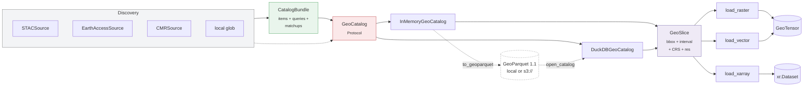
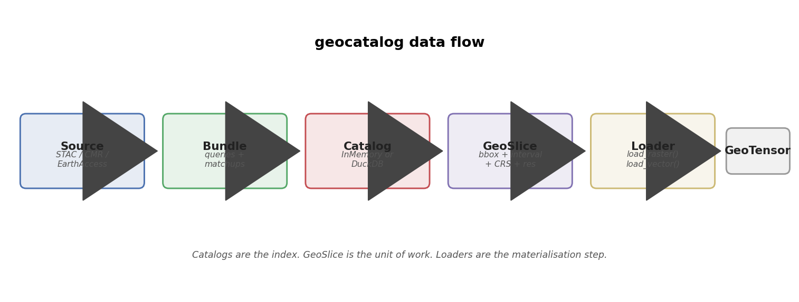
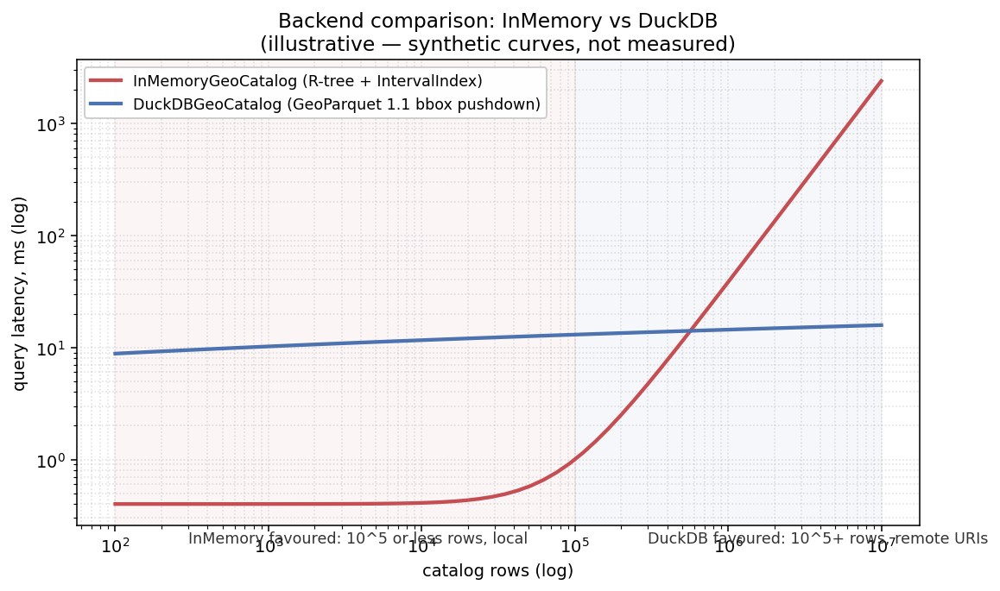
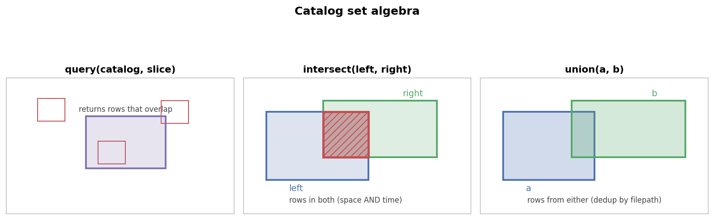

# Concepts

This page is the conceptual reference: what a catalog *is*, how the
pieces fit together, and when to reach for which backend. The
[Quickstart](quickstart.md) shows the same ideas on a real dataset; the
[API reference](api/reference.md) is the authoritative method list.

## Architecture



The same flow as a static figure (rendered by
`docs/assets/make_diagrams.py` — re-run with
`uv run --group docs python docs/assets/make_diagrams.py`):



### Three layers, in order

1. **Discovery** — `Source` adapters (`STACSource`,
   `EarthAccessSource`, `CMRSource`) yield `SourceRow`s. Local
   builders (`build_raster_catalog`, `build_vector_catalog`,
   `build_xarray_catalog`) read filenames + metadata directly.
2. **Index** — a `GeoCatalog` Protocol implementation. Two backends
   ship: `InMemoryGeoCatalog` (eager, GeoDataFrame + R-tree) and
   `DuckDBGeoCatalog` (lazy, SQL over GeoParquet 1.1). The Protocol
   surface — `query`, `intersect`, `union`, `iter_rows`,
   `iter_slices`, `to_geoparquet` — is identical across both.
3. **Materialise** — loaders (`load_raster`, `load_raster_timeseries`,
   `load_xarray`, `load_vector`) consume a `GeoSlice` plus a catalog
   and return a `GeoTensor` (or `xr.Dataset`).

## `GeoSlice` — the unit of work

```python
from geocatalog import GeoSlice
import pandas as pd

aoi = GeoSlice(
    bounds=(-120.25, 38.85, -119.85, 39.30),     # Lake Tahoe, lon/lat
    interval=pd.Interval(
        pd.Timestamp("2024-06-01"),
        pd.Timestamp("2024-09-30"),
        closed="both",
    ),
    resolution=(0.0001, 0.0001),                 # ~10 m at this latitude
    crs="EPSG:4326",
)
```

The dataclass is `frozen=True`. Slices can be cached, hashed, sent
across process boundaries, or persisted as JSON. To "change" a slice,
use `dataclasses.replace(aoi, bounds=...)`. The explicit copy is
intentional — silent mutation of a query that's been logged is the
worst kind of bug.

### Grid alignment

`GeoSlice.shape` rounds `(xmax-xmin)/x_res` to the nearest integer,
which silently accepts bounds that aren't a whole number of pixels.
That's fine for most pipelines but bites at the matchup boundary
(stacking a chip against a label raster a pixel short). Two opt-in
escape hatches:

- `aligned_shape()` is the strict counterpart to `.shape` — same
  return type, but raises `ValueError` with the residual when the
  extent isn't an integer multiple of the resolution.
- The `align=` constructor argument enables construction-time
  validation: `"warn"` emits a `GridAlignmentWarning` (via stdlib
  `warnings.warn`, so it's visible regardless of loguru's
  library-quiet default), `"error"` raises, `"snap"` rounds outward
  while preserving the affine origin (`xmin` and `ymax` for
  north-up) — `xmax` extends rightward, `ymin` extends downward.
  Default is `"off"` (today's silent behaviour). Unknown modes are
  rejected at construction.

The `align` argument is *not* part of slice identity — two slices
with the same bounds, interval, resolution, and CRS compare equal
and hash equal regardless of mode.

For cross-source co-registration there's `is_grid_aligned(a, b)`,
which returns `True` iff `a` and `b` share a pixel lattice (same
resolution + origins congruent mod resolution + same CRS). Pass
`explain=True` for per-axis residual diagnostics.

See `docs/design/exact-grid-alignment.md` for the full design.

## Schema model

The shared row schema across backends:

| Column | Type | Meaning |
| --- | --- | --- |
| `geometry` | Shapely Polygon | The file's footprint in the catalog's CRS |
| `start_time` / `end_time` *(promoted to `IntervalIndex`)* | Timestamp | Time interval, `closed='both'` |
| `filepath` | str | Path or URI to the source file |
| `crs` | str | The file's source CRS (may differ from catalog CRS) |

Extras depend on the backend:

- **xarray** adds `n_timesteps`, `time_var`.
- **vector** adds `layer`.
- **STAC ingestion** adds `asset_key`, `stac_item_id`,
  `stac_collection`, plus any `extra_properties` you opt into.
- **Bundles** add `id`, `source`, `collection`, `assets` (JSON), and
  `provenance`.

The `IntervalIndex` is the trick that makes temporal queries cheap.
Combined with the R-tree on `geometry` (InMemory) or the bbox-column
predicate pushdown (DuckDB), a `query(slice)` is two cheap index
lookups intersected.

## Backends

Both implement the `GeoCatalog` Protocol. The Protocol *is* the
contract — anywhere you accept a `GeoCatalog`, either one works.

| | InMemoryGeoCatalog | DuckDBGeoCatalog |
| --- | --- | --- |
| Install | base | `pip install 'geocatalog[duckdb]'` |
| Storage | `gpd.GeoDataFrame` in RAM | GeoParquet 1.1 on disk / S3 / HF |
| Indexing | R-tree + `IntervalIndex` | GeoParquet 1.1 covering bbox column |
| Scale | up to ~10⁵ rows | 10⁶+ rows |
| Remote URIs | only via fsspec read | native via DuckDB `httpfs` |
| Mutation | new instance per op | new instance per op (lazy SQL relation) |
| Build mode | eager | streaming (`backend="duckdb"`, bounded RAM) |



*The curves above are illustrative — synthetic, not measured. The
shape is what matters: InMemory is unbeatable until the GeoDataFrame
stops fitting in cache; DuckDB's bbox pushdown keeps remote-Parquet
queries flat as row count grows.*

### When to pick which

- **InMemory** — interactive exploration, fixture catalogs, anything
  under ~10⁵ rows. Construction is eager; the `gdf` attribute exposes
  the underlying GeoDataFrame.
- **DuckDB** — 10⁶+ rows, remote artifacts, or any flow where you want
  to share a single GeoParquet file as the "source of truth." Build
  with `backend="duckdb"` to stream rows into Parquet in bounded
  memory; read with `open_catalog("cat.parquet")` or directly with
  `DuckDBGeoCatalog.open`.

### The factory

```python
import geocatalog as gc

# Prefers DuckDB when [duckdb] is installed; falls back to InMemory.
catalog = gc.open_catalog("cat.parquet")

# Force one or the other:
catalog = gc.open_catalog("cat.parquet", engine="duckdb")
catalog = gc.open_catalog("cat.parquet", engine="memory")

# Remote — DuckDB reads only the row-groups your query touches.
catalog = gc.open_catalog("s3://my-bucket/cat.parquet")
```

## Set algebra

`query`, `intersect`, `union` — all return *new* catalogs. The
originals are untouched, which makes them safe to compose and cache.



```python
import geocatalog as gc

imagery = gc.build_raster_catalog(...)
labels  = gc.build_vector_catalog(...)

# Rows from imagery whose footprint AND time interval overlap labels.
paired = gc.intersect(imagery, labels)

# Rows from imagery covering 2023 OR 2024.
combined = gc.union(catalog_2023, catalog_2024)

# Just the imagery rows that touch this slice.
hits = imagery.query(aoi)
```

`intersect(left, right, spatial_only=True)` is the right tool for
pairing imagery with **static** labels (no temporal overlap by
construction).

## Persistence

### GeoParquet roundtrip

```python
gc.to_geoparquet(catalog, "cat.parquet")
# ... share the file ...
catalog = gc.from_geoparquet("cat.parquet")
```

The artifact is **GeoParquet 1.1**, with a per-row covering `bbox`
struct — readable by DuckDB, geopandas, GDAL, pandas, and any other
GeoParquet-aware tool. `DuckDBGeoCatalog` uses the same file directly.

### Hive partitioning + append

For archives that grow over time, write to a directory of
Hive-partitioned shards and append new rows incrementally:

```python
from geocatalog import append_files

catalog = append_files(
    archive="s3://my-bucket/s2_archive/",
    filepaths=new_scene_paths,
    extract_fn=extract_raster_row,         # picklable
    crs="EPSG:4326",
    backend="raster",
    partition_by=("year", "month"),        # derived from start_time
)
```

Only new rows are written; existing shards are untouched. Mismatched
`partition_by` against an existing archive raises `ValueError` rather
than silently producing a mixed layout.

### Streaming build (`backend="duckdb"`)

Default builders collect every row in RAM. Beyond ~10⁵ files the build
itself becomes the bottleneck. Switch to streaming:

```python
catalog = gc.build_raster_catalog(
    filepaths,                       # 10^6 Sentinel-2 scenes
    filename_regex=r"S2_T\w+_(?P<date>\d{8}).*\.tif",
    backend="duckdb",
    out_path="s2_archive.parquet",   # required when backend="duckdb"
    n_workers=8,                     # parallel rasterio.open
    sort_by=("start_time", "geometry_hilbert"),  # row-group pruning
)
```

Peak RAM is `batch_size * row_size` (default ~10 MB at
`batch_size=10_000`), not `O(n_rows)`. The resulting GeoParquet has a
per-row bbox column and Hilbert-sorted geometries — set up for
efficient predicate pushdown at query time.

## Bridging to a patcher

`CatalogDomain` wraps a catalog so a tiling patcher can walk it:

```python
import geocatalog as gc

catalog = gc.build_raster_catalog(...)
domain = gc.CatalogDomain(catalog=catalog, resolution=(10.0, 10.0))

for slice_ in domain.slices():
    chip = gc.load_raster(catalog, slice_, band_indexes=[2, 3, 4, 8])
    yield model(chip.values)
```

The canonical consumer is
[`geotoolz.patch.SpatialPatcher`](https://github.com/jejjohnson/geotoolz),
but any code that iterates `domain.slices()` works.

With the `[patch]` extra installed, `geocatalog.staging.field_for`
hands a catalog directly to `geopatcher.SpatialPatcher` as a
`RasterField` — no manual construction. See the
[end-to-end notebook](notebooks/end_to_end_lake_tahoe.ipynb) for a
worked example.

## Provenance: `Source` → `Bundle` → `Catalog`

`Source` adapters (`STACSource`, `EarthAccessSource`, `CMRSource`)
yield `SourceRow`s — pre-catalog records that carry the query
parameters that produced them. `CatalogBundle` collects those rows,
along with the queries and any matchup records, into a single
durable directory. `bundle.catalog` is the `InMemoryGeoCatalog` you
work with day-to-day; `bundle.to_directory("./my_catalog")` persists
the full provenance trail.

See [recipes/staging-and-bundles.md](recipes/staging-and-bundles.md)
for the workflow.

## See also

- [Quickstart](quickstart.md) — same concepts on real Sentinel-2 over Lake Tahoe.
- [API reference](api/reference.md) — full method signatures.
- [Schema versions](schema-versions.md) — GeoParquet schema migration.
- [Logging](logging.md) — `loguru.enable("geocatalog")` to see what the
  catalog is doing under the hood.
