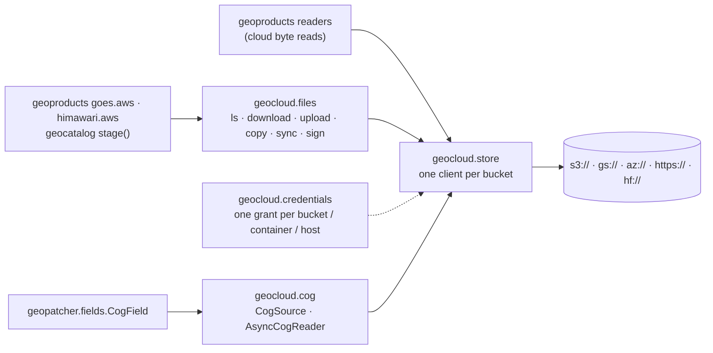

# geotoolz-cloud

Cloud object storage for the stack (import name `geocloud`): one
process-wide [obstore](https://developmentseed.org/obstore/) client pool,
file verbs on it (list, download, upload, copy, sync, sign), credentials
registered once per bucket (also handed to GDAL), and batched, async
Cloud-Optimized GeoTIFF reads and validated COG writes.

```bash
pip install geotoolz-cloud            # the client pool
pip install 'geotoolz-cloud[cog]'     # + COG reads (async-geotiff)
```

Every package that reads from a bucket takes its client from
`geocloud.store`:
- geopatcher's `CogField`;
- geoproducts' cloud byte reads (its `[obstore]` extra) and its NOAA
  bucket helpers (`goes.aws`, `himawari.aws`, through `geocloud.files`);
- geocatalog's `stage()` (its `[cloud]` extra, through `geocloud.files`).

A process talking to one bucket therefore builds **one** client and
**one** HTTP/2 connection pool for it.



## The client pool — `geocloud.store`

```python
from obstore.store import ObjectStore

from geocloud.store import get_obstore, object_key

uri = "s3://bucket/scenes/2026/10/07/B04.tif"
store: ObjectStore = get_obstore(uri)            # built once per bucket, then reused
head: bytes = bytes(store.get_range(object_key(uri), start=0, length=16_384))
```

| URI | Pooled store | `object_key` |
| --- | --- | --- |
| `s3://bucket/key`, `gs://bucket/key` | `S3Store` / `GCSStore(bucket)` | `key` |
| `az://account/container/key` | `AzureStore(container, account)` | `key` |
| `abfs[s]://container@account.dfs.core.windows.net/key` | `AzureStore(container, account)` | `key` |
| `https://account.blob.core.windows.net/container/key` | `AzureStore(container, account)` | `key` |
| `http[s]://host/path?query` (pre-signed / SAS) | `HTTPStore(origin?query)` | `path` |
| `hf://[datasets/]org/repo[@rev]/path` | `HTTPStore` on the Hub (token from `$HF_TOKEN`) | `…/resolve/<rev>/path` |

Pooled stores never carry a prefix, `storage_options` are part of the pool
key, and an `http(s)` query string stays on the store, so signed URLs are
requested signed. `clear_obstore_pool()` drops every client after you
rotate credentials; it also runs automatically in a forked child.

## Moving files — `geocloud.files`

One set of verbs for every location: any URI the pool understands, or a
local path (`str`, `Path`, `file://`). The same call covers cloud → local,
local → cloud and cloud → cloud, and remote ends share the pooled clients.

```python
from datetime import timedelta
from pathlib import Path

from geocloud import files

# Inspect
scenes: list[files.ObjectInfo] = files.ls("s3://bucket/scenes/2026/10/")
top: list[files.ObjectInfo] = files.ls("s3://bucket/scenes/", recursive=False)  # + sub-"dirs"
files.exists("s3://bucket/scenes/2026/10/07/B04.tif")      # True
files.info("s3://bucket/scenes/2026/10/07/B04.tif").size   # 123_456_789

# Move
local: Path = files.download(scenes[0].uri, "data/")        # → data/B04.tif
files.upload("out/ndvi.tif", "az://account/results/ndvi/")  # keeps the name
files.copy("s3://bucket/a.tif", "s3://bucket/archive/")     # server-side
files.copy("s3://bucket/a.tif", "gs://other/a.tif")         # streamed across clouds
files.sync("s3://bucket/scenes/", "data/scenes/")           # resumable mirror
files.rm("s3://bucket/tmp/", recursive=True)

# Small objects and file handles
meta: bytes = files.read_bytes("gs://bucket/scene/MTL.json")
files.write_bytes("az://account/results/run.json", b"{}")
with files.open("s3://bucket/results/log.txt", "wb") as fh:
    fh.write(b"done")

# Share without credentials
url: str = files.sign("s3://bucket/a.tif", expires=timedelta(hours=6))
```

| Verb | Does | Notes |
| --- | --- | --- |
| `ls(prefix, recursive=True)` | list objects (sorted `ObjectInfo`) | prefixes match whole segments: `2026` ≠ `2026-old` |
| `info` / `exists` | one object's size, mtime, etag | a prefix alone does not "exist" |
| `read_bytes` / `write_bytes` | whole object in memory | writes are atomic in the store |
| `open(uri, "rb" \| "wb")` | seekable reader (range requests) / buffered writer | hand the reader to h5py, `zipfile`, … |
| `download(uri, dest)` | object → local file | 16 MiB ranged reads into a hidden `.part`, size-checked, renamed |
| `upload(path, uri)` | local file → object | multipart for large files |
| `copy(src, dst)` | any → any | server-side in one bucket / container; ranged reads into a multipart upload between stores |
| `sync(src, dst)` | mirror a prefix / directory | skips same-size objects already there; never deletes |
| `rm(uri, recursive=False)` | delete | batched bulk deletes |
| `sign(uri, expires=…)` | pre-signed HTTPS URL | S3, GCS, Azure; computed locally, no request |

A trailing `/` on a destination (or an existing local directory) keeps
the source's file name. `overwrite=False` on `copy` / `download` /
`upload` leaves an existing destination alone and returns it.
`storage_options` on every verb is forwarded to `get_obstore`. When the two
ends of a `copy` or `sync` need different credentials, register each root
with `geocloud.credentials` (below) instead.

Large objects move in 16 MiB byte ranges, one request each. obstore's
client timeout (30 s per request by default, with a capped number of
resumes) therefore bounds a range, not a whole multi-gigabyte object.
Every range is pinned to the entity tag seen first, so an object replaced
mid-transfer raises instead of arriving half old, half new.

**Testing code that moves files.** `geocloud.store.mount` serves one
bucket, container or host from a store you built, so the code under test
keeps its real URIs:

```python
from obstore.store import MemoryStore

from geocloud.store import mount, unmount

mount("s3://bucket", MemoryStore())   # every s3://bucket/... URI now hits memory
...
unmount("s3://bucket")
```

## Credentials — `geocloud.credentials`

Register credentials once per **store root** (a bucket, an Azure account
or container, an HTTP host); every call on the pool then picks them up,
so the code that moves or reads data only ever handles URIs.

```python
from geocloud import credentials, files

credentials.set_credentials("s3://noaa-goes19", anonymous=True, region="us-east-1")
credentials.set_credentials("az://myaccount/raw", sas_token=sas)     # one container
credentials.set_credentials("az://myaccount", use_azure_cli=True)    # its other containers
credentials.set_credentials("s3://private", aws_access_key_id=key, aws_secret_access_key=secret)
credentials.set_credentials("https://data.example.com",
                     client_options={"default_headers": {"Authorization": f"Bearer {token}"}})

files.copy("az://myaccount/raw/scene.tif", "s3://private/scenes/")  # each end its own grant
credentials.credential_roots()   # ['az://myaccount', 'az://myaccount/raw', 's3://noaa-goes19', …]
```

- **Spelled-out keywords.** `anonymous=True` sends unsigned requests,
  with no credential lookup and no instance-metadata probe. `sas_token=`
  is checked when it is registered: an expired token, a token without
  `sig=`, or a container-scoped token registered for a whole account is
  rejected right there.
- **Everything else is an obstore store option.** Examples are keys,
  `region`, `endpoint`, `use_azure_cli`, `service_account`,
  `credential_provider` (from `obstore.auth`) and `client_options`. They
  are validated by building a store, so a typo fails at `set_credentials`.
- **Precedence.** An Azure container's entry wins over its account's.
  `storage_options` passed to a call win over registered ones.
- **No registration needed** for Azure managed or workload identity, or
  S3 / GCS instance credentials: obstore's default chains find them.
  Nothing here writes `os.environ`.

### A credentials file

`load_credentials(path)` registers every table of a TOML file. The file at
`$GEOCLOUD_CREDENTIALS` (default `~/.config/geocloud/credentials.toml`)
loads by itself on first use; set `GEOCLOUD_CREDENTIALS=` (empty) to turn
that off. A value can reference the environment instead of holding the
secret. A file other users can read triggers a warning.

```toml
["s3://noaa-goes19"]
anonymous = true
region = "us-east-1"

["az://myaccount/raw"]
sas_token = "${RAW_SAS}"

["s3://private"]
aws_access_key_id = "${AWS_KEY}"
aws_secret_access_key = "${AWS_SECRET}"
region = "eu-west-1"
```

### GDAL, rasterio and georeader

`gdal_access(uri)` turns the same registry into a GDAL path plus config
options. A root registered once therefore reads through obstore and
GDAL alike:

```python
import rasterio
from georeader.rasterio_reader import RasterioReader

path, env = credentials.gdal_access("az://myaccount/raw/scene.tif")
reader = RasterioReader(path, rio_env_options=env)
with rasterio.Env(**env), rasterio.open(path) as src:
    ...
```

| Registered | GDAL path | Options |
| --- | --- | --- |
| S3 keys / anonymous / endpoint | `/vsis3/bucket/key` | `AWS_*` (`AWS_NO_SIGN_REQUEST`, `AWS_S3_ENDPOINT`, …) |
| GCS service-account file / anonymous | `/vsigs/bucket/key` | `GOOGLE_APPLICATION_CREDENTIALS`, `GS_NO_SIGN_REQUEST` |
| Azure account key / account SAS / anonymous | `/vsiaz/container/key` | `AZURE_STORAGE_ACCOUNT`, `AZURE_STORAGE_ACCESS_KEY` / `_SAS_TOKEN` |
| Azure **container** SAS | `/vsicurl/https://account.blob.core.windows.net/container/key?<sas>` | none |
| signed `http(s)://` URL | `/vsicurl/<url>` | none |

Two kinds of credentials can't be passed to GDAL and raise an error:
credential-provider objects, and inline service-account keys. For those,
pre-sign the object with `files.sign` and read `/vsicurl/<url>`.

### Keeping secrets out of logs

`redact(text)` masks SAS signatures, S3 / GCS query signatures and
credentials, `token=` / `key=` parameters and `Bearer` headers. Every
error geocloud raises about a URI already goes through it.

## Writing COGs — `geocloud.cog.write_cog`

`write_cog` writes a `GeoTensor`, or a lazy georeader reader, as a
validated COG to a local path or any bucket. It runs on the base install
(GDAL's `COG` driver through rasterio).

```python
import numpy as np
from georeader.geotensor import GeoTensor

from geocloud.cog import write_cog

ndvi: GeoTensor                                              # (1, 10980, 10980) float32, NaN fill
write_cog(ndvi, "s3://bucket/products/ndvi.tif")             # deflate + float predictor, average overviews
write_cog(classes, "landcover.tif", compress="zstd")         # uint8: nearest overviews keep class values
write_cog(mask, "az://account/qa/cloud-mask.tif")            # bool → uint8 0 / 1, no nodata
write_cog(reader, "gs://bucket/mosaic.tif")                  # lazy GeoData: staged strip by strip
```

How a write runs:

1. **Stage.** The pixels go to a tiled GeoTIFF in a private temporary
   directory, together with nodata, band descriptions and tags. A
   `GeoTensor` is written in one call. A lazy reader is read strip by
   strip, so a scene larger than memory never loads whole.
2. **Translate.** GDAL's `COG` driver lays out the tiles, builds the
   overviews and puts the header first.
3. **Check.** With `validate=True` (the default), the result must read
   back as `LAYOUT=COG` with the expected shape, dtype, tiles and
   overviews.
4. **Place.** A local file is renamed into place, so a failed write
   never leaves a truncated file and an existing file survives a failed
   overwrite. A cloud `dest` is uploaded through
   [`geocloud.files`](#moving-files-geocloudfiles), using the
   credentials registered for that bucket.

| Keyword | Default | Notes |
| --- | --- | --- |
| `compress` | `"deflate"` | also `zstd`, `lzw`, `lerc*`, `webp` / `jpeg` (8-bit), `none` |
| `level` | GDAL's | DEFLATE 1–12, ZSTD 1–22 |
| `predictor` | `True` | GDAL picks horizontal (ints) or floating-point (floats) for DEFLATE / LZW / ZSTD |
| `blocksize` | `512` | a power of two |
| `overviews` | `True` | down to one tile |
| `resampling` | auto | `nearest` for integer / bool data, `average` for floats |
| `nodata` | `"auto"` | the data's `fill_value_default` if the dtype can hold it; never for a bool mask |
| `descriptions` | auto | from `attrs["band_names"]` (or `descriptions`) when it has one entry per band |
| `tags`, `creation_options` | — | dataset tags; raw GDAL `COG` options that win over the keywords |
| `overwrite`, `validate` | `True` | `overwrite=False` raises `FileExistsError` |

Compared with `georeader.save.save_cog`:

| | `save_cog` | `write_cog` |
| --- | --- | --- |
| Options | a free-form profile dict, which it modifies in place | explicit keywords with checked values |
| Defaults | LZW, no predictor, cubic-spline overviews for every dtype | values that suit the dtype |
| Validation | none | the output must be a COG |
| Local write | non-atomic | atomic |
| Cloud write | fsspec, via a temp file in the current directory | the shared obstore pool and the credentials registry |
| Lazy readers | no | yes |
| Unsupported dtypes (bool, float16) | fail | converted (uint8, float32) |
| A nodata the dtype cannot hold | written as is | dropped (`"auto"`) or rejected (explicit value) |

## COG reads — `geocloud.cog`

`CogSource` is an opened, tiled COG:
- `read_windows` collects every tile a batch of windows touches;
- it fetches each tile once, in concurrent groups of row-adjacent tiles;
- it crops each window out of the decoded tiles.

Reads come sync or `await`-ed, and a source pickles by URL, so it ships to
process-pool workers. `AsyncCogReader` is its georeader-shaped face:
`GeoData` metadata, lazy window views, and `read_*` coroutines that mirror
`georeader.read` pixel for pixel.

```python
from georeader.geotensor import GeoTensor
from rasterio.windows import Window

from geocloud.cog import AsyncCogReader, CogSource, read_from_tile

src: CogSource = CogSource.open(uri)                         # one header fetch
chips: list[GeoTensor] = src.read_windows(                   # shared tiles fetched once
    [Window(0, 0, 512, 512), Window(256, 0, 512, 512)]
)                                                            # 2 × (bands, 512, 512)

reader: AsyncCogReader = await AsyncCogReader.open(uri)
tile: GeoTensor = await read_from_tile(reader, x=163, y=395, z=10)  # (bands, 256, 256)
coarse: AsyncCogReader = reader.reader_overview(2)           # low zooms: read an overview
```

Codec fidelity:
- Lossless codecs decode bit-for-bit like GDAL.
- JPEG tiles are decoded by async-tiff rather than libjpeg, so they can
  differ by a few DN: up to ±3 for `PHOTOMETRIC=YCbCr`.

To patch a COG, use [`geopatcher.fields.CogField`](../patcher/api/fields.md):
the same source, with the `Field` interface.

- [API reference](api.md)
