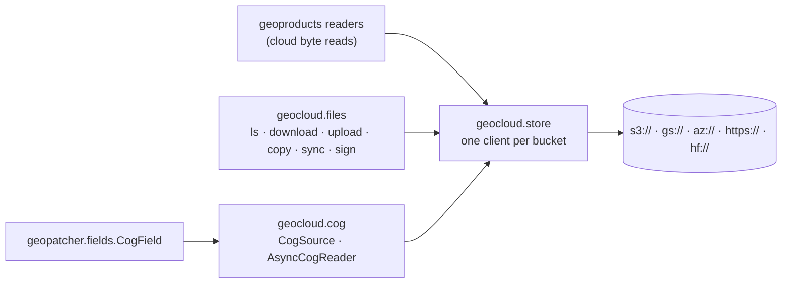

# geotoolz-cloud

Cloud object storage for the stack (import name `geocloud`): one
process-wide [obstore](https://developmentseed.org/obstore/) client pool,
file verbs on it (list, download, upload, copy, sync, sign), and batched,
async Cloud-Optimized GeoTIFF reads.

```bash
pip install geotoolz-cloud            # the client pool
pip install 'geotoolz-cloud[cog]'     # + COG reads (async-geotiff)
```

Every package that reads from a bucket takes its client from
`geocloud.store`:
- geopatcher's `CogField`;
- geoproducts' cloud byte reads (its `[obstore]` extra).

A process talking to one bucket therefore builds **one** client and
**one** HTTP/2 connection pool for it.



## The client pool — `geocloud.store`

```python
from obstore.store import ObjectStore

from geocloud.store import get_obstore, object_key

uri = "s3://bucket/scenes/2026/10/07/B04.tif"
store: ObjectStore = get_obstore(uri)            # built once per bucket, then reused
head: bytes = bytes(store.get_range(object_key(uri), start=0, length=16_384))
```

| URI | Pooled store | `object_key` |
| --- | --- | --- |
| `s3://bucket/key`, `gs://bucket/key` | `S3Store` / `GCSStore(bucket)` | `key` |
| `az://account/container/key` | `AzureStore(container, account)` | `key` |
| `abfs[s]://container@account.dfs.core.windows.net/key` | `AzureStore(container, account)` | `key` |
| `https://account.blob.core.windows.net/container/key` | `AzureStore(container, account)` | `key` |
| `http[s]://host/path?query` (pre-signed / SAS) | `HTTPStore(origin?query)` | `path` |
| `hf://[datasets/]org/repo[@rev]/path` | `HTTPStore` on the Hub (token from `$HF_TOKEN`) | `…/resolve/<rev>/path` |

Pooled stores never carry a prefix, `storage_options` are part of the pool
key, and an `http(s)` query string stays on the store, so signed URLs are
requested signed. `clear_obstore_pool()` drops every client after you
rotate credentials; it also runs automatically in a forked child.

## Moving files — `geocloud.files`

One set of verbs for every location: any URI the pool understands, or a
local path (`str`, `Path`, `file://`). The same call covers cloud → local,
local → cloud and cloud → cloud, and remote ends share the pooled clients.

```python
from datetime import timedelta
from pathlib import Path

from geocloud import files

# Inspect
scenes: list[files.ObjectInfo] = files.ls("s3://bucket/scenes/2026/10/")
top: list[files.ObjectInfo] = files.ls("s3://bucket/scenes/", recursive=False)  # + sub-"dirs"
files.exists("s3://bucket/scenes/2026/10/07/B04.tif")      # True
files.info("s3://bucket/scenes/2026/10/07/B04.tif").size   # 123_456_789

# Move
local: Path = files.download(scenes[0].uri, "data/")        # → data/B04.tif
files.upload("out/ndvi.tif", "az://account/results/ndvi/")  # keeps the name
files.copy("s3://bucket/a.tif", "s3://bucket/archive/")     # server-side
files.copy("s3://bucket/a.tif", "gs://other/a.tif")         # streamed across clouds
files.sync("s3://bucket/scenes/", "data/scenes/")           # resumable mirror
files.rm("s3://bucket/tmp/", recursive=True)

# Small objects and file handles
meta: bytes = files.read_bytes("gs://bucket/scene/MTL.json")
files.write_bytes("az://account/results/run.json", b"{}")
with files.open("s3://bucket/results/log.txt", "wb") as fh:
    fh.write(b"done")

# Share without credentials
url: str = files.sign("s3://bucket/a.tif", expires=timedelta(hours=6))
```

| Verb | Does | Notes |
| --- | --- | --- |
| `ls(prefix, recursive=True)` | list objects (sorted `ObjectInfo`) | prefixes match whole segments: `2026` ≠ `2026-old` |
| `info` / `exists` | one object's size, mtime, etag | a prefix alone does not "exist" |
| `read_bytes` / `write_bytes` | whole object in memory | writes are atomic in the store |
| `open(uri, "rb" \| "wb")` | seekable reader (range requests) / buffered writer | hand the reader to h5py, `zipfile`, … |
| `download(uri, dest)` | object → local file | 16 MiB ranged reads into a hidden `.part`, size-checked, renamed |
| `upload(path, uri)` | local file → object | multipart for large files |
| `copy(src, dst)` | any → any | server-side in one bucket / container; ranged reads into a multipart upload between stores |
| `sync(src, dst)` | mirror a prefix / directory | skips same-size objects already there; never deletes |
| `rm(uri, recursive=False)` | delete | batched bulk deletes |
| `sign(uri, expires=…)` | pre-signed HTTPS URL | S3, GCS, Azure; computed locally, no request |

A trailing `/` on a destination (or an existing local directory) keeps
the source's file name. `overwrite=False` on `copy` / `download` /
`upload` leaves an existing destination alone and returns it.
`storage_options` on every verb is forwarded to `get_obstore`.

Large objects move in 16 MiB byte ranges, one request each. obstore's
client timeout (30 s per request by default, with a capped number of
resumes) therefore bounds a range, not a whole multi-gigabyte object.
Every range is pinned to the entity tag seen first, so an object replaced
mid-transfer raises instead of arriving half old, half new.

**Testing code that moves files.** `geocloud.store.mount` serves one
bucket, container or host from a store you built, so the code under test
keeps its real URIs:

```python
from obstore.store import MemoryStore

from geocloud.store import mount, unmount

mount("s3://bucket", MemoryStore())   # every s3://bucket/... URI now hits memory
...
unmount("s3://bucket")
```

## COG reads — `geocloud.cog`

`CogSource` is an opened, tiled COG:
- `read_windows` collects every tile a batch of windows touches;
- it fetches each tile once, in concurrent groups of row-adjacent tiles;
- it crops each window out of the decoded tiles.

Reads come sync or `await`-ed, and a source pickles by URL, so it ships to
process-pool workers. `AsyncCogReader` is its georeader-shaped face:
`GeoData` metadata, lazy window views, and `read_*` coroutines that mirror
`georeader.read` pixel for pixel.

```python
from georeader.geotensor import GeoTensor
from rasterio.windows import Window

from geocloud.cog import AsyncCogReader, CogSource, read_from_tile

src: CogSource = CogSource.open(uri)                         # one header fetch
chips: list[GeoTensor] = src.read_windows(                   # shared tiles fetched once
    [Window(0, 0, 512, 512), Window(256, 0, 512, 512)]
)                                                            # 2 × (bands, 512, 512)

reader: AsyncCogReader = await AsyncCogReader.open(uri)
tile: GeoTensor = await read_from_tile(reader, x=163, y=395, z=10)  # (bands, 256, 256)
coarse: AsyncCogReader = reader.reader_overview(2)           # low zooms: read an overview
```

Codec fidelity:
- Lossless codecs decode bit-for-bit like GDAL.
- JPEG tiles are decoded by async-tiff rather than libjpeg, so they can
  differ by a few DN: up to ±3 for `PHOTOMETRIC=YCbCr`.

To patch a COG, use [`geopatcher.fields.CogField`](../patcher/api/fields.md):
the same source, with the `Field` interface.

- [API reference](api.md)
