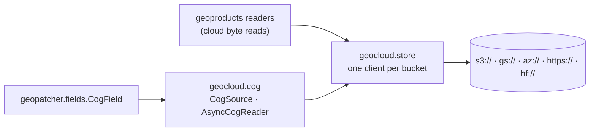

# geotoolz-cloud

Cloud object storage for the stack (import name `geocloud`): one
process-wide [obstore](https://developmentseed.org/obstore/) client pool,
and batched, async Cloud-Optimized GeoTIFF reads on top of it.

```bash
pip install geotoolz-cloud            # the client pool
pip install 'geotoolz-cloud[cog]'     # + COG reads (async-geotiff)
```

Every package that reads from a bucket takes its client from
`geocloud.store`:
- geopatcher's `CogField`;
- geoproducts' cloud byte reads (its `[obstore]` extra).

A process talking to one bucket therefore builds **one** client and
**one** HTTP/2 connection pool for it.



## The client pool — `geocloud.store`

```python
from obstore.store import ObjectStore

from geocloud.store import get_obstore, object_key

uri = "s3://bucket/scenes/2026/10/07/B04.tif"
store: ObjectStore = get_obstore(uri)            # built once per bucket, then reused
head: bytes = bytes(store.get_range(object_key(uri), start=0, length=16_384))
```

| URI | Pooled store | `object_key` |
| --- | --- | --- |
| `s3://bucket/key`, `gs://bucket/key` | `S3Store` / `GCSStore(bucket)` | `key` |
| `az://account/container/key` | `AzureStore(container, account)` | `key` |
| `abfs[s]://container@account.dfs.core.windows.net/key` | `AzureStore(container, account)` | `key` |
| `https://account.blob.core.windows.net/container/key` | `AzureStore(container, account)` | `key` |
| `http[s]://host/path?query` (pre-signed / SAS) | `HTTPStore(origin?query)` | `path` |
| `hf://[datasets/]org/repo[@rev]/path` | `HTTPStore` on the Hub (token from `$HF_TOKEN`) | `…/resolve/<rev>/path` |

Pooled stores never carry a prefix, `storage_options` are part of the pool
key, and an `http(s)` query string stays on the store, so signed URLs are
requested signed. `clear_obstore_pool()` drops every client after you
rotate credentials; it also runs automatically in a forked child.

## COG reads — `geocloud.cog`

`CogSource` is an opened, tiled COG:
- `read_windows` collects every tile a batch of windows touches;
- it fetches each tile once, in concurrent groups of row-adjacent tiles;
- it crops each window out of the decoded tiles.

Reads come sync or `await`-ed, and a source pickles by URL, so it ships to
process-pool workers. `AsyncCogReader` is its georeader-shaped face:
`GeoData` metadata, lazy window views, and `read_*` coroutines that mirror
`georeader.read` pixel for pixel.

```python
from georeader.geotensor import GeoTensor
from rasterio.windows import Window

from geocloud.cog import AsyncCogReader, CogSource, read_from_tile

src: CogSource = CogSource.open(uri)                         # one header fetch
chips: list[GeoTensor] = src.read_windows(                   # shared tiles fetched once
    [Window(0, 0, 512, 512), Window(256, 0, 512, 512)]
)                                                            # 2 × (bands, 512, 512)

reader: AsyncCogReader = await AsyncCogReader.open(uri)
tile: GeoTensor = await read_from_tile(reader, x=163, y=395, z=10)  # (bands, 256, 256)
coarse: AsyncCogReader = reader.reader_overview(2)           # low zooms: read an overview
```

Codec fidelity:
- Lossless codecs decode bit-for-bit like GDAL.
- JPEG tiles are decoded by async-tiff rather than libjpeg, so they can
  differ by a few DN: up to ±3 for `PHOTOMETRIC=YCbCr`.

To patch a COG, use [`geopatcher.fields.CogField`](../patcher/api/fields.md):
the same source, with the `Field` interface.

- [API reference](api.md)
