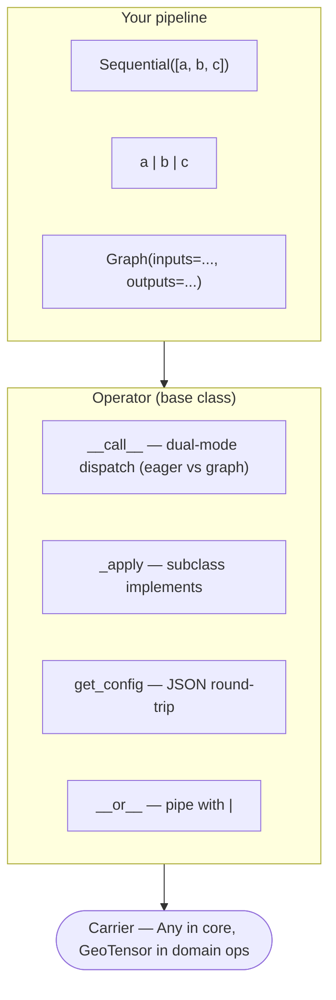
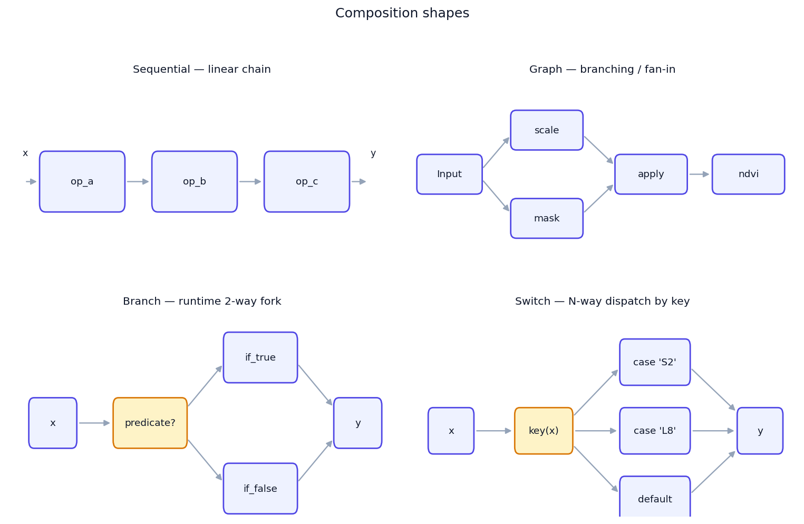
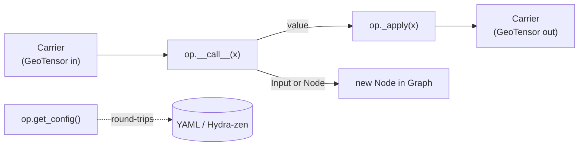
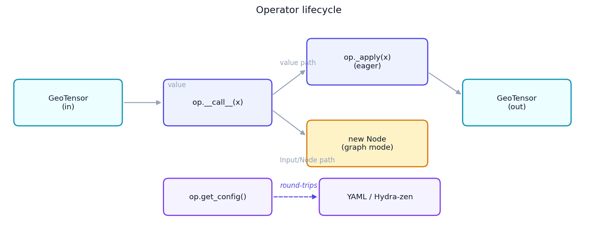
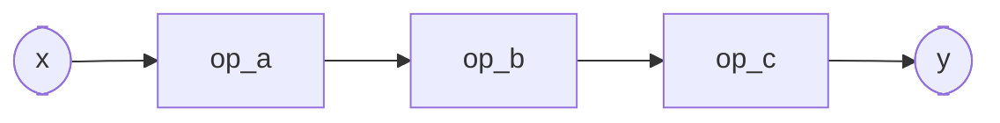
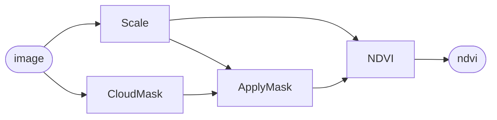
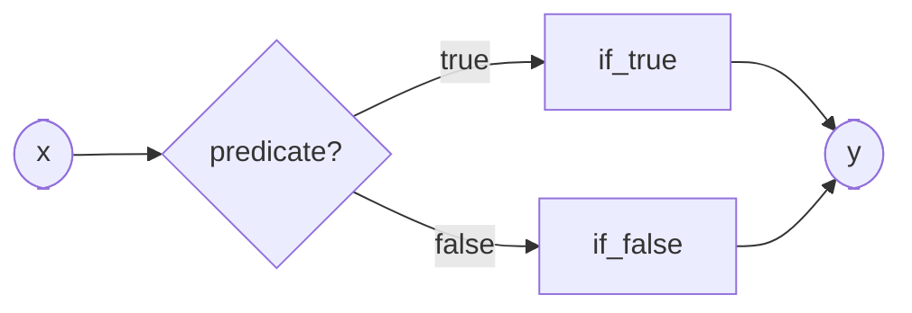
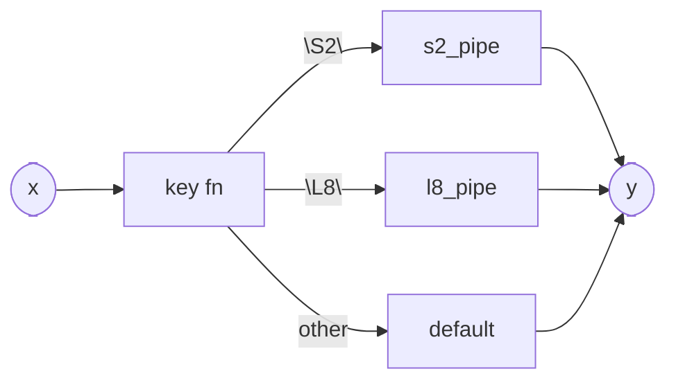
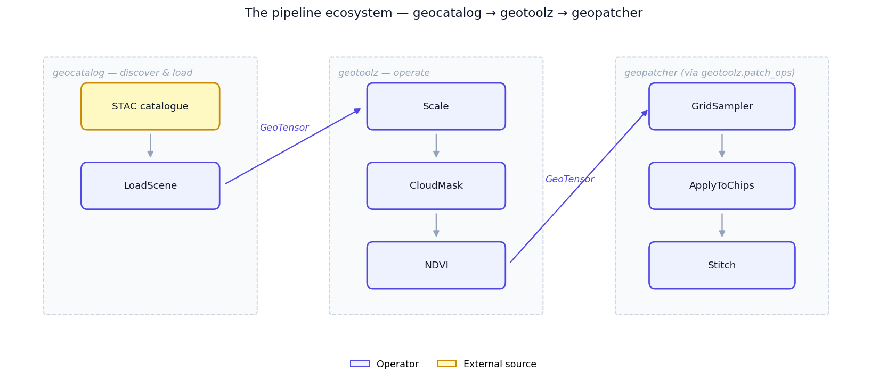
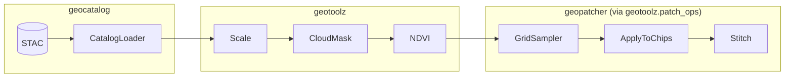

# Concepts

This page is the *why* — the composition algebra behind `geotoolz`,
why each primitive looks the way it does, and when to reach for which
one. For a real-data walk-through, see the [Quickstart](quickstart.md);
for a hands-on tour against scalars (no GIS setup), see the
[composition core notebook][notebook] in the research_notebook
geostack project.

[notebook]: https://github.com/jejjohnson/research_notebook/blob/main/projects/geostack/notebooks/01_composition_core.ipynb

## The model in one diagram



The composition core is **carrier-agnostic**. The same algebra runs on
`GeoTensor`s in production and on scalars or ndarrays in tests. Domain
operators (`NDVI`, `MaskFromSCL`, …) narrow to `GeoTensor` at their own
signatures; the core stays generic.

{ loading=lazy }

## What an `Operator` is

An `Operator` is a thing you call. Subclasses implement `_apply`; the
base class handles two responsibilities for free:

1. **Dual-mode `__call__`** — passing a value runs `_apply` eagerly;
   passing an `Input` / `Node` records a `Node` in a `Graph`. One
   method, two behaviours, dispatched on argument type.
2. **Config round-trip** — `get_config()` returns a JSON-serialisable
   dict of constructor args. Powers `__repr__`, pickling sanity, and
   the optional Hydra-zen integration.

### Lifecycle



{ loading=lazy }

### Typed I/O contract

Operators don't *require* Pydantic models, but they pair well with one
when you want the input/output contract spelled out — especially when an
operator takes multi-input dicts. The pattern:

```python
from pydantic import BaseModel
from pipekit import Operator


class ScaleConfig(BaseModel):
    scale: float = 1e-4
    clip: tuple[float, float] | None = None


class Scale(Operator):
    """Multiply DN by a scale factor, optionally clipping the output."""

    def __init__(self, **cfg) -> None:
        self.cfg = ScaleConfig(**cfg)

    def _apply(self, gt):
        out = gt.values * self.cfg.scale
        if self.cfg.clip is not None:
            lo, hi = self.cfg.clip
            out = out.clip(lo, hi)
        return gt.array_as_geotensor(out)

    def get_config(self) -> dict:
        return self.cfg.model_dump()
```

`ScaleConfig` validates the constructor args (one-shot, at `__init__`
time); `get_config()` round-trips them losslessly. Inputs and outputs
remain `GeoTensor`s — the typed model lives at the *config* boundary,
not at the carrier boundary.

## `Sequential` — linear composition



`Sequential` threads the output of each operator into the next:

```python
from pipekit import Sequential

pipe = Sequential([Add(1), Add(10), Add(100)])
pipe(0)             # 111
```

Equivalent with the `|` pipe operator:

```python
pipe = Add(1) | Add(10) | Add(100)
```

`|` **flattens** nested `Sequential`s — `a | (b | c)` and `(a | b) | c`
both yield a single three-element `Sequential`. No nested wrappers, no
surprises.

**Reach for `Sequential` when** the pipeline is a single chain: load →
clean → transform → write. Most RS pipelines are this shape.

## `Graph` — symbolic multi-input / multi-output



When your pipeline has branches, fan-out, or multiple inputs,
`Sequential` isn't enough. `Graph` builds a DAG by *calling operators on
placeholders*:

```python
import geotoolz as gz

img = gz.Input("image")

scaled = Scale(scale=1e-4)(img)
mask = CloudMask()(img)
clean = ApplyMask()(scaled, mask)
ndvi = NDVI(nir_idx=7, red_idx=3)(clean)

g = gz.Graph(inputs={"image": img}, outputs={"ndvi": ndvi})
result = g(image=img_gt)                   # {"ndvi": GeoTensor}
```

`Graph` topologically sorts the nodes, evaluates each exactly once, and
returns a dict keyed by output name. Cycle detection and
unreachable-input detection happen at construction time, not at `_apply`
time.

A `Graph` is itself an `Operator`, so it composes — drop one inside a
`Sequential`, or wrap one in `Fanout`.

**Reach for `Graph` when** you need named intermediates, multiple
inputs, multiple outputs, or fan-in (RMSE between a prediction and a
reference, multi-temporal fusion, …).

## `Branch` — runtime conditional



```python
gz.Branch(
    predicate=lambda gt: gt.crs.is_geographic,
    if_true=ReprojectToUTM(),
    if_false=gz.Identity(),
)
```

**Reach for `Branch` when** the *whole pipeline* needs a two-way fork
based on a runtime predicate. For per-pixel masking, use `ApplyMask` /
`Where` instead — branches dispatch on the carrier, not on each pixel.

## `Switch` — multi-way dispatch



```python
gz.Switch(
    key=lambda gt: gt.attrs["platform"],
    cases={"S2": s2_pipeline, "L8": l8_pipeline},
    default=gz.Identity(),
)
```

**Reach for `Switch` when** you have a finite, named set of pipelines
keyed off a scene attribute (sensor, product level, season).

## Sequential vs Graph vs Branch/Switch — at a glance

| You want… | Reach for | Notes |
|---|---|---|
| 2–6 steps, single chain | `Sequential` or `op_a \| op_b` | Most pipelines. |
| Named intermediates, branches, fan-in | `Graph` | Use `Input` placeholders. |
| Two-way runtime fork on the carrier | `Branch` | Predicate operates on the whole carrier. |
| N-way dispatch keyed off an attribute | `Switch` | Cases are operators, key is a callable. |
| One-input → many named outputs | `Fanout` | Sugar over a single-input `Graph`. |
| Side-effect that keeps the carrier flowing | `Sink` | Composes; unlike a terminal write. |

## Lazy vs eager execution

`geotoolz`'s composition core is **eager by default**. Every `__call__`
on a value runs `_apply` immediately and returns the next carrier. There
is no deferred graph being built up behind the scenes when you call an
operator on a `GeoTensor`.

The one exception: passing an `Input` or `Node` instead of a value puts
the operator in **graph mode**, where it records a `Node` instead of
executing. That's how `Graph` is built. Once you call the constructed
`Graph` on real inputs, the whole graph evaluates eagerly.

Lazy execution over chunked arrays (Dask-style) isn't in the algebra —
if you need it, wrap a `dask.array` inside the carrier and let the
underlying compute layer handle laziness. The Operator boundary stays
eager.

## Where geotoolz slots into the ecosystem

{ loading=lazy }



- **[`geocatalog`](https://github.com/jejjohnson/geocatalog)** sits
  upstream — it discovers and loads scenes from STAC into `GeoTensor`s.
- **`geotoolz`** consumes those `GeoTensor`s and runs per-scene
  transforms.
- **[`geopatcher`](https://github.com/jejjohnson/geopatcher)** handles
  sliding-window patching for big rasters. `geotoolz.patch_ops` wraps
  its `GridSampler`, `ApplyToChips`, and `Stitch` so a tiled-inference
  flow composes inside a `Sequential` like any other operator.

For the end-to-end multi-repo walk-through (catalog → patch → operate),
see the canonical Lake Tahoe notebook:
[`geocatalog/docs/notebooks/end_to_end_lake_tahoe.ipynb`](https://github.com/jejjohnson/geocatalog/blob/main/docs/notebooks/end_to_end_lake_tahoe.ipynb).

## The v0.1 idiom library

Beyond the bare composition primitives, the core ships a small library
of "operators you reach for constantly" — observers, control flow, and
tiny building blocks. The idea: **the `Operator` interface is general
enough to express things that aren't transforms** — side effects,
branching, defaults, escape hatches all become first-class composable
units that round-trip the same as any transform.

### Observers (identity-with-side-effect)

| Operator | What it does |
|---|---|
| `Tap` | Calls `fn(gt)` and passes input through unchanged. |
| `Snapshot` | Capture-by-name; intermediates available as `snap[key]` after the pipeline runs. |
| `ShapeTrace` | Prints `shape`, `dtype`, `crs` at each step. `mode="diff_only"` skips redundant lines. |

### Control flow

| Operator | What it does |
|---|---|
| `Branch` | `if predicate(x): if_true(x) else if_false(x)`. |
| `Switch` | Multi-way dispatch on `key(x)`. |
| `Fanout` | One input → dict of outputs. Sugar over a single-input `Graph`. |

### Building blocks

| Operator | What it does |
|---|---|
| `Identity` | Explicit no-op. Use in `Branch.if_false`, anywhere a slot needs an `Operator`. |
| `Const` | Return a fixed value regardless of input. |
| `Lambda` | Inline-callable escape hatch (won't YAML-round-trip). |
| `Sink` | Side-effect terminal write that *returns the input*. Composes. |

## Two small disciplines

### Round-trip discipline (`forbid_in_yaml`)

Operators that hold runtime closures (`Tap`, `Lambda`, `Branch`,
`Switch`, `Sink`, `ModelOp`) carry `forbid_in_yaml = True`. Their
`get_config()` is a debug repr, not a faithful YAML round-trip. Use
them freely in code; if you need a fully reproducible YAML artifact,
avoid closures.

### Terminal-operator validation (`_terminal`)

Some operators legitimately return `None` (e.g. a write to disk). Mark
them with `_terminal = True`; `Sequential` then rejects them in any
position except the last:

```python
class WriteCOG(Operator):
    _terminal = True
    def _apply(self, gt):
        save_to_disk(gt, self.path)

Sequential([WriteCOG("/a"), Add(1)])  # TypeError
Sequential([Add(1), WriteCOG("/a")])  # ok
```

`Sink` is **not** terminal — it does a side effect *and* returns the
input. That's why `Sink` composes mid-chain and `WriteCOG` doesn't.

## Related pages

- [Quickstart](quickstart.md) — 15-min real-data walk-through.
- [Recipes](recipes/define-an-operator.md) — short focused how-tos.
- [Normalization](normalization.md), [Multi-format readers](io.md),
  [Sensor readers](readers.md) — module-specific deep-dives.
- [Core API reference](api/core.md).

## Extended examples

The chronological walk-through that exercises every primitive on this
page — `Operator` / `Sequential` / `Graph` / `Branch` / `Switch` /
`Tap` / `Snapshot` / `ShapeTrace` / `Profile` / `AssertShape` —
against plain scalars first, then real Sentinel-2 over Lake Tahoe,
lives in
[`research_notebook/projects/geostack`](https://github.com/jejjohnson/research_notebook/tree/main/projects/geostack):

- [`01_composition_core`](https://github.com/jejjohnson/research_notebook/blob/main/projects/geostack/notebooks/01_composition_core.ipynb) — every primitive against scalars.
- [`02_pipeline_idioms`](https://github.com/jejjohnson/research_notebook/blob/main/projects/geostack/notebooks/02_pipeline_idioms.ipynb) — recipe gallery (Tap / Snapshot / Profile / Histogram / Try / Retry / Cache / Quarantine / Assert*).
- [`07_deployment_shapes`](https://github.com/jejjohnson/research_notebook/blob/main/projects/geostack/notebooks/07_deployment_shapes.ipynb) — 13 deployment patterns (notebook, ETL, FastAPI, tile server, orchestrator, …).
