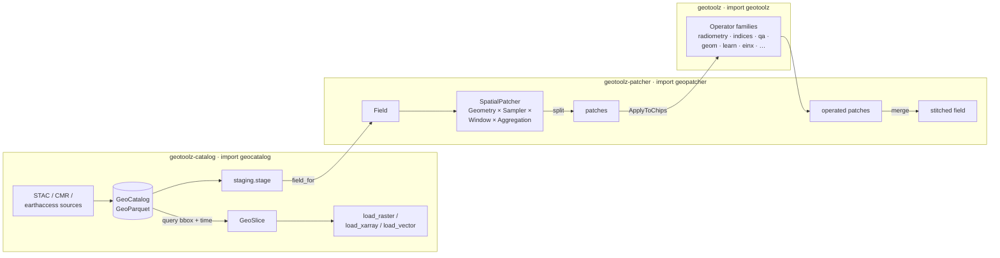

# The geostack

This repository ships **three packages that are designed as one stack**:
find data (`geocatalog`), cut it into model-sized pieces (`geopatcher`),
and compute on it (`geotoolz`) — with the operator-graph composition core
supplied by the external [pipekit](https://github.com/jejjohnson/pipekit)
framework. Each package works standalone, but the seams between them are
first-class API.



| Package (dist) | Import | Role |
|---|---|---|
| `geotoolz-catalog` | `geocatalog` | *Which files cover my bbox + time window?* Queryable spatiotemporal index with GeoParquet interchange, in-memory + DuckDB backends, discovery sources, matchup, staging. |
| `geotoolz-patcher` | `geopatcher` | *How do I turn a huge field into model-sized patches and back?* Four-axis Patcher (Geometry × Sampler × Window × Aggregation) over a substrate-agnostic `Field` protocol. |
| `geotoolz` | `geotoolz` | *What do I compute on each piece?* Carrier-preserving `pipekit.Operator` families for remote sensing, from radiometry to spectral indices to matched filters. |

## The seams

These are the deliberate integration points — each one is a small,
documented contract rather than an import tangle:

**1. `GeoSlice` — the catalog ↔ loader ↔ patcher wire format.**
A frozen `(bounds, interval, resolution, crs)` request for data.
Catalogs produce them, loaders consume them, and
[exact grid alignment](catalog/design/exact-grid-alignment.md)
(`align=`, `divide_evenly`, `is_grid_aligned`) keeps slice shapes honest
against co-registered products.

**2. `staging.field_for` — catalog rows become patcher Fields.**
`geocatalog.staging.stage()` resolves remote URIs into a local cache, and
`field_for()` wraps the staged rows as a `geopatcher` `Field`, so a
catalog query drops straight into `SpatialPatcher.split` (enabled by the
`geotoolz-catalog[patch]` extra).

**3. `patch_ops` — the patcher joins the operator graph.**
`geotoolz.patch_ops` (same classes as `geopatcher.integrations.pipekit`)
wraps a `SpatialPatcher` as pipeline stages: `GridSampler → ApplyToChips →
Stitch` composes tile-predict-stitch inference inside a `Sequential`, and
the label-aware `StratifiedSample` / `BalancedSampler` emit the same
`Patch` carrier for training-time draws. See the
[patching module guide](patch_ops.md).

**4. Coregistration operators plug into matched patching.**
`geopatcher.MatchedField` fans one anchor out across N sources and takes a
*coregistration callable* per secondary — the intended callables are
`geotoolz.geom.coregister` operators (`RasterToRasterLike`,
`RasterToPoints`, …). The catalog's [matchup engine](catalog/design/query-matchup.md)
finds the row pairs; the patcher reads them; the operators align them.

**5. One obstore pool per process.**
All three packages soft-import a shared pooled `obstore` client, so a
pipeline touching the same bucket through the catalog's staging, the
patcher's `ObstoreCogField`, and geotoolz's sensor readers reuses one
HTTP/2 connection pool.

## End to end in one screen

```python
import geocatalog as gc
import geopatcher as gp
import geotoolz as gz
from geotoolz.patch_ops import ApplyToChips, GridSampler, Stitch

# 1. Discover + index (catalog)
cat = gc.from_stac_search(
    "https://planetarycomputer.microsoft.com/api/stac/v1",
    collections=["sentinel-2-l2a"], bbox=aoi_bbox, datetime="2024-06",
)

# 2. Stage + bridge to Fields (catalog → patcher seam)
staged = gc.staging.stage(cat, dest="./cache")
field = gc.staging.field_for(staged)[0]          # one Field per catalog row

# 3. Patch + operate + stitch (patcher → operators seam)
patcher = gp.SpatialPatcher(
    geometry=gp.SpatialRectangular(size=(256, 256)),
    sampler=gp.SpatialRegularStride(step=(192, 192)),
    window=gp.SpatialHann(),
    aggregation=gp.SpatialOverlapAdd(),
)
ndvi = gz.Sequential([
    gz.DNToReflectance(scale=1e-4),        # geotoolz radiometry
    gz.NDVI(nir_idx=3, red_idx=2),         # geotoolz indices
])
pipe = gz.Sequential([
    GridSampler(patcher),
    ApplyToChips(ndvi),
    Stitch(gp.SpatialOverlapAdd(), domain=field.domain),
])
ndvi_scene = pipe(field)
```

The [catalog → patch → operate recipe](recipes/integration-with-geocatalog-and-geopatcher.md)
walks through this pipeline step by step, and each package's section of
this site covers its own axis in depth.

## Install

Everything ships from this repo as three distributions:

```bash
pip install geotoolz                      # operators only
pip install 'geotoolz[patch]'             # + geotoolz-patcher (geopatcher)
pip install geotoolz-catalog              # catalog only
pip install 'geotoolz-catalog[patch]'     # catalog + patcher bridge
```

Pre-PyPI, install from a clone (`uv sync --all-packages`) or via git URLs
with `subdirectory=packages/<name>`.
