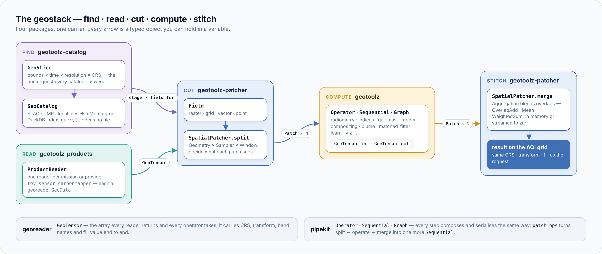
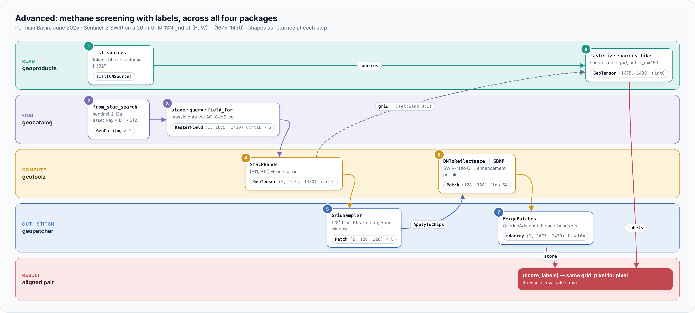

# How the packages interlock

> Each package works on its own; the seams between them are small, typed,
> first-class API — so a catalog query, a product reader, a patcher and an
> operator chain fit together without glue code.



Five packages, one job each. `geotoolz-cloud` sits underneath the others:
every read or write that touches a bucket goes through it.

| Step | Package | Hands the next step |
|---|---|---|
| **Find** — which files cover my area and dates? | `geocatalog` | a `GeoSlice` query result, staged local files |
| **Read** — open this mission's product | `geoproducts` | a georeader `GeoData` / `GeoTensor` |
| **Cut** — make model-sized pieces and put them back | `geopatcher` | `Patch`es, then a stitched `GeoTensor` |
| **Compute** — what do I do to each piece? | `geotoolz` | a `GeoTensor` with the input's georeferencing |
| **Store** — buckets, credentials, COGs | `geocloud` | pooled clients, files on disk, validated COGs |

## The seams

**1. `GeoSlice` — the catalog ↔ loader ↔ patcher request.**
A frozen `(bounds, interval, resolution, crs)` request for data. Catalogs
answer it, loaders read it, and opt-in
[exact grid alignment](catalog/design/exact-grid-alignment.md)
(`align=`, `count_steps`, `is_grid_aligned`) keeps slice shapes honest
across co-registered products.

**2. `geocatalog.patch.field_for` — catalog rows become patcher fields.**
`geocatalog.staging.stage` copies remote assets into a local cache (through
`geocloud.files`, the `geotoolz-catalog[cloud]` extra), and `field_for`
mosaics the rows onto a `GeoSlice` grid — in the slice CRS, across files in
any CRS — and wraps the result as one `geopatcher.RasterField`, so a query
drops straight into `SpatialPatcher.split` / `merge`
(`geotoolz-catalog[patch]`).

**3. `ProductReader` — every reader is a georeader `GeoData`.**
A `geoproducts` reader drops into `geopatcher.RasterField` or
`geoproducts.stack` without adapters. A geotoolz operator needs pixels, so
call `reader.load()` first. A sensor's presets bind
geotoolz operators to its band names (`geotoolz-products[operators]`).

**4. `geotoolz.patch_ops` — the patcher joins the operator graph.**
`GridSampler → ApplyToChips → MergePatches` (the same classes as
`geopatcher.integrations.pipekit`) puts tile → predict → stitch inside a
`Sequential`, and the label-aware `StratifiedSample` / `BalancedSampler`
emit the same `Patch` carrier for training draws. See
[Tile → operate → stitch](operators/patch_ops.md).

**5. Coregistration operators plug into matched patching.**
`geopatcher.matched.MatchedField` fans one anchor out across sources and
takes a coregistration callable per secondary — `geotoolz.geom.coregister`
operators (`RasterToRasterLike`, `RasterToPoints`, …). The catalog's
[matchup engine](catalog/design/query-matchup.md) finds the row pairs, the
patcher reads them, the operators align them.

**6. `geocloud` — one pool, one credential registry.**
`geocloud.store` owns the process-wide obstore client pool and
`geocloud.credentials` the per-bucket credentials, so the catalog's staging,
the patcher's `CogField`, the product readers' bucket helpers and
`geocloud.cog.write_cog` share connections and grants: register a bucket
once, then pass only URIs.

## All of them at once — methane screening with labels

A training-data and screening pass over the Permian Basin. Carbon Mapper
(**geoproducts**) supplies the known methane sources; the catalog
(**geocatalog**) finds the Sentinel-2 SWIR scenes; the patcher
(**geopatcher**) tiles them; a **geotoolz** SWIR-ratio retrieval runs per
tile; and the known sources are rasterized onto the very same grid as
labels. The output is an aligned `(score, labels)` pair, ready to
threshold, evaluate or train on.



```python
import numpy as np
import pandas as pd
import planetary_computer
import pyproj
import pystac_client
from georeader.geotensor import GeoTensor

import geocatalog as gc
import geopatcher as gp
import geotoolz as gz
from geoproducts import carbonmapper as cm
from geotoolz.patch_ops import ApplyToChips, GridSampler, MergePatches

bbox_lonlat: tuple[float, float, float, float] = (-104.2, 31.9, -103.9, 32.2)  # Delaware Basin
utm: str = "EPSG:32613"                                                         # UTM 13N, metres

# 1 · products — known oil & gas methane sources (Carbon Mapper, typed records)
config: cm.CarbonMapperConfig = cm.CarbonMapperConfig.load()   # ~/.geoproducts/auth_carbonmapper.json or env
token: str = config.get_token() or config.refresh_access_token()
sources: list[cm.CMSource] = cm.list_sources(token, bbox=bbox_lonlat, sectors=["1B2"])

# 2 · catalog — June 2025 Sentinel-2 SWIR bands on a 20 m UTM grid
aoi: gc.GeoSlice = gc.GeoSlice(
    bounds=pyproj.Transformer.from_crs("EPSG:4326", utm, always_xy=True).transform_bounds(*bbox_lonlat),
    interval=pd.Interval(pd.Timestamp("2025-06-01"), pd.Timestamp("2025-06-30"), closed="both"),
    resolution=(20.0, 20.0),                              # native SWIR → grid (H, W) = (1675, 1430)
    crs=utm,
)
client: pystac_client.Client = pystac_client.Client.open(
    "https://planetarycomputer.microsoft.com/api/stac/v1",
    modifier=planetary_computer.sign_inplace,
)
swir: dict[str, gp.RasterField] = {
    band: gc.patch.field_for(
        gc.staging.stage(
            gc.sources.from_stac_search(client, collections=["sentinel-2-l2a"], bounds=bbox_lonlat,
                                datetime="2025-06", asset_key=band),
            dest="./cache",
        ).query(aoi),
        aoi,
    )                                                    # (1, 1675, 1430) uint16 per band
    for band in ("B11", "B12")                           # SWIR-1 ≈ 1610 nm · SWIR-2 ≈ 2190 nm
}
scene: GeoTensor = gz.StackBands()([swir["B11"].reader, swir["B12"].reader])  # (2, 1675, 1430) uint16

# 3 · patcher + operators — SWIR-ratio methane score, tile by tile
patcher: gp.SpatialPatcher = gp.SpatialPatcher(
    geometry=gp.spatial.geometry.Rectangular(size=(128, 128), boundary="pad"),
    sampler=gp.spatial.sampler.RegularStride(step=(96, 96)),
    window=gp.spatial.window.Hann(),
    aggregation=gp.spatial.aggregation.OverlapAdd(),
)
enhancement: gz.Sequential = (
    gz.DNToReflectance(scale=1e-4)                       # (2, h, w) uint16 → float64 reflectance
    | gz.SBMP(swir1=0, swir2=1)                          # (2, h, w) → (h, w) CH4 enhancement score
)
field: gp.RasterField = gp.RasterField(scene)
screen: gz.Sequential = gz.Sequential([
    GridSampler(patcher=patcher),                        # field → list[Patch]       (2, 128, 128) each
    ApplyToChips(operator=enhancement),                  # list[Patch] → list[Patch] (128, 128) each
    MergePatches(aggregation=gp.spatial.aggregation.OverlapAdd(), domain=field.domain),
])
score: GeoTensor = screen(field)                        # (1675, 1430) float64, on the scene's grid

# 4 · products again — known sources rasterized onto the same grid as labels
labels: GeoTensor = cm.rasterize_sources_like(sources, score, buffer_m=150.0)  # (1675, 1430) uint8 {0, 1}

pair: tuple[np.ndarray, np.ndarray] = (np.asarray(score), np.asarray(labels))  # aligned pixel-for-pixel
```

Swap one stage at a time: a `MatchedFilter` instead of `SBMP`, or
`cm.list_plumes` instead of sources for event-level labels. Two swaps need
one more step each:

- **A DuckDB catalog for 10⁶+ scenes.** `stage` takes an in-memory catalog,
  so query the DuckDB catalog down to the AOI, then call `.materialize()`.
- **Continent-scale outputs.** `OverlapAdd(streaming=True)` writes to disk
  only with a `target_path` and `chunks`; see
  [streaming overlap-add](patcher/recipes/streaming-overlap-add.md).

## Next steps

- The [quickstart](index.md#quickstart-catalog-patcher-operators) runs the
  catalog → patcher → operators flow on Sentinel-2 over Lake Tahoe.
- Each package's Overview page covers its own step in depth.
