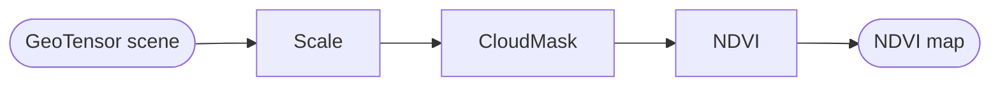
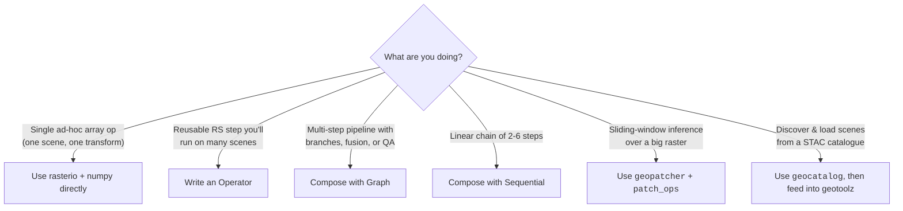
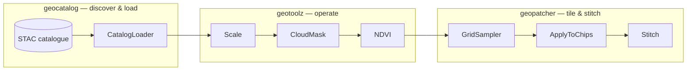

# geotoolz

> Composable operators for remote sensing — small typed functions you
> compose into linear chains or named DAGs, running on `GeoTensor`s.

!!! tip "This site covers the whole geostack"
    This is the documentation for the **geotoolz monorepo** — three
    packages designed as one stack. This page introduces the operator
    library; the [Patcher](patcher/index.md) and
    [Catalog](catalog/index.md) sections cover the other two, and
    [The geostack](geostack.md) shows how they interlock end to end.

`geotoolz` is built around one idea: **every step of a remote-sensing
pipeline is an `Operator`** — a typed function from one carrier to
another — and pipelines are just compositions of those operators. The
composition core (`Operator`, `Sequential`, `Graph`, `Branch`, `Switch`,
…) lives in the carrier-agnostic [`pipekit`](https://github.com/jejjohnson/pipekit)
framework. `geotoolz` adds the RS-specific operator families on top.



## Is this the right tool?



If you find yourself wanting to (a) reuse the same RS step across
scripts, (b) round-trip a pipeline to YAML, (c) compose branching /
fan-in flows, or (d) plug into a tiled-inference setup — `geotoolz` is
the right shape.

## Mental model

Every operator is a typed function from inputs to outputs. The contract
is small enough to fit in two methods:

```python
from pipekit import Operator

class MyOp(Operator):
    def __init__(self, *, knob: float) -> None:
        self.knob = knob

    def _apply(self, gt):          # the work
        return gt * self.knob

    def get_config(self):           # JSON-serialisable args
        return {"knob": self.knob}
```

Pipelines compose:

- **`Sequential([a, b, c])`** threads output → input down a linear list.
- **`Graph(inputs=..., outputs=...)`** builds a named DAG by calling
  operators on `Input` placeholders. Use it when you need branching,
  fan-in, or multi-output flows.
- **`Branch(predicate, if_true, if_false)`** and **`Switch(key, cases)`**
  are explicit control-flow operators that round-trip the same as any
  transform.

A `Graph` is itself an `Operator`, so you can nest them inside a
`Sequential` and vice-versa.

## A two-operator pipeline

```python
import geotoolz as gz
from geotoolz import Operator, Sequential


class Scale(Operator):
    def __init__(self, *, scale: float = 1e-4) -> None:
        self.scale = scale

    def _apply(self, gt):
        return gt.array_as_geotensor(gt.values * self.scale)

    def get_config(self):
        return {"scale": self.scale}


class NDVI(Operator):
    def __init__(self, *, nir_idx: int, red_idx: int, eps: float = 1e-10) -> None:
        self.nir_idx, self.red_idx, self.eps = nir_idx, red_idx, eps

    def _apply(self, gt):
        a = gt.values
        nir, red = a[self.nir_idx], a[self.red_idx]
        return gt.array_as_geotensor((nir - red) / (nir + red + self.eps))

    def get_config(self):
        return {"nir_idx": self.nir_idx, "red_idx": self.red_idx, "eps": self.eps}


pipe = Sequential([Scale(scale=1e-4), NDVI(nir_idx=7, red_idx=3)])
ndvi = pipe(sentinel2_geotensor)
```

For the same shape with real data and a matplotlib plot at the end, see
the [Quickstart](quickstart.md) or the [operator-composition
notebook](notebooks/operators_lake_tahoe.ipynb).

## Where geotoolz fits



- **[`geocatalog`](https://github.com/jejjohnson/geotoolz/tree/main/packages/geotoolz-catalog)** discovers
  and loads scenes from STAC.
- **`geotoolz`** runs the per-scene transforms.
- **[`geopatcher`](https://github.com/jejjohnson/geotoolz/tree/main/packages/geotoolz-patcher)** handles
  sliding-window patching for big rasters, exposed as Operator wrappers
  in [`geotoolz.patch_ops`](api/core.md) (`GridSampler`, `ApplyToChips`,
  `Stitch`) so a tiled-inference pipeline composes inside a `Sequential`.

The full multi-repo walk-through lives in **the canonical Lake Tahoe
notebook**:
[`geocatalog/docs/notebooks/end_to_end_lake_tahoe.ipynb`](https://github.com/jejjohnson/geotoolz/tree/main/packages/geotoolz-catalog/blob/main/docs/notebooks/end_to_end_lake_tahoe.ipynb).
The slice of that flow that's about *composition of operators* is
[`docs/notebooks/operators_lake_tahoe.ipynb`](notebooks/operators_lake_tahoe.ipynb)
in this repo.

## Pre-alpha status

`geotoolz` is `0.0.x`. The composition core has stabilised; the domain
operator surface (radiometry, indices, cloud, compositing, segmentation,
…) is landing module-by-module. Several submodules are partially
implemented — check the source under `src/geotoolz/<module>/_src/` if
you need to know what works today. Demos and recipes in these docs
deliberately favour **inline `Operator` subclasses** over named imports,
so they keep teaching the composition pattern even as the named-op surface
churns.

## Where next

- **[Quickstart](quickstart.md)** — a 15-minute walk-through over one
  Sentinel-2 Lake Tahoe scene.
- **[Concepts](concepts.md)** — the composition algebra, with diagrams.
- **Recipes**:
  - [Define an operator](recipes/define-an-operator.md)
  - [Branching pipelines](recipes/branching-pipelines.md)
  - [Integration with geocatalog & geopatcher](recipes/integration-with-geocatalog-and-geopatcher.md)
- **Tutorial**: [Composing a Sentinel-2 NDVI pipeline](notebooks/operators_lake_tahoe.ipynb) — the docs' canonical worked example.
- **Extended examples ↗**: chronological walkthroughs of the whole stack — composition core, pipeline idioms, image processing on real burn-scars, ML patches, deployment shapes — live in [`research_notebook/projects/geostack`](https://github.com/jejjohnson/research_notebook/tree/main/projects/geostack). The notebooks there execute against real MPC / GBIF / Natural Earth data; this repo's docs reference them by name.
- **Reference**: [Core API](api/core.md) · [Changelog](https://github.com/jejjohnson/geotoolz/blob/main/CHANGELOG.md) · [GitHub](https://github.com/jejjohnson/geotoolz)

Related: [Normalization](normalization.md) · [Multi-format readers](io.md) · [Sensor readers](readers.md).
