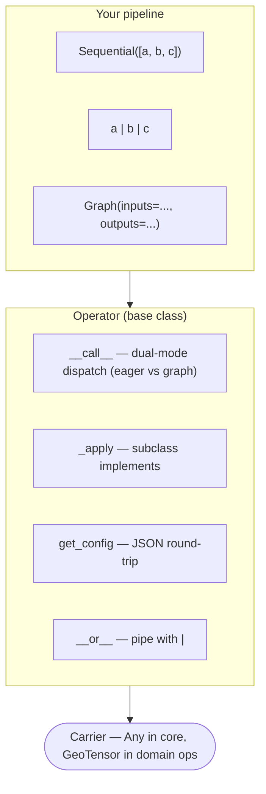
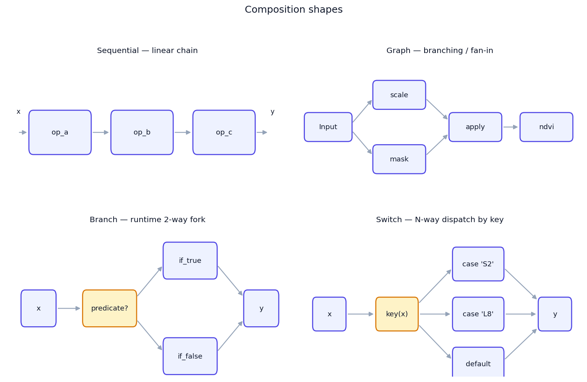
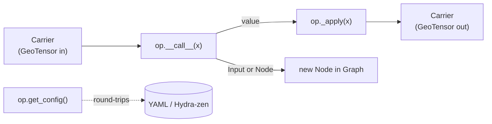
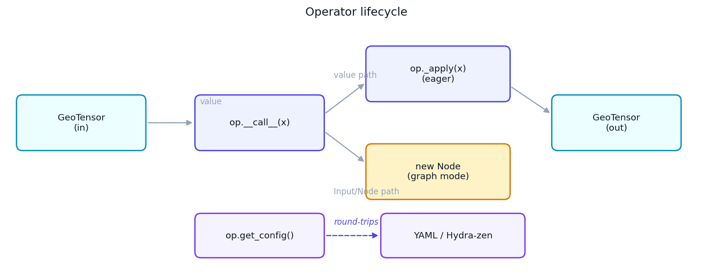
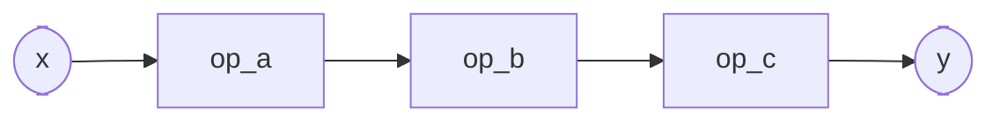
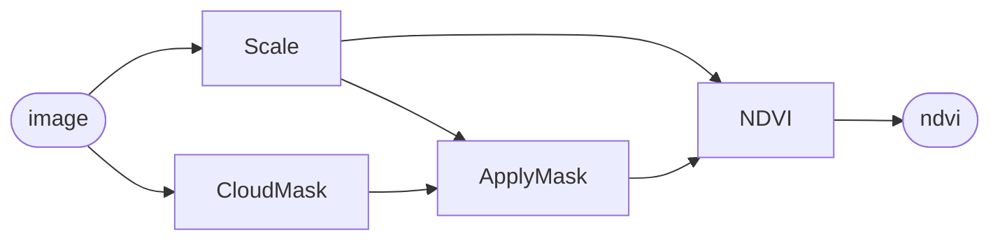
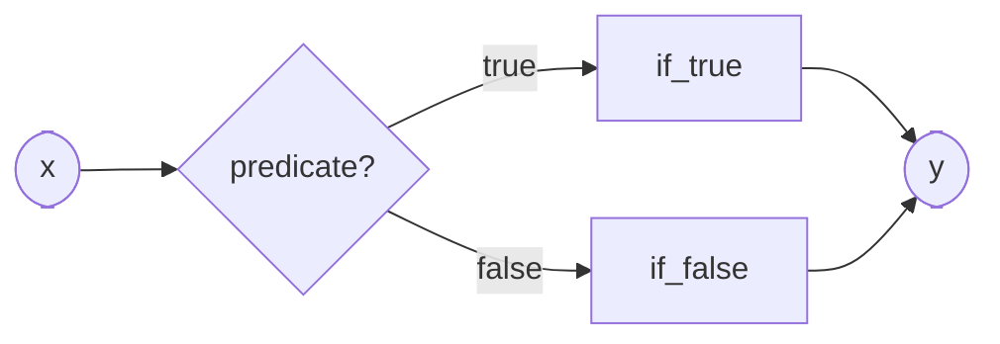
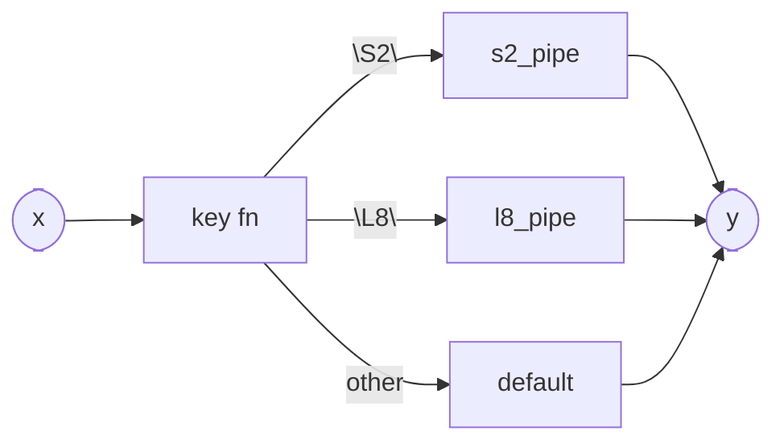
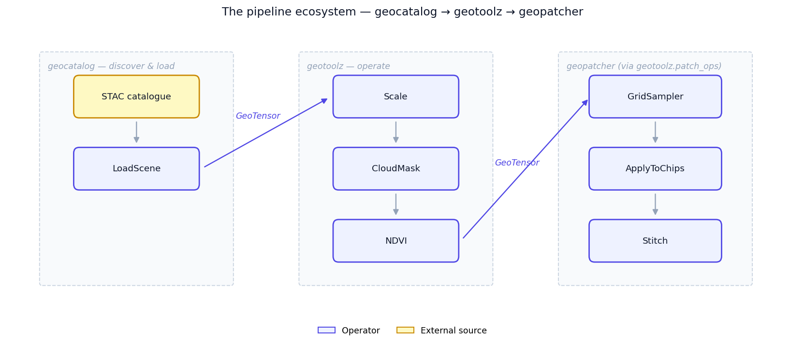
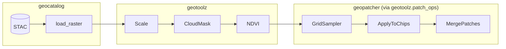

# Concepts

This page is the *why* — the composition algebra behind `geotoolz`,
why each primitive looks the way it does, and when to reach for which
one. For a real-data walk-through, see the [Quickstart](quickstart.md);
for a hands-on tour against scalars (no GIS setup), see the
[composition core notebook][notebook] in the research_notebook
geostack project.

[notebook]: https://github.com/jejjohnson/research_notebook/blob/main/projects/geostack/notebooks/01_composition_core.ipynb

## The model in one diagram



The composition core is **carrier-agnostic**. The same algebra runs on
`GeoTensor`s in production and on scalars or ndarrays in tests. Domain
operators (`NDVI`, `MaskClouds`, …) narrow to `GeoTensor` at their own
signatures; the core stays generic.

{ loading=lazy }

## What an `Operator` is

An `Operator` is a thing you call. Subclasses implement `_apply`; the
base class handles two responsibilities for free:

1. **Dual-mode `__call__`** — passing a value runs `_apply` eagerly;
   passing an `Input` / `Node` records a `Node` in a `Graph`. One
   method, two behaviours, dispatched on argument type.
2. **Config round-trip** — `get_config()` returns a JSON-serialisable
   dict of constructor args. Powers `__repr__`, pickling sanity, and
   the optional Hydra-zen integration.

### Lifecycle



{ loading=lazy }

### Typed I/O contract

Operators don't *require* Pydantic models, but they pair well with one
when you want the constructor contract spelled out and validated. The
pattern keeps the keyword-only constructor and stores the validated
values under the argument names, so `get_config()` is still derived
automatically:

```python
import numpy as np
from pydantic import BaseModel
from pipekit import Operator
from geotoolz.carrier import wrap_like


class ScaleConfig(BaseModel):
    scale: float = 1e-4
    clip: tuple[float, float] | None = None


class Scale(Operator):
    """Multiply DN by a scale factor, optionally clipping the output."""

    def __init__(self, *, scale: float = 1e-4, clip: tuple[float, float] | None = None) -> None:
        cfg = ScaleConfig(scale=scale, clip=clip)
        self.scale, self.clip = cfg.scale, cfg.clip

    def _apply(self, gt):
        out = np.asarray(gt, dtype=np.float32) * self.scale
        if self.clip is not None:
            out = out.clip(*self.clip)
        return wrap_like(gt, out)
```

`ScaleConfig` validates the constructor args (one-shot, at `__init__`
time); `get_config()` round-trips them losslessly. Inputs and outputs
remain `GeoTensor`s — the typed model lives at the *config* boundary,
not at the carrier boundary.

## `Sequential` — linear composition



`Sequential` threads the output of each operator into the next:

```python
from pipekit import Sequential

pipe = Sequential([Add(1), Add(10), Add(100)])
pipe(0)             # 111
```

Equivalent with the `|` pipe operator:

```python
pipe = Add(1) | Add(10) | Add(100)
```

`|` **flattens** nested `Sequential`s — `a | (b | c)` and `(a | b) | c`
both yield a single three-element `Sequential`. No nested wrappers, no
surprises.

**Reach for `Sequential` when** the pipeline is a single chain: load →
clean → transform → write. Most RS pipelines are this shape.

## `Graph` — symbolic multi-input / multi-output



When your pipeline has branches, fan-out, or multiple inputs,
`Sequential` isn't enough. `Graph` builds a DAG by *calling operators on
placeholders*:

```python
import geotoolz as gz

img = gz.Input("image")

scaled = Scale(scale=1e-4)(img)
mask = CloudMask()(img)
clean = ApplyMask()(scaled, mask)
ndvi = NDVI(nir=7, red=3)(clean)

g = gz.Graph(inputs={"image": img}, outputs={"ndvi": ndvi})
result = g(image=img_gt)                   # {"ndvi": GeoTensor}
```

`Graph` topologically sorts the nodes, evaluates each exactly once, and
returns a dict keyed by output name. Cycle detection and
unreachable-input detection happen at construction time, not at `_apply`
time.

A `Graph` is itself an `Operator`, so it composes — drop one inside a
`Sequential`, or wrap one in `Fanout`.

**Reach for `Graph` when** you need named intermediates, multiple
inputs, multiple outputs, or fan-in (RMSE between a prediction and a
reference, multi-temporal fusion, …).

## Multi-input operators — carriers are positional

An operator that combines several carriers takes **every carrier as a
positional `_apply` argument**; constructor kwargs hold only scalars and
configuration (thresholds, band references, nested operators). That one
convention is what lets a `Graph` wire the carriers in, because a graph
passes its parent nodes positionally:

| Kind | Signature | Call | In a `Graph` |
|---|---|---|---|
| Two carriers | `_apply(self, gt, other, ...)` | `IMEEstimate(wind_speed=3.5)(kg_m2, plume_mask)` | `IMEEstimate(wind_speed=3.5)(Input("enh"), Input("mask"))` |
| Optional second carrier | `_apply(self, gt, other=None)` | `SBMP()(scene, reference_scene)` / `SBMP()(scene)` | `SBMP()(Input("scene"), Input("ref"))` |
| N-ary reducer | `_apply(self, *frames)` | `CombineMasks()(m1, m2)` or `CombineMasks()([m1, m2])` | `CombineMasks()(Input("a"), Input("b"))` |

- **Two-carrier operators** — `plume.IMEEstimate(enh, plume_mask)`,
  `plume.CrossSectionalFlux(enh, plume_mask)`,
  `plume.PlumeFootprint(mask, enhancement=None)`,
  `plume.SBMP(scene, reference_scene=None)`,
  `plume.PlumeColumnStats(labels, column)`,
  `plume.PlumeQNDFeatures(labels, column, albedo=None)`,
  `measure.RegionProps(labels, intensity_image=None)`,
  `mask.ApplyMask(gt, mask)`, `mask.AltitudeMask(scene, dem)`,
  `mask.SlopeMask(scene, dem)`, `segment.SLIC` / `Felzenszwalb` /
  `Quickshift(image, mask=None)`, `segment.Watershed(image, markers=None,
  mask=None)`, `segment.RandomWalker(image, markers)`,
  `segment.MarkBoundaries(image, label_img)`,
  `geom.PhaseAlign` / `OpticalFlowTVL1` / `OpticalFlowILK(moving,
  reference)`, `indices.dNBR(pre, post)`, `viz.Overlay(background,
  foreground)` and the `geom.coregister` operators (`RasterToRasterLike(src,
  like)`, …). The primary carrier — the one the output is wrapped like —
  always comes first.
- **N-ary reducers** take any number of positional carriers, or one list /
  tuple of them: `mask.CombineMasks`, `augment.CutMix(gt, *pool)`, the
  `compositing` composites (`MedianComposite` / `MaxNDVIComposite` also
  take one `(T, C, H, W)` stack; `CloudFreeComposite` / `MinCloudComposite`
  / `BAPComposite` take `(frame, mask_or_metadata)` pairs),
  `StackMatched` and `BlendMatched` (which also take one `Mapping`;
  `BlendMatched(method="ivw")` takes `(tensor, variance)` pairs).
- **Grid check.** The carriers are combined pixel by pixel, so every
  multi-input operator checks them with `grid_matches` (see
  [Georeferencing checks](#georeferencing-checks)) and raises a
  `ValueError` naming the operator and both grids. A 20 m mask handed to
  `IMEEstimate` with a 10 m enhancement is an error, not a silently wrong
  `ime_kg`.
- **Mask / reference operators stay configuration.** `ApplyMask(mask=op)`
  still takes a mask-*producing* operator (e.g. `BBoxMask`) that runs on
  the input; mask *carriers* are passed at call time.
- **Target-grid templates are the exception.** `geom.ReprojectLike` /
  `ResampleLike` / `RasterizeLike(like=...)`, `geom.Georeference(glt=...)`
  and `normalize.HistogramMatch(reference=...)` pin a grid template or a
  reference distribution rather than a second pixel-aligned carrier; use
  `geom.coregister.RasterToRasterLike()(src, like)` when the target grid is
  itself a graph input.

The old constructor kwargs (`IMEEstimate(plume_mask=...)`,
`SlopeMask(dem=...)`, `CutMix(pool=...)`, `BlendMatched(...)(tensors,
variances)`, …) were removed outright (#141); passing one raises
`TypeError`.

## `Branch` — runtime conditional



```python
gz.Branch(
    predicate=lambda gt: gt.crs.is_geographic,
    if_true=ReprojectToUTM(),
    if_false=gz.Identity(),
)
```

**Reach for `Branch` when** the *whole pipeline* needs a two-way fork
based on a runtime predicate. For per-pixel masking, use `ApplyMask` /
`Where` instead — branches dispatch on the carrier, not on each pixel.

## `Switch` — multi-way dispatch



```python
gz.Switch(
    key=lambda gt: gt.attrs["platform"],
    cases={"S2": s2_pipeline, "L8": l8_pipeline},
    default=gz.Identity(),
)
```

**Reach for `Switch` when** you have a finite, named set of pipelines
keyed off a scene attribute (sensor, product level, season).

## Sequential vs Graph vs Branch/Switch — at a glance

| You want… | Reach for | Notes |
|---|---|---|
| 2–6 steps, single chain | `Sequential` or `op_a \| op_b` | Most pipelines. |
| Named intermediates, branches, fan-in | `Graph` | Use `Input` placeholders. |
| Two-way runtime fork on the carrier | `Branch` | Predicate operates on the whole carrier. |
| N-way dispatch keyed off an attribute | `Switch` | Cases are operators, key is a callable. |
| One-input → many named outputs | `Fanout` | Sugar over a single-input `Graph`. |
| Side-effect that keeps the carrier flowing | `Sink` | Composes; unlike a terminal write. |

## Lazy vs eager execution

`geotoolz`'s composition core is **eager by default**. Every `__call__`
on a value runs `_apply` immediately and returns the next carrier. There
is no deferred graph being built up behind the scenes when you call an
operator on a `GeoTensor`.

The one exception: passing an `Input` or `Node` instead of a value puts
the operator in **graph mode**, where it records a `Node` instead of
executing. That's how `Graph` is built. Once you call the constructed
`Graph` on real inputs, the whole graph evaluates eagerly.

Lazy execution over chunked arrays (Dask-style) isn't in the algebra —
if you need it, wrap a `dask.array` inside the carrier and let the
underlying compute layer handle laziness. The Operator boundary stays
eager.

## Where geotoolz slots into the ecosystem

{ loading=lazy }



- **[`geocatalog`](https://github.com/jejjohnson/geotoolz/tree/main/packages/geotoolz-catalog)** sits
  upstream — it discovers and loads scenes from STAC into `GeoTensor`s.
- **`geotoolz`** consumes those `GeoTensor`s and runs per-scene
  transforms.
- **[`geopatcher`](https://github.com/jejjohnson/geotoolz/tree/main/packages/geotoolz-patcher)** handles
  sliding-window patching for big rasters. `geotoolz.patch_ops` wraps
  its `GridSampler`, `ApplyToChips`, and `MergePatches` so a tiled-inference
  flow composes inside a `Sequential` like any other operator.

For the end-to-end multi-repo walk-through (catalog → patch → operate),
see the canonical Lake Tahoe notebook:
[`docs/catalog/notebooks/end_to_end_lake_tahoe.ipynb`](https://github.com/jejjohnson/geotoolz/blob/main/docs/catalog/notebooks/end_to_end_lake_tahoe.ipynb).

## The idiom library

Beyond the bare composition primitives, the core ships a small library
of "operators you reach for constantly" — observers, control flow, and
tiny building blocks. The idea: **the `Operator` interface is general
enough to express things that aren't transforms** — side effects,
branching, defaults, escape hatches all become first-class composable
units that round-trip the same as any transform.

### Observers (identity-with-side-effect)

| Operator | What it does |
|---|---|
| `Tap` | Calls `fn(gt)` and passes input through unchanged. |
| `Snapshot` | Capture-by-name; intermediates available as `snap[key]` after the pipeline runs. |
| `ShapeTrace` | Prints `shape`, `dtype`, `crs` at each step. `mode="diff_only"` skips redundant lines. |

### Control flow

| Operator | What it does |
|---|---|
| `Branch` | `if predicate(x): if_true(x) else if_false(x)`. |
| `Switch` | Multi-way dispatch on `key(x)`. |
| `Fanout` | One input → dict of outputs. Sugar over a single-input `Graph`. |

### Building blocks

| Operator | What it does |
|---|---|
| `Identity` | Explicit no-op. Use in `Branch.if_false`, anywhere a slot needs an `Operator`. |
| `Const` | Return a fixed value regardless of input. |
| `Lambda` | Inline-callable escape hatch (won't YAML-round-trip). |
| `Sink` | Side-effect terminal write that *returns the input*. Composes. |

## Two small disciplines

### Round-trip discipline (`forbid_in_yaml`)

Operators that hold runtime closures (`Tap`, `Lambda`, `Branch`,
`Switch`, `Sink`, `ModelOp`) carry `forbid_in_yaml = True`. Their
`get_config()` is a debug repr, not a faithful YAML round-trip. Use
them freely in code; if you need a fully reproducible YAML artifact,
avoid closures.

### Terminal-operator validation (`_terminal`)

Some operators legitimately return `None` (e.g. a write to disk). Mark
them with `_terminal = True`; `Sequential` then rejects them in any
position except the last:

```python
from georeader.save import save_cog


class SaveCOG(Operator):
    _terminal = True

    def __init__(self, *, path: str) -> None:
        self.path = path

    def _apply(self, gt):
        save_cog(gt, self.path)        # returns None

Sequential([SaveCOG(path="/a.tif"), Scale()])  # TypeError
Sequential([Scale(), SaveCOG(path="/a.tif")])  # ok
```

The built-in writers (`gz.WriteGeoTIFF`, `gz.WriteCOG`, `gz.WriteZarr`)
are terminal the same way. `Sink` is **not** terminal — it does a side
effect *and* returns the input. That's why `Sink` composes mid-chain and
`SaveCOG` doesn't.

## Fitted operators (`fit` / `transform`)

Some operators learn state from data: the `normalize` scalers
(`StandardScaler`, `RobustScaler`, `MinMaxScaler`),
`matched_filter.MatchedFilter`, `restore.MNF` and `learn.SklearnOp`
(with its `Pixelwise*` wrappers). They share one contract (decision
record for [#143](https://github.com/jejjohnson/geotoolz/issues/143)):

| Method | Does |
|---|---|
| `fit(x) -> self` | Learns the state from `x` into trailing-underscore attributes (`mean_`, `std_`, `cov_op_`, `state_`, …) and returns the operator. |
| `transform(x)` | Applies the learned (or constructor-supplied) state. Never fits, never mutates the operator; raises `ValueError` when nothing is fitted. |
| `inverse(x)` | Undoes `transform` where that is meaningful (the scalers, `MNF`). |
| `op(x)` / `_apply` | Calls `transform`, after fitting on the first call when the operator is configured to learn on call. |

Every one of them satisfies `pipekit.protocols.FittableTransformer`
(`SklearnOp` also satisfies `Predictor`), so pipekit's split-object
tooling treats them like a scikit-learn transformer:

```python
scaler = gz.normalize.StandardScaler().fit(train_scene)
normed = scaler(scene)                 # == scaler.transform(scene)
restored = scaler.inverse(normed)

mnf = gz.restore.MNF(n_components=3).fit(scene)
denoised = mnf.inverse(mnf(scene))     # classical MNF noise filter
```

**Fitted state is never configuration.** `get_config()` mirrors the
constructor, and fitted attributes are not constructor parameters, so a
statistic learned on call never lands in `get_config()` / `op.state` (the
effect `__config_exclude__` gives auto-derived configs; these operators
curate their config). To persist a fit, feed it back as constructor
arguments — `StandardScaler(mean=s.mean_, std=s.std_)` round-trips
through YAML — or, for `SklearnOp`, use `save_state` / `state_path=`.

**Learning on call.** `fit_on_call=True` (scalers), an unset
`mean` / `cov_op` (`MatchedFilter`), an unfitted `MNF` and
`SklearnOp(fit_mode="fit_on_call")` fit on the **first** call and reuse
that state for every later call. `MatchedFilter(fit_on_call=True)` is
the per-scene exception: it estimates the background from each cube
locally and stores nothing.

**Thread safety.** `transform` is read-only, so a fitted operator can
be shared freely across `pipekit.ThreadMap` workers. A first-call fit
runs under a per-instance lock with a double-checked "is it fitted?"
test: concurrent first calls fit exactly once and every call sees the
fully published state, never a half-written one. *Which* item that fit
sees is whichever call takes the lock first, so **call `fit(x)` before
parallel use** whenever the result must be deterministic. `SklearnOp`'s
history-dependent modes (`refit`, `fit_streaming`, `fit_only`, and
`task="fit_predict"`) mutate the estimator on every call; each call's
fit + apply is atomic under the lock, which serialises those calls
rather than racing them. The lock pickles (and deep-copies) to a fresh
one, so the operators still work under `ProcessMap` — each process
then fits its own copy, another reason to fit up front.

**Pre-fitted models.** `learn.ModelOp` wraps an already-trained model and
never fits. It checks the model's shape at construction —
`method="predict"` requires a `pipekit.protocols.Predictor`, the default
`method="__call__"` a callable — and returns the model's output as-is,
without rewrapping it into the input carrier.

## Georeferencing checks

Every operator family uses the same helpers from `geotoolz.carrier`:

- **Geo-dependent operators** (reprojection, rasterisation, metre-based
  measurements, …) reject a plain array with one message:
  `"<Op> requires a georeferenced GeoTensor input; got a plain array (ndarray)."`
- **Multi-input operators** (see
  [Multi-input operators](#multi-input-operators-carriers-are-positional):
  `dNBR`, the compositors, `StackMatched`, `BlendMatched`, DEM-driven
  masks, the plume quantifiers, …) require the inputs to be on the same
  grid (`require_grid_match`, an error naming the operator): equal spatial shape `(H, W)` and — when both inputs are
  georeferenced — equal CRS and an **exactly** equal affine transform.
  Sub-pixel drift is a real bug source, so there is no default tolerance.
  Per-pixel reductions over a stack (the `compositing` operators) also
  require the full shape, band axis included, to match. Plain arrays
  carry no georeferencing, so for them only the shape is compared.

## Band names

Every operator that takes a band reference (`indices.NDVI(red="B04")`,
`spectral.SelectBands`, `viz.Composite`/`TrueColor`, `qa.MaskClouds(qa_band=...)`,
`augment.BandJitter`, `compositing`, `plume.SBMP`, …) resolves it with the one
shared resolver, `geotoolz.carrier.resolve_band`, so `"B04"` means the same
band in every family:

- **Integers** (any integral type, `np.int64` included) are band-axis positions
  and pass through unchanged, on GeoTensors and plain arrays alike.
- **Strings** are looked up in the carrier's `attrs` under these keys, **in this
  order**: `band_names` → `descriptions` → `bands`. The first key whose names
  contain the requested band wins; a key that lacks it hands over to the next.
  A key may hold a sequence of names (position = band index) or a
  `{name: index}` mapping.
- geotoolz readers and operators write **only** `band_names`; `descriptions`
  (rasterio) and `bands` are read for compatibility with other producers.
- A string reference on a plain `np.ndarray` raises `TypeError` (there is no
  metadata to resolve it against); a name missing from a GeoTensor's `attrs`
  raises `ValueError`. The single documented exception is `plume.SBMP`, which
  maps its `"B11"`/`"B12"` defaults onto the Sentinel-2 L2A order for a plain
  12-band array only (`SENTINEL2_L2A_BANDS`).

## Mask polarity

*Decision record (#154).* Every masking mask — produced by
`geotoolz.qa` / `geotoolz.mask` or consumed by `ApplyMask` — uses one
polarity: **`True` = masked out (drop the pixel)**. (Detection outputs
such as segmentation or plume masks mark the detected feature; feed them
to `ApplyMask` directly to drop it, or through `InvertMask` to keep it.)

- **Producers.** `geotoolz.qa` (`MaskClouds`, `MaskNoData`, `MaskInvalid`,
  `MaskSaturated`, the sensor presets), `restore.OutlierMask`, and every
  geometry / DEM mask in `geotoolz.mask` (`PolygonMask`, `BBoxMask`,
  `DistanceMask`, `LandMask`, `OceanMask`, `CountryMask`, `AltitudeMask`,
  `SlopeMask`, and the `altitude_mask` / `slope_mask` / `distance_mask`
  primitives) return `True` where the pixel should be dropped.
- **Region masks choose a side with `keep=`.** Geometry and DEM masks
  describe a region (a polygon, an elevation or slope interval, a
  distance zone) and take `keep="inside"` (default) or `keep="outside"`
  — the side that survives. With the default, the mask is `True`
  *outside* the region, so `ApplyMask(mask=BBoxMask(bounds=aoi))` keeps
  the AOI and `ApplyMask(mask=LandMask())` keeps land.
- **Consumers.** `ApplyMask` / `apply_mask` fill where the mask is
  `True`; `CombineMasks(op="or")` drops a pixel any input drops. There is
  no `invert=` switch on the consumers: a keep-polarity mask from
  elsewhere (e.g. georeader's `validmask()`) is flipped explicitly with
  `InvertMask` / `invert_mask`.
- **Invalid pixels.** `qa.MaskInvalid` is georeader's `invalidmask()`
  reduced over bands with the package's nodata rule (a `NaN` fill matches
  `NaN`; non-finite values are invalid; see `geotoolz.carrier`).
- **Morphology is polarity-neutral.** `DilateMask`, `BufferMask`,
  `RemoveSmallObjects`, … grow / shrink / clean the `True` pixels,
  whatever they mean.

*Why:* `apply_mask`, all of `qa` and every consumer already assumed
`True` = drop; the geometry masks were the odd ones out, which made
`ApplyMask(mask=BBoxMask(...))` delete the AOI and let
`CombineMasks("or")` silently mix polarities. A single polarity with a
named side (`keep=`) removes the need for `invert=` flags at every
consumer.

## Related pages

- [Quickstart](quickstart.md) — 15-min real-data walk-through.
- [Recipes](how-to/define-an-operator.md) — short focused how-tos.
- [Normalization](normalization.md), [Multi-format readers](io.md),
  [Product readers](../products/product-readers.md) — module-specific deep-dives.
- [Core API reference](api/core.md).

## Extended examples

The chronological walk-through that exercises every primitive on this
page — `Operator` / `Sequential` / `Graph` / `Branch` / `Switch` /
`Tap` / `Snapshot` / `ShapeTrace` / `Profile` / `AssertShape` —
against plain scalars first, then real Sentinel-2 over Lake Tahoe,
lives in
[`research_notebook/projects/geostack`](https://github.com/jejjohnson/research_notebook/tree/main/projects/geostack):

- [`01_composition_core`](https://github.com/jejjohnson/research_notebook/blob/main/projects/geostack/notebooks/01_composition_core.ipynb) — every primitive against scalars.
- [`02_pipeline_idioms`](https://github.com/jejjohnson/research_notebook/blob/main/projects/geostack/notebooks/02_pipeline_idioms.ipynb) — recipe gallery (Tap / Snapshot / Profile / Histogram / Try / Retry / Cache / Quarantine / Assert*).
- [`07_deployment_shapes`](https://github.com/jejjohnson/research_notebook/blob/main/projects/geostack/notebooks/07_deployment_shapes.ipynb) — 13 deployment patterns (notebook, ETL, FastAPI, tile server, orchestrator, …).
