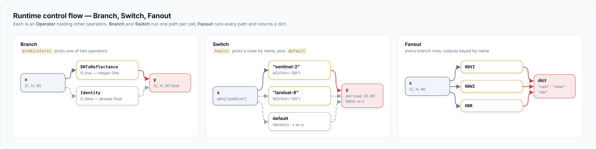

# Branching pipelines

Branch a pipeline when one chain is not enough: two scenes in, several
products out, a fork on the input's type, or one recipe per sensor. Which
shape to pick is in [Concepts](../concepts.md#choose-a-composition-shape);
this page builds each one.



## Combine two scenes in a Graph

A `Graph` takes several `Input`s and wires them into multi-input
operators. Here pre- and post-fire scenes meet at `dNBR`, and a threshold
on the result marks the burn scar.

```python
import numpy as np
from georeader.geotensor import GeoTensor
from rasterio.transform import from_origin

import geotoolz as gz

rng: np.random.Generator = np.random.default_rng(0)
grid: dict = {"transform": from_origin(750_000, 4_350_000, 10, 10), "crs": "EPSG:32610"}
names: dict = {"band_names": ["B4", "B8", "B12"]}
pre: GeoTensor = GeoTensor(rng.uniform(0.05, 0.4, (3, 32, 32)), **grid, fill_value_default=np.nan, attrs=names)   # (3, 32, 32) float64
post: GeoTensor = GeoTensor(rng.uniform(0.05, 0.4, (3, 32, 32)), **grid, fill_value_default=np.nan, attrs=names)  # (3, 32, 32) float64

before: gz.Input = gz.Input("pre")
after: gz.Input = gz.Input("post")
nbr_pre: gz.Node = gz.NBR(nir="B8", swir2="B12")(before)       # (3, H, W) → (H, W) float64
nbr_post: gz.Node = gz.NBR(nir="B8", swir2="B12")(after)       # (3, H, W) → (H, W) float64
dnbr: gz.Node = gz.dNBR()(nbr_pre, nbr_post)                   # (H, W), (H, W) → (H, W) float64
burn: gz.Node = gz.Threshold(threshold=0.27)(dnbr)             # (H, W) float64 → (H, W) bool

graph: gz.Graph = gz.Graph(inputs={"pre": before, "post": after}, outputs={"dnbr": dnbr, "burn": burn})
out: dict[str, GeoTensor] = graph(pre=pre, post=post)          # {"dnbr": (32, 32) float64, "burn": (32, 32) bool}
```

The graph checks for cycles and unreachable inputs when you build it.
Each node runs once, even when several nodes read it. `dNBR` checks that
both inputs share one pixel grid.

## Fork on the input with Branch

`Branch(predicate, if_true, if_false)` picks one of two operators per
call. Here digital numbers are scaled to reflectance, and an input that
is already reflectance passes through.

```python
import numpy as np

import geotoolz as gz

to_reflectance: gz.Branch = gz.Branch(
    predicate=lambda x: np.issubdtype(np.asarray(x).dtype, np.integer),
    if_true=gz.DNToReflectance(scale=1e-4),
    if_false=gz.Identity(),
)
pipeline: gz.Sequential = to_reflectance | gz.NDVI(red=0, nir=1)

rng: np.random.Generator = np.random.default_rng(0)
dn: np.ndarray = rng.integers(200, 4000, size=(2, 16, 16), dtype=np.uint16)  # (2, 16, 16) uint16
refl: np.ndarray = dn * 1e-4                                                # (2, 16, 16) float64
a: np.ndarray = pipeline(dn)                                                # (2, 16, 16) uint16 → (16, 16) float64
b: np.ndarray = pipeline(refl)                                              # (2, 16, 16) float64 → (16, 16) float64
assert np.allclose(a, b)
```

The predicate sees the whole carrier, not each pixel. For per-pixel
choices, build a mask and use `gz.ApplyMask`.

## Dispatch by sensor with Switch

`Switch(key, cases, default)` picks a pipeline by name. Here the band
that holds near-infrared depends on the platform written in `attrs`.

```python
import numpy as np
from georeader.geotensor import GeoTensor
from rasterio.transform import from_origin

import geotoolz as gz

ndvi_by_sensor: gz.Switch = gz.Switch(
    key=lambda gt: gt.attrs["platform"],
    cases={
        "sentinel-2": gz.NDVI(red="B4", nir="B8"),
        "landsat-8": gz.NDVI(red="B4", nir="B5"),
    },
)

rng: np.random.Generator = np.random.default_rng(0)
grid: dict = {"transform": from_origin(750_000, 4_350_000, 30, 30), "crs": "EPSG:32610", "fill_value_default": np.nan}
s2: GeoTensor = GeoTensor(rng.random((2, 16, 16)), **grid, attrs={"platform": "sentinel-2", "band_names": ["B4", "B8"]})  # (2, 16, 16) float64
l8: GeoTensor = GeoTensor(rng.random((2, 16, 16)), **grid, attrs={"platform": "landsat-8", "band_names": ["B4", "B5"]})   # (2, 16, 16) float64

ndvi_s2: GeoTensor = ndvi_by_sensor(s2)                       # (2, 16, 16) float64 → (16, 16) float64
ndvi_l8: GeoTensor = ndvi_by_sensor(l8)                       # (2, 16, 16) float64 → (16, 16) float64
```

An unknown key runs `default`, which is `Identity()` when omitted. Pass
an operator that raises if unknown sensors must fail.

## Compute several products with Fanout

`Fanout` runs one input through several operators and returns a dict.
It is shorthand for a single-input `Graph`.

```python
import numpy as np
from georeader.geotensor import GeoTensor
from rasterio.transform import from_origin

import geotoolz as gz

rng: np.random.Generator = np.random.default_rng(0)
scene: GeoTensor = GeoTensor(
    rng.uniform(0.02, 0.5, (4, 16, 16)),                       # (4, 16, 16) float64
    transform=from_origin(750_000, 4_350_000, 10, 10), crs="EPSG:32610",
    fill_value_default=np.nan, attrs={"band_names": ["B3", "B4", "B8", "B12"]},
)

products: gz.Fanout = gz.Fanout({
    "ndvi": gz.NDVI(red="B4", nir="B8"),
    "ndwi": gz.NDWI(green="B3", nir="B8"),
    "nbr": gz.NBR(nir="B8", swir2="B12"),
})
out: dict[str, GeoTensor] = products(scene)                   # {"ndvi", "ndwi", "nbr"}: (16, 16) float64 each
```

## Nest a Graph in a Sequential

A `Graph` with one input is an operator like any other. Put it after a
preprocessing chain; the `Sequential` then returns the graph's dict.

```python
import numpy as np

import geotoolz as gz

x: gz.Input = gz.Input("reflectance")
indices: gz.Graph = gz.Graph(
    inputs={"reflectance": x},
    outputs={"ndvi": gz.NDVI(red=0, nir=1)(x), "ndwi": gz.NDWI(green=2, nir=1)(x)},
)
pipeline: gz.Sequential = gz.DNToReflectance(scale=1e-4) | indices

dn: np.ndarray = np.random.default_rng(0).integers(200, 4000, size=(3, 16, 16), dtype=np.uint16)  # (3, 16, 16) uint16
out: dict[str, np.ndarray] = pipeline(dn)                     # {"ndvi", "ndwi"}: (16, 16) float64 each
```

## Pitfalls

- **Closures do not serialise.** `Branch` and `Switch` hold callables, so
  they are `forbid_in_yaml`. Rebuild such pipelines in code.
- **A terminal step ends a chain.** Writers return `None`, so they go
  last; use `Sink` to write mid-chain.
- **Inputs must share a grid.** Multi-input operators reject carriers on
  different grids; resample first with `geom.coregister.RasterToRasterLike`.
