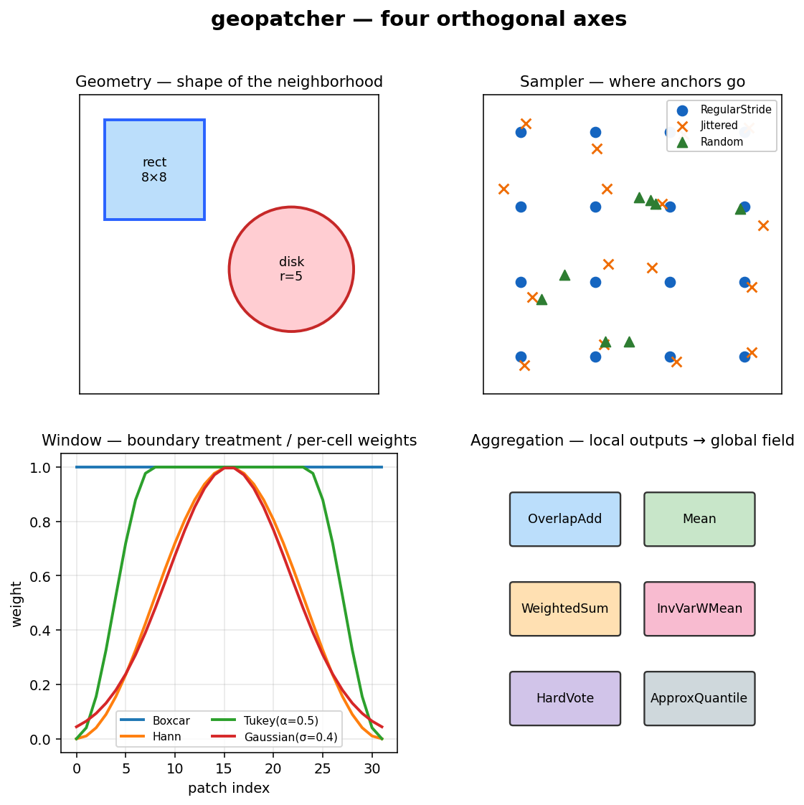
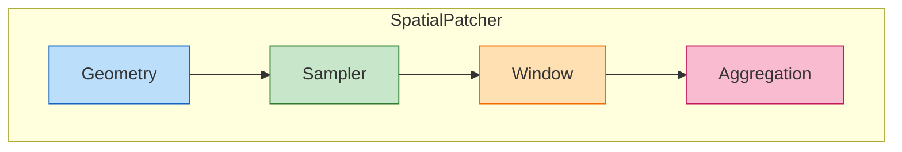
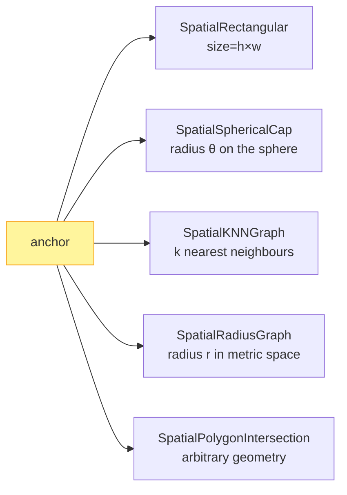
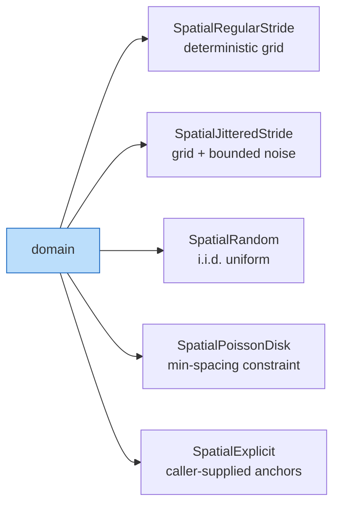
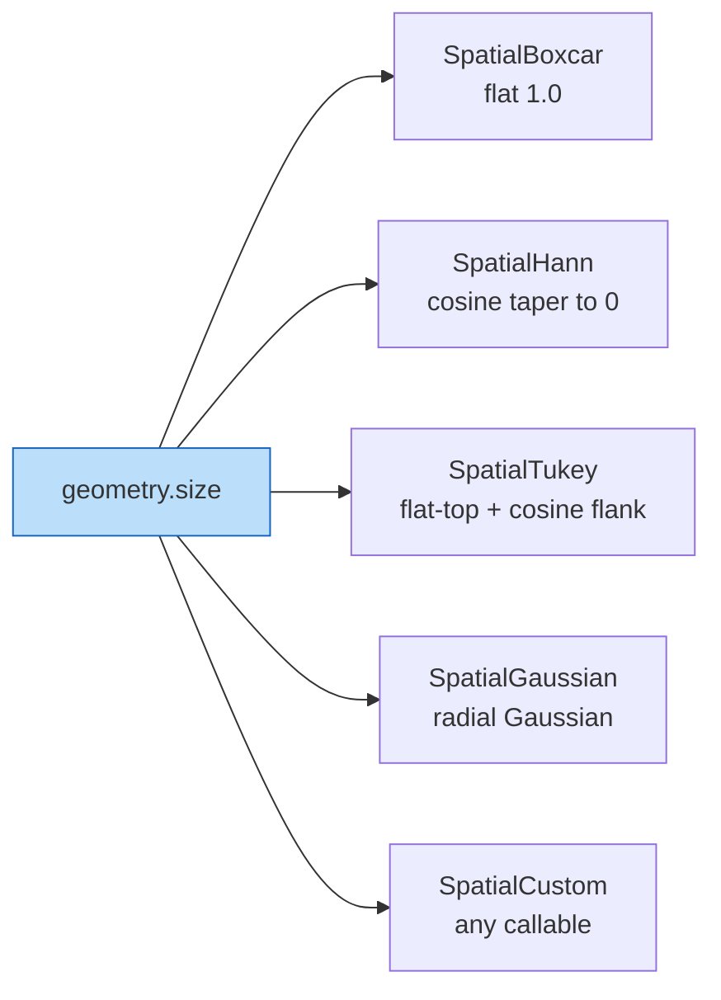
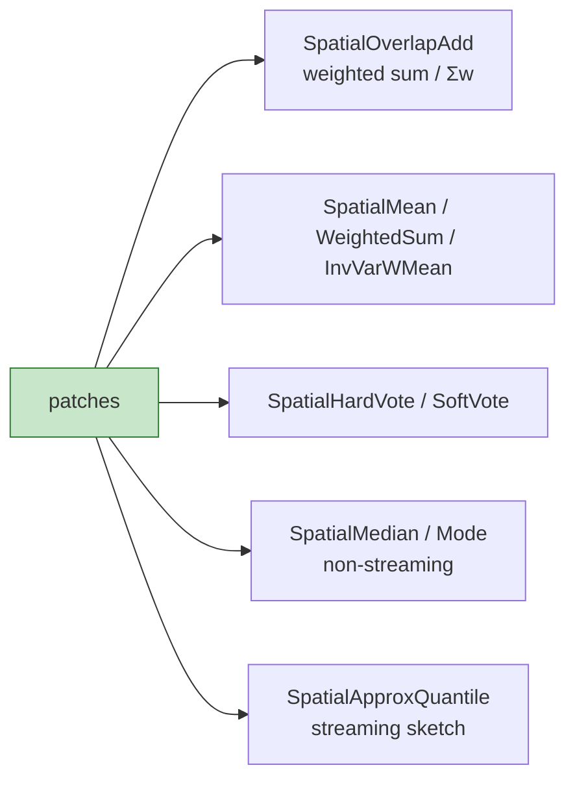
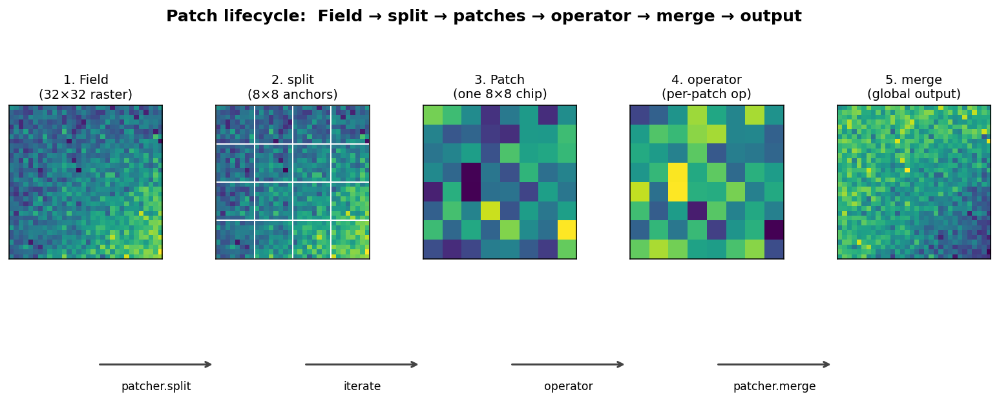
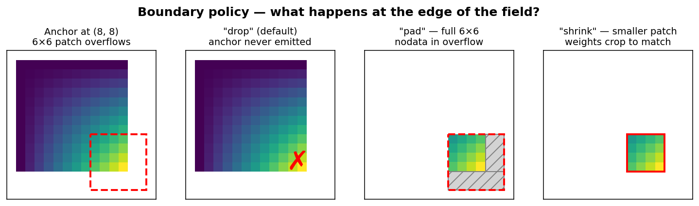

# Concepts

`geopatcher` answers a single question — *what slice of the data does my
operator see at once, and how do local outputs become a global field?* —
by composing **four orthogonal axes** over a `Field` Protocol.

This page walks through each axis, the patch lifecycle, determinism
contracts, boundary policies, streaming vs eager modes, and the async /
hooks / on-error machinery that surrounds them.

## The four-axis abstraction





Each axis is a strategy object — a small dataclass with a single method —
that the patcher composes at construction time. Anything you can swap
without touching the other three is on its own axis.

### Axis 1 — Geometry

*Shape and scale of the neighborhood around an anchor (and the domain
topology it lives on).*



The geometry produces a *window* of indices into the field — a raster
`Window`, a list of neighbour ids, a polygon, … — that the field uses to
`select` the patch payload.

### Axis 2 — Sampler

*Where anchors are placed. Overlap is emergent — it falls out of the
sampler stride relative to the geometry size.*



### Axis 3 — Window

*Per-cell weights applied on the way in (signal taper) and on the way
out (denominator for normalised reconstruction).*



### Axis 4 — Aggregation

*Local outputs → global field. Streaming-safe members fold one patch at
a time; non-streaming members need the whole list.*



## Patch lifecycle

A single end-to-end run touches each axis in turn:



```python
patcher = SpatialPatcher(geometry=..., sampler=..., window=..., aggregation=...)

for patch in patcher.split(field):     # Iterator[Patch] — streaming default
    out = operator(patch.data)
    yield patch.with_data(out)

stitched = patcher.merge(out_patches, field.domain)
```

A `Patch` carries:

- `data`  — the payload selected from the field (usually an ndarray / `GeoTensor`).
- `anchor` — the sampler-emitted coordinate (`(row, col)` for raster, …).
- `indices` — the geometry-emitted index window (`rasterio.windows.Window`, neighbour ids, …).
- `weights` — the window-emitted per-cell weights.

`split` is an iterator by design — materialise with `list(...)` when you
want the eager case.

## Determinism contracts

Stochastic samplers — `SpatialRandom`, `SpatialJitteredStride`,
`SpatialPoissonDisk`, `TemporalRandom` — accept a `seed: int | None`.

| `seed` | Behavior |
|---|---|
| `int` | **Anchor → patch is deterministic.** Two samplers with the same config return bit-identical anchors across calls *and* across instances. Required for reproducible ML eval, CI, and journal-resume. |
| `None` (default) | Re-seeds from OS entropy on each call. Anchors will differ across calls. Pick this only for casual exploration. |

The Hypothesis round-trip suite (`tests/test_roundtrip.py`) leans on the
`int` contract — given a seed, it shrinks failing examples to the minimal
`(shape, stride, seed)` triple and replays them deterministically.

## Boundary policies

What happens when an anchor sits close enough to the edge that the
neighborhood would overflow the domain? `SpatialRectangular` exposes
this as a first-class parameter:

```python
geom = SpatialRectangular(size=(256, 256), boundary="pad")
```



| Mode | Behavior |
|------|----------|
| `"drop"` (default) | Sampler clips so overflowing anchors are never emitted. |
| `"pad"` | Edge anchors are emitted; the raster `Field` reads with `boundless=True` so the patch is the full geometry size, padded in the overflow region with the reader's nodata. **`RasterField` / `AsyncRasterField` only.** |
| `"shrink"` | Edge anchors are emitted; the geometry clips the returned `Window` so the patch is smaller at the edge and weights crop to match. |
| `"raise"` | Edge anchors are emitted; `SpatialPatcher.split` raises a `ValueError` on the first overflow. Useful with `SpatialExplicit` for strict edge handling. |

`"reflect"` and a fully aggregation-aware `"pad"` (zero-weight mask in
the overflow region for COLA-correct stitching) are planned follow-ups.

## Streaming vs eager

`split` is an iterator. The default mode is **streaming** — each patch is
yielded, consumed, and (with `max_in_flight`) released before the next
one is materialised.

```python
# Streaming — bounded memory regardless of field size.
patcher = SpatialPatcher(..., aggregation=SpatialOverlapAdd())
stitched = patcher.merge(patcher.split(field), field.domain)

# Bounded-memory accumulator on disk (zarr) instead of RAM.
# Route the merge call through `agg` (not the patcher's default agg)
# so the streaming code path is the one that actually runs.
agg = SpatialOverlapAdd(streaming=True, target_path="out/", chunks=(256, 256))
stitched_zarr = agg.merge(patcher.split(field), field.domain)
```

Every `SpatialAggregation` carries a `streaming_safe: ClassVar[bool]`
flag. The fully-streaming family (`Sum`, `Mean`, `Variance`,
`OverlapAdd`, `WeightedSum`, `InvVarWeightedMean`, `HardVote`,
`SoftVote`) folds one patch at a time; the non-streaming members
(`Median`, `Mode`, `Learned`) need the full patch list. Streaming the
non-streaming ones emits a `RuntimeWarning` pointing at the streamable
substitute (`Median` → `ApproxQuantile`, `Mode` → `HardVote`).

**Eager** is opt-in: `list(patcher.split(field))`.

## Async, hooks, on-error policies

### Async path

`AsyncSpatialPatcher` mirrors `SpatialPatcher` over `AsyncField`
(currently `AsyncRasterField` over `georeader.AsyncGeoTIFFReader`). The
async path is concurrent at the I/O boundary, not the compute boundary —
patches are read concurrently but operators run synchronously on each.

```python
async for patch in async_patcher.asplit(async_field, prefetch=8):
    ...
```

### Hooks

A `PatcherHook` Protocol exposes `on_split_start`, `on_patch_start`,
`on_patch_done`, `on_split_end`, `on_merge_start`, `on_merge_end`,
`on_error`. Hooks may implement only the callbacks they need. Pass a
list to `split` / `merge`. Exceptions raised by hooks themselves are
converted to `RuntimeWarning`s so observability code cannot abort
patching. See the [observability page](observability.md) for tqdm /
OpenTelemetry examples.

### `on_error` policies

Each patch-read is independently isolated through one of four policies:

| Policy | Behavior |
|---|---|
| `"raise"` (default) | Fail fast — preserves historical behavior. |
| `"skip"` | Log to `patcher.errors`, omit the failed anchor from the stream. |
| `"mask"` | Emit a NaN-valued patch the same shape as the geometry. |
| `"retry"` | Retry matching exceptions up to `max_retries` before logging and skipping. `retry_on` defaults to `(OSError, TimeoutError)` so programmer errors are never silently retried. |

See [`recipes/on-error-policies.md`](recipes/on-error-policies.md) for
the full pattern, and [`recipes/journal-and-resume.md`](recipes/journal-and-resume.md)
for the `PatchJournal` restart story.

## Index space vs coordinate space (temporal stencils)

By default the temporal samplers and geometries work in **integer index
space**: `TemporalRegularStride(step=3)` skips three array elements,
`TemporalLookbackHorizon(lookback=12)` counts twelve array elements
backwards. This is fast and unambiguous when the source cadence is fixed
and known.

For workloads where the cadence is a property of the *store* (ARCO-ERA5
Zarrs, multi-resolution archives) you also want **coordinate space** —
"9 hours of context, regardless of whether that's 9 array steps or 3 or
something else." `TimeStencil` plus `TemporalStencilGeometry` /
`TemporalStencilSampler` express the window in physical units against a
1-D coordinate vector you pass via `TemporalPatcher.split(..., coord=)`
(or `SpatioTemporalPatcher.split(..., coord=)`, which threads it into
the temporal half of both couplings).
The patcher requires `coord=` when either component opts in via
`needs_coord = True`; the integer path is unchanged when it doesn't.
The recipe in [`recipes/temporal-stencils.md`](recipes/temporal-stencils.md)
walks through both layers; ADR-004 in
[`decisions.md`](decisions.md) records the design.

## Random access via `IndexedPatchView`

`SpatialPatcher.split` returns an iterator (ADR-001 — laziness is
the default). For ML loaders that need integer-indexed random access —
torch `Dataset.__getitem__`, Grain `RandomAccessDataSource`, xrpatcher's
`patcher[i]` — wrap the (patcher, field) pair in an
`IndexedPatchView`. It's a stdlib `Sequence[Patch]` with optional
in-memory `cache=True` / `preload=True` flags mirroring xrpatcher's API.

The iterator-first split stays canonical; `IndexedPatchView` is a
wrapper, not a replacement. No torch/grain/jax dependency in
`geopatcher` core — frameworks wrap the Sequence themselves in one line.
The recipe in [`recipes/xarray-nd-patching.md`](recipes/xarray-nd-patching.md)
walks through the migration story; ADR-005 in
[`decisions.md`](decisions.md) records the design.

## Where the framework draws the line

- **Mesh / `uxarray`** (`UXarrayField`) is deferred to v0.2.
- **Hierarchical Patcher-of-Patchers** is a *recipe* on top of the
  framework rather than a dedicated class. See
  [`recipes/streaming-overlap-add.md`](recipes/streaming-overlap-add.md).
- **Two-pass / global-context operators** are explicitly out of scope as
  framework primitives; users compose the two passes themselves with
  the codified `patcher.reduce` and `patcher.two_pass` helpers.

## Cross-stack links

- **Catalogs:** [`geocatalog`](https://github.com/jejjohnson/geotoolz/tree/main/packages/geotoolz-catalog) — which scenes / time range / AOI to read.
- **Operators:** [`geotoolz`](https://github.com/jejjohnson/geotoolz) — how to chain per-patch and global ops.
- **End-to-end:** [`geocatalog/docs/notebooks/end_to_end_lake_tahoe.ipynb`](https://github.com/jejjohnson/geotoolz/tree/main/packages/geotoolz-catalog/blob/main/docs/notebooks/end_to_end_lake_tahoe.ipynb) — the canonical cross-repo Sentinel-2 / Lake Tahoe notebook.
