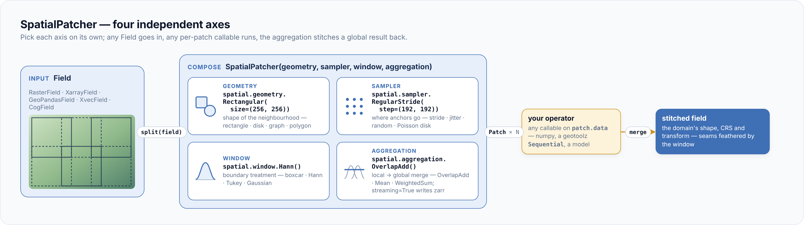

# geotoolz-patcher

> **Split a geospatial field into local patches, run an operator per
> patch, and stitch the outputs back into a global result — along four
> independently composable axes.**

## Where it comes from

A model trained on 256 × 256 chips cannot see a whole Sentinel-2 tile at
once, and a 1 TB output does not fit in memory. So you cut the scene into
overlapping pieces, run on each, and glue the answers back without seams.
Every project writes that loop again, with its own edge cases.

`geopatcher` splits the loop into four choices you make separately: the
**Geometry** (the shape of a patch), the **Sampler** (where patches go),
the **Window** (how each cell is weighted) and the **Aggregation** (how
local outputs merge). Any `Field` goes in — a raster, an xarray grid,
GeoPandas polygons, xvec points — and any per-patch callable runs. It is
the patcher of the [geostack](../index.md); see
[how the packages interlock](../geostack.md).



## Install

```bash
pip install geotoolz-patcher                       # base — RasterField only
pip install 'geotoolz-patcher[patch-full]'         # every Field adapter and runner
```

| Extra | Pulls in | Needed for |
|---|---|---|
| `[grid]` | xarray | `geopatcher.fields.XarrayField` |
| `[vector]` | geopandas, shapely | `geopatcher.fields.GeoPandasField` |
| `[point]` | xvec | `geopatcher.fields.XvecField` |
| `[xarray-raster]` | rioxarray, xarray | `geopatcher.fields.RioXarrayField` |
| `[streaming]` | zarr ≥ 3 | `spatial.aggregation.OverlapAdd(streaming=True)` |
| `[dask]` | dask[bag], xarray | `geopatcher.fields.DaskField`, `geopatcher.run.to_delayed` |
| `[jax]` | jax | `geopatcher.run.batch_split` |
| `[cog]` | geotoolz-cloud[cog] | `geopatcher.fields.CogField` |
| `[patch-full]` | all of the above | everything except `[pipekit]` |
| `[pipekit]` | pipekit | `geopatcher.integrations.pipekit` (`GridSampler`, `ApplyToChips`, `MergePatches`) |

`pipekit` is not on PyPI yet: install the `[pipekit]` extra from a clone
with `uv sync --extra pipekit`. A missing extra fails at the point of use
with an `ImportError` that names it.

## Quickstart

Cut a 512 × 512 raster into 128-pixel patches with 32 pixels of overlap,
double each patch and stitch the result with Hann-feathered seams.

```python
import numpy as np
import rasterio
from georeader.geotensor import GeoTensor

import geopatcher as gp

# 1. Wrap any GeoTensor (or lazy georeader reader) as a Field.
arr: np.ndarray = np.outer(np.linspace(0, 1, 512), np.linspace(0, 1, 512)).astype(np.float32)[None]  # (1, 512, 512) float32
field: gp.RasterField = gp.RasterField(
    GeoTensor(arr, transform=rasterio.Affine(10, 0, 500_000, 0, -10, 4_300_000), crs="EPSG:32611")
)

# 2. Compose the four axes.
patcher: gp.SpatialPatcher = gp.SpatialPatcher(
    geometry=gp.spatial.geometry.Rectangular(size=(128, 128)),
    sampler=gp.spatial.sampler.RegularStride(step=(96, 96)),        # 32 px overlap
    window=gp.spatial.window.Hann(),                                # feather the seams
    aggregation=gp.spatial.aggregation.OverlapAdd(),
)

# 3. Split → operate per patch → merge.
patches: list[gp.Patch] = list(patcher.split(field))               # 25 × (1, 128, 128) float32
out: list[gp.Patch] = [p.with_data(np.asarray(p.data) * 2.0) for p in patches]  # 25 × (1, 128, 128) float32
stitched: np.ndarray = patcher.merge(out, field.domain)             # (1, 512, 512) float64 · NaN = row 0, col 0
```

`patch.anchor` is the patch origin in pixels (`(0, 0)`, `(0, 96)`, …).
`merge` returns a bare array; `patcher.merge_to_field(out, field)` returns
a `GeoTensor` with the source's transform and CRS. The Hann taper is zero
on each patch's leading row and column, so the scene's first row and
column come back as NaN — see [Window convention](patching.md#window-convention).

## What's inside

| Namespace | What's there | Read |
|---|---|---|
| `geopatcher` | `SpatialPatcher`, `AsyncSpatialPatcher`, `TemporalPatcher`, `SpatioTemporalPatcher`; the `Patch` carriers; `Field` / `Domain`; `RasterField` | [Concepts](concepts.md) · [Core API](api/core.md) |
| `geopatcher.spatial` | the four axes — `geometry`, `sampler`, `window`, `aggregation` | [Behaviour](patching.md) · [API](api/spatial.md) |
| `geopatcher.temporal` | the same four axes along time, plus `stencils` | [Temporal patching](recipes/temporal-patching.md) · [API](api/temporal.md) |
| `geopatcher.fields` | `XarrayField`, `RioXarrayField`, `DaskField`, `GeoPandasField`, `XvecField`, `CogField`, `ReprojectingRasterField`, the domain types | [Fields](patching.md#fields-and-domains) · [API](api/fields.md) |
| `geopatcher.matched` | co-registered multi-source patching (`MatchedField`, `MatchedSpatialPatcher`, …) | [API](api/matched.md) |
| `geopatcher.run` | `parallel_map`, `prefetch_iterable`, Dask and JAX bridges, `PatchCache`, `IndexedPatchView` | [Cache reads](recipes/patch-cache.md) · [API](api/run.md) |
| `geopatcher.observe` | `PatcherHook`, `PatchJournal`, `PatchErrorRecord`, strict mode | [Hooks](observability.md) · [Journal](recipes/journal-and-resume.md) |
| `geopatcher.config` | `axis_envelope` / `from_config` round-trips | [API](api/config.md) |
| `geopatcher.integrations.pipekit` | `GridSampler`, `ApplyToChips`, `MergePatches` (re-exported as `geotoolz.patch_ops`) | [API](api/integrations.md) |

Cloud-Optimized GeoTIFF reads come from [geotoolz-cloud](../cloud/index.md);
`geopatcher.fields.CogField` is their `Field`.

## Is this the right tool?

| Your job | Use |
|---|---|
| The operator works on the whole scene in memory | the operator directly — no patcher |
| Independent local work (inference, filters) | `SpatialPatcher` + `spatial.aggregation.OverlapAdd` with a `Hann` or `Tukey` window |
| The output is bigger than RAM | `OverlapAdd(streaming=True)` — [Stream to disk](recipes/streaming-overlap-add.md) |
| The operator needs a global statistic (scene mean / std) | `patcher.two_pass` — [Global statistics](recipes/global-statistics.md) |
| Windows along time, or space × time cubes | `TemporalPatcher` / `SpatioTemporalPatcher` — [Temporal patching](recipes/temporal-patching.md) |

## Advanced — patching as a geotoolz operator

The `[pipekit]` bridge makes *split → operate → merge* one more
`Sequential`, so a geotoolz operator runs tile by tile with no loop.

```python
import numpy as np
import rasterio
from georeader.geotensor import GeoTensor

import geopatcher as gp
import geotoolz as gz
from geotoolz.patch_ops import ApplyToChips, GridSampler, MergePatches

rng: np.random.Generator = np.random.default_rng(0)
scene: GeoTensor = GeoTensor(
    rng.integers(1, 10_000, size=(4, 512, 512), dtype=np.uint16),  # (4, 512, 512) uint16
    transform=rasterio.Affine(10, 0, 500_000, 0, -10, 4_300_000),
    crs="EPSG:32611",
    fill_value_default=0,
    attrs={"band_names": ["blue", "green", "red", "nir"]},
)
field: gp.RasterField = gp.RasterField(scene)
patcher: gp.SpatialPatcher = gp.SpatialPatcher(
    geometry=gp.spatial.geometry.Rectangular(size=(128, 128)),
    sampler=gp.spatial.sampler.RegularStride(step=(96, 96)),
    window=gp.spatial.window.Hann(),
    aggregation=gp.spatial.aggregation.OverlapAdd(),
)

ndvi: gz.Sequential = gz.DNToReflectance(scale=1e-4) | gz.NDVI(nir="nir", red="red")
tiled: gz.Sequential = gz.Sequential([
    GridSampler(patcher=patcher),          # field → 25 Patches     (4, 128, 128) uint16
    ApplyToChips(operator=ndvi),           # (4, 128, 128) uint16 → (128, 128) float64
    MergePatches(aggregation=gp.spatial.aggregation.OverlapAdd(), domain=field.domain),
])
ndvi_map: GeoTensor = tiled(field)         # (512, 512) float64 · NaN = no data
```

The domain fixes the grid and the patches fix the bands, so NDVI's
one-band chips merge into one `(H, W)` map on the scene's transform and
CRS. The [stack quickstart](../index.md#quickstart-catalog-patcher-operators)
runs the same pipeline on real Sentinel-2 data.

## Next steps

- **[Concepts](concepts.md)** — the four axes, the patch lifecycle, fields and streaming.
- **[Quickstart](quickstart.md)** — the same patcher on a real Sentinel-2 scene.
- **How-tos** — [stream to disk](recipes/streaming-overlap-add.md),
  [handle read failures](recipes/on-error-policies.md),
  [resume a job](recipes/journal-and-resume.md),
  [cache reads](recipes/patch-cache.md),
  [mixed CRS](recipes/mixed-crs.md),
  [global statistics](recipes/global-statistics.md),
  [temporal patching](recipes/temporal-patching.md).
- **[Tutorial](notebooks/patcher_lake_tahoe.ipynb)** — patching Sentinel-2 over Lake Tahoe, with plots.
- **[Behaviour reference](patching.md)** and the **[API reference](api/reference.md)**.
