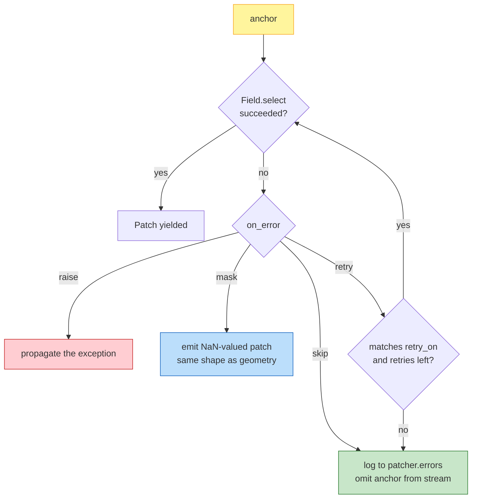

# On-error policies — raise / skip / mask / retry

Bulk inference over thousands of patches usually involves *some* I/O
failures: a transient HTTP 503, a missing tile, a corrupt block, a
timeout. `SpatialPatcher` makes the error policy a first-class
construction parameter so you can pick the right tradeoff between
fail-fast safety and bulk-throughput resilience.

## The four policies



| Policy | When to use |
|---|---|
| `"raise"` (default) | Dev / CI. You want to know on the first failure. |
| `"skip"` | Bulk inference where downstream cares about coverage but tolerates gaps. Failed anchors land in `patcher.errors` as `PatchErrorRecord`s; nothing is emitted on the iterator. |
| `"mask"` | Bulk inference where downstream needs a complete grid (training / evaluation matrices). NaN-valued patches keep the geometry and aggregation contract intact. |
| `"retry"` | Transient I/O (S3, HTTP COG, remote zarr). Retries up to `max_retries` only for exceptions matching `retry_on` — programmer errors are never silently retried. |

## 1. `"raise"` — fail fast (default)

```python
import geopatcher as gp

patcher = gp.SpatialPatcher(
    geometry    = gp.SpatialRectangular(size=(256, 256)),
    sampler     = gp.SpatialRegularStride(step=(256, 256)),
    window      = gp.SpatialBoxcar(),
    aggregation = gp.SpatialOverlapAdd(),
    on_error    = "raise",     # default
)

for patch in patcher.split(field):       # raises on the first I/O failure
    ...
```

## 2. `"skip"` — log and omit

Failed patches never appear on the iterator. Inspect
`patcher.errors` after the fact:

```python
patcher = gp.SpatialPatcher(..., on_error="skip", capture_traceback=False)

outs = list(patcher.split(field))
print(f"succeeded: {len(outs)},  failed: {len(patcher.errors)}")
for record in patcher.errors[:5]:
    print(record.anchor, record.kind, record.message)
```

`capture_traceback=False` skips traceback formatting — useful when
thousands of expected failures would otherwise inflate `patcher.errors`
with megabytes of frames.

## 3. `"mask"` — NaN-valued patches

Useful when the downstream stage needs a complete grid (a training
matrix, an evaluation array, a stitched reconstruction with masked
gaps):

```python
import numpy as np

patcher = gp.SpatialPatcher(..., on_error="mask")

for patch in patcher.split(field):
    if np.isnan(patch.data).all():
        # Failure mask — record but keep the slot.
        ...
    else:
        out = my_operator(patch.data)
```

Aggregations ignore NaNs in the weighted sum (the window-weight
denominator picks up the zero contribution), so masked patches turn
into transparent holes in the reconstruction without breaking the
overlap-add invariant.

## 4. `"retry"` — bounded retries for transient I/O

```python
patcher = gp.SpatialPatcher(
    ...,
    on_error    = "retry",
    max_retries = 3,
    retry_on    = (OSError, TimeoutError),   # default
)
```

Important properties:

- `retry_on` defaults to **I/O-shaped exceptions only** (`OSError`,
  `TimeoutError`). `ValueError`, `KeyError`, `TypeError` are *not*
  retried unless you opt in — programmer errors should surface fast.
- After `max_retries` attempts, the policy falls through to `"skip"`:
  the record is appended to `patcher.errors` and the anchor is omitted
  from the stream.
- Each retry is logged via the `on_error` hook (see
  [`observability.md`](../observability.md)) so retry rates are
  observable.

You can pass strings or classes to `retry_on`:

```python
retry_on = ("rasterio.errors.RasterioIOError", OSError, TimeoutError)
```

## Pattern — pair with parallel_map and journaling

For production bulk inference, combine `on_error="retry"` with the
reference runner and a `PatchJournal`:

```python
from geopatcher.runners import parallel_map

patcher = gp.SpatialPatcher(
    ...,
    on_error    = "retry",
    max_retries = 3,
)

outputs = parallel_map(
    patcher, field, my_operator,
    n_workers=8,
    backend="thread",
    on_error="skip",            # parallel_map-level — failed workers omitted
)
```

The two `on_error` settings are independent and compose:

- `SpatialPatcher.on_error` governs the **read** path (`Field.select`).
- `parallel_map(on_error=...)` governs the **operator** path.

Set both to `"skip"` for maximally-resilient bulk inference; set both to
`"raise"` for dev and CI.

## See also

- [`observability.md`](../observability.md) — hooks for `on_error`, `on_patch_done`, etc.
- [`recipes/journal-and-resume.md`](journal-and-resume.md) — make the bulk job restartable after a crash.
- [`recipes/streaming-overlap-add.md`](streaming-overlap-add.md) — pair with disk-backed aggregation for >1 TB outputs.
