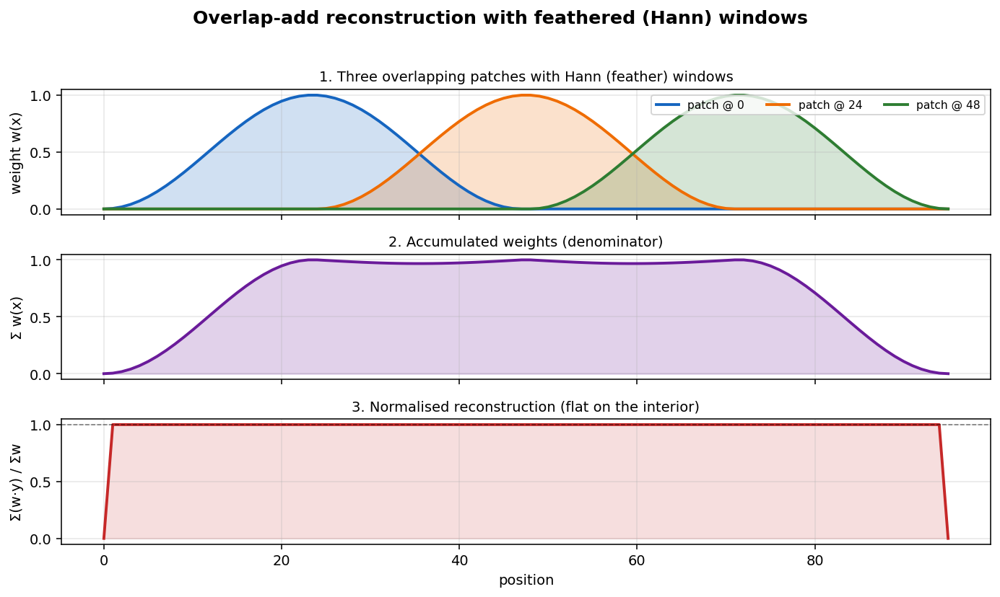

# Streaming overlap-add — bounded-memory pipelines for >1 TB outputs

`SpatialOverlapAdd` is the canonical streaming-safe aggregation. By
default it accumulates the weighted-sum buffer and the sum-of-weights
buffer in RAM; flip `streaming=True` and point `target_path` at a fresh
directory and the same call accumulates into a chunked zarr store on
disk instead.

This recipe walks through:

1. The in-RAM baseline.
2. The disk-backed variant (`streaming=True`).
3. The Patcher-of-Patchers recipe for super-tile-by-super-tile execution.
4. When to reach for `streaming_safe = False` aggregations (you usually
   shouldn't).

## Prerequisites

```bash
pip install 'geopatcher[streaming]'   # zarr>=3
```

The streaming path uses `zarr >= 3`. The optional extras gate it so the
base install stays slim.



The schematic above shows three Hann-tapered patches whose weighted
contributions and accumulated weights sum to a flat interior — the
mathematical heart of overlap-add reconstruction.

## 1. In-RAM baseline

```python
import dataclasses
import numpy as np
import rasterio
from georeader.geotensor import GeoTensor

import geopatcher as gp

arr = np.outer(np.linspace(0, 1, 256), np.linspace(0, 1, 256)).astype(np.float32)
field = gp.RasterField(
    GeoTensor(values=arr, transform=rasterio.Affine.identity(), crs="EPSG:32630")
)

patcher = gp.SpatialPatcher(
    geometry    = gp.SpatialRectangular(size=(64, 64)),
    sampler     = gp.SpatialRegularStride(step=(32, 32)),
    window      = gp.SpatialHann(),
    aggregation = gp.SpatialOverlapAdd(),
)

outputs = [
    p.with_data(np.asarray(p.data) * 2.0)
    for p in patcher.split(field)
]
stitched = patcher.merge(outputs, field.domain)
print(stitched.shape, stitched.dtype)
```

Two float buffers the size of the field live in RAM during merge —
fine for one scene, not fine for a 1 TB output.

## 2. Disk-backed accumulator

Same call, two extra kwargs:

```python
stream_dir = "out/tahoe.zarr"

agg = gp.SpatialOverlapAdd(
    streaming    = True,
    target_path  = stream_dir,
    chunks       = (64, 64),    # match the patch shape for one-block writes
)
on_disk = agg.merge(outputs, field.domain)        # zarr.Array, lazy
materialised = np.asarray(on_disk[:])             # explicit read
np.testing.assert_allclose(materialised, np.asarray(stitched), atol=1e-5)
```

The accumulator never holds more than one patch in RAM at a time. The
return value is a `zarr.Array` you can hand straight to `xarray.open_zarr`
or stream into another stage.

**Tip — chunk alignment:** set `chunks` equal to the patch geometry so
each patch hits exactly one zarr block on write. Misalignment forces
read-modify-write of multiple chunks per patch.

**Tip — dtype:** the on-disk store defaults to `float32`. The in-RAM
path uses `float64`, so disk-backed results may differ in the last few
ULPs. For bit-exact reconstruction either run everything in `float64`
or compare with `atol=1e-5`.

## 3. Patcher-of-Patchers (hierarchical)

A *recipe*, not a class — an outer Patcher chops the field into
super-tiles and an inner Patcher chops each super-tile into chips. The
inner aggregation reconstructs per-super-tile at super-tile scale; the
outer writes super-tile-shaped blocks into a global zarr store.

```python
outer = gp.SpatialPatcher(
    geometry    = gp.SpatialRectangular(size=(1024, 1024)),
    sampler     = gp.SpatialRegularStride(step=(1024, 1024)),
    window      = gp.SpatialBoxcar(),
    aggregation = gp.SpatialOverlapAdd(streaming=True, target_path="out.zarr",
                                       chunks=(1024, 1024)),
)
inner = gp.SpatialPatcher(
    geometry    = gp.SpatialRectangular(size=(64, 64)),
    sampler     = gp.SpatialRegularStride(step=(32, 32)),
    window      = gp.SpatialHann(),
    aggregation = gp.SpatialOverlapAdd(),
)


def run_inner(super_data: np.ndarray) -> np.ndarray:
    sub_field = gp.RasterField(
        GeoTensor(values=super_data, transform=rasterio.Affine.identity(),
                  crs="EPSG:32630")
    )
    sub_outs = [
        p.with_data(my_operator(p.data))
        for p in inner.split(sub_field)
    ]
    return inner.merge(sub_outs, sub_field.domain)


outer_outputs = [
    p.with_data(run_inner(np.asarray(p.data)))
    for p in outer.split(field)
]
outer.merge(outer_outputs, field.domain)
```

Peak memory tops out at `(super-tile RAM) + (one chip)` — the right size
for distributed launchers like Dask or a Kubernetes Job.

## 4. Backpressure on the iterator

`split` accepts `max_in_flight` (patch count) and `max_in_flight_bytes`
(payload total) to bound the iterator's outstanding work:

```python
for patch in patcher.split(field, max_in_flight_bytes=512 * 1024 * 1024):
    out = my_operator(patch.data)
    ...
    # patch closes itself on garbage collection; close explicitly with
    # `patch.close()` or `with patch: ...` to release the slot eagerly.
```

This pairs naturally with the streaming aggregation — the iterator
throttles itself to the operator's throughput so the upstream reader
never gets ahead.

## 5. `streaming_safe = False` aggregations

`SpatialMedian`, `SpatialMode`, and `SpatialLearned` need per-cell
history that doesn't fit in a monoidal fold. Calling `merge` on them
emits a `RuntimeWarning` pointing at the streamable substitute:

| Non-streaming | Streaming substitute |
|---|---|
| `SpatialMedian` | `SpatialApproxQuantile` (sketch) |
| `SpatialMode` | `SpatialHardVote` (or `SpatialApproxMode`) |
| `SpatialLearned` | codified two-pass via `patcher.two_pass` |

For the approximate sketch family (`ApproxQuantile`, `ApproxCardinality`,
`ApproxMode`, `StreamingHistogram`, `Reservoir`), the streaming reducer
state stays bounded by the sketch parameters — independent of input
size.

## See also

- [`recipes/on-error-policies.md`](on-error-policies.md) — pair streaming with `on_error="skip"` for resilient bulk inference.
- [`recipes/journal-and-resume.md`](journal-and-resume.md) — make the streaming job restartable after a crash.
- [Streaming reconstruction notebook](https://github.com/jejjohnson/research_notebook/blob/main/projects/geostack/notebooks/patching/06_streaming.ipynb) — runnable walk-through with the zarr accumulator + real GeoTIFFs (lives in the research_notebook geostack project).
