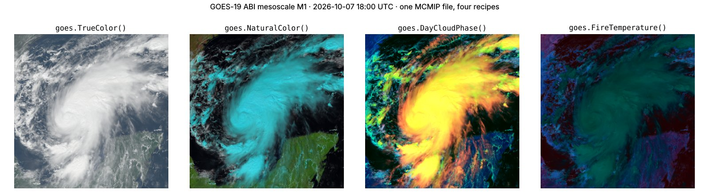

# GOES-R ABI

`geoproducts.goes` reads the GOES-R Advanced Baseline Imager (ABI) — GOES-16,
-17, -18 and -19 — at both product levels: L1b radiances and every L2
product (clear sky mask, cloud-top height, land surface temperature, fire
detection, stability indices, cloud and moisture imagery, …). It finds them
in NOAA's public AWS buckets, puts them on one grid, and turns them into the
standard RGB composites.

<p align="center"></p>

```bash
pip install 'geotoolz-products[goes]'            # h5py (NetCDF-4 / HDF5) + geotoolz-cloud (buckets)
pip install 'geotoolz-products[goes,operators]'  # + geotoolz presets and RGB recipes
```

Without the extra, the readers and the bucket helpers in `goes.aws` raise
an `ImportError` naming it; the recipe table in `goes.recipes` always
works. `goes.aws` lists and downloads unsigned through
[`geocloud.files`](../cloud/index.md#moving-files-geocloudfiles), so it shares the stack's
connection pool.

## What a file is

Every ABI file — L1b or L2 — lays its variables on the **ABI fixed grid**:
`x` / `y` are scan angles in radians, so scaling them by the
perspective-point height gives a clean `+proj=geos` affine grid. The
readers recover it from the file's own projection variable and read pixel
windows lazily: only the HDF5 chunks under a window are decompressed.

| Level | File | Reader | Bands |
|---|---|---|---|
| L1b | `OR_ABI-L1b-Rad{F,C,M1,M2}-M6Cnn_…` — one channel of one scan | `goes.Reader` | the channel (`"C13"`), calibrated |
| L2 | `OR_ABI-L2-<code>{F,C,M1,M2}-M6_…` — one product of one scan | `goes.L2Reader` | the product's variables (`"HT"`, `"BCM"`, …) |
| L2 imagery | `MCMIP` (all 16 channels) / `CMIP` (one) | `goes.L2Reader` | channels (`"C01"` … `"C16"`), already calibrated |

| Sector | `product` suffix | Size (2 km grid) | Cadence |
|---|---|---|---|
| Full disk | `F` (`ABI-L1b-RadF`, `ABI-L2-ACMF`) | 5424 × 5424 | 10 min |
| CONUS / PACUS | `C` | 1500 × 2500 | 5 min |
| Mesoscale | `M` (sectors `M1`, `M2`) | 500 × 500 | 1 min |

L1b channels keep their native resolution — C02 at 0.5 km; C01, C03 and C05
at 1 km; the rest at 2 km — and L2 products have their own (cloud-top height
at 4 km, stability indices at 10 km). `goes.BANDS` is the 16-channel table.

## L1b radiances

```python
from datetime import datetime
from pathlib import Path

from georeader.geotensor import GeoTensor

import geoproducts
from geoproducts import goes
from geoproducts.goes import aws

files: list[aws.ABIFile] = aws.list_files(
    satellite="G19",                      # GOES-East
    product="ABI-L1b-RadC",               # CONUS sector
    start=datetime(2026, 10, 7, 18, 0),   # naive → UTC
    end=datetime(2026, 10, 7, 18, 10),
    channel=13,                           # clean longwave window
)                                         # 2 scans, 5 min apart, ~4 MB each
path: Path = aws.download(files[0], "data/goes")  # ranged reads to .part, then renamed

reader: goes.Reader = goes.Reader(path, calibration="brightness_temperature")
reader.shape                              # (1, 1500, 2500) · +proj=geos · 2004 m pixels

aoi = (-100.0, 30.0, -95.0, 35.0)         # lon/lat box over east Texas
bt: GeoTensor = reader.read_from_bounds(aoi, crs_bounds="EPSG:4326")      # (1, 219, 266) float32, K
flags: GeoTensor = reader.quality.read_from_bounds(aoi, crs_bounds="EPSG:4326")  # (1, 219, 266) uint8 DQF
```

Every calibration coefficient comes from the file being read:

| `calibration=` | Output | Formula |
|---|---|---|
| `"counts"` | `uint16` | the stored detector counts (read unsigned) |
| `"radiance"` *(default)* | `float32` | `counts · scale_factor + add_offset` |
| `"reflectance"` | `float32` | `kappa0 · radiance` (C01–C06) |
| `"brightness_temperature"` | `float32`, K | `(fk2 / ln(fk1 / L + 1) − bc1) / bc2` (C07–C16) |

`reflectance` is NOAA's reflectance factor: it folds in the Earth–Sun
distance and band solar irradiance, not the solar zenith angle. Outputs
carry `band_names=("C13",)`, `wavelengths` (nm), per-band `units` and
`calibration` in `attrs`; off-disk and missing pixels are `NaN`.
`reader.quality.flags()` maps the `DQF` values to their meanings.

## L2 products

`goes.L2Reader` reads any L2 product: each band is one variable of the file.
Masks and class codes stay integer; packed or floating variables decode to
`float32` with `NaN` fill.

```python
def first(product: str) -> Path:
    item: aws.ABIFile = aws.list_files(
        satellite="G19", product=product, sector="M1",
        start=datetime(2026, 10, 7, 18, 0), end=datetime(2026, 10, 7, 18, 2),
    )[0]
    return aws.download(item, "data/goes")

cmi: goes.L2Reader = goes.L2Reader(first("ABI-L2-MCMIPM"))   # (16, 500, 500) C01 … C16 · 4.8 MB
acm: goes.L2Reader = goes.L2Reader(first("ABI-L2-ACMM"))     # (2, 500, 500) uint8 · BCM, ACM
acha: goes.L2Reader = goes.L2Reader(first("ABI-L2-ACHAM"))   # (1, 250, 250) float32 · HT (m), 4 km

acm.flags("ACM")   # {0: 'clear', 1: 'probably_clear', 2: 'probably_cloudy', 3: 'cloudy'}
acm.quality        # QualityReader(variables=('DQF',)) — on the same grid
```

| Product | Default bands | Notes |
|---|---|---|
| `ACM` clear sky mask | `BCM`, `ACM` | `uint8`; binary and four-level cloud mask |
| `ACHA` / `ACHA2KM` cloud-top height | `HT` | metres |
| `LST` land surface temperature | `LST` | K |
| `FDC` fire detection | `Mask` | `int16` classes; `variables="Power"` for MW |
| `DSI` stability indices | `LI`, `CAPE`, `TT`, `SI`, `KI` | 10 km; quality in `DQF_Overall` |
| `MCMIP` / `CMIP` imagery | `C01` … `C16` / one channel | reflectance factor (C01–C06), K (C07–C16) |
| anything else (`TPW`, `AOD`, …) | every non-`DQF` variable | `available_variables` lists them |

Pass `variables=` to choose: `goes.L2Reader(path, variables=["HT"])`.

## One grid: `geoproducts.stack`

`geoproducts.stack` works for any reader. It reads every reader only where it overlaps a reference grid and warps
it there with georeader — no operator library needed. Finer float grids are
averaged, coarser ones interpolated bilinearly, masks resampled with
`mode` / `nearest`.

```python
scene: GeoTensor = geoproducts.stack([cmi, acm, acha])   # (19, 500, 500) float32
scene.attrs["band_names"][-3:]                    # ('BCM', 'ACM', 'HT') — on the 2 km grid

c01, c02, c03 = (goes.Reader(p, calibration="reflectance") for p in l1b_paths)
rgb_in: GeoTensor = geoproducts.stack([c01, c02, c03], bounds=aoi, crs_bounds="EPSG:4326")
                                                  # (3, 437, 530) — C02 averaged to 1 km
```

An integer-only stack (masks) stays integer; mixing in float bands decodes
integer fills to `NaN`.

## RGB recipes

The operational RGBs are recipes — each channel a band or band expression,
stretched between fixed bounds and gamma-corrected. `goes.recipes` holds them
as data; with the `[operators]` extra each preset is a
[`gz.viz.RGBRecipe`](../operators/api/viz.md) operator:

```python
import geotoolz as gz

true_color: GeoTensor = goes.TrueColor()(scene)        # (3, 500, 500) float32 in [0, 1]
cloud_phase: GeoTensor = goes.DayCloudPhase()(scene)   # ice red/orange · liquid cyan · snow green
```

| Preset | Channels | Recipe |
|---|---|---|
| `goes.TrueColor()` | C01, C02, C03 | red C02 · CIMSS synthetic green · blue C01, γ 2.2 |
| `goes.NaturalColor()` | C02, C03, C05 | CIRA day land cloud |
| `goes.DayCloudPhase()` | C02, C05, C13 | CIRA day cloud phase distinction |
| `goes.FireTemperature()` | C05, C06, C07 | CIRA fire temperature |

`goes.presets.Recipe("…")` builds any entry of `goes.recipes.RECIPES`, and a
custom `goes.recipes.Recipe` works the same way.

## Clouds and parallax

```python
import geotoolz as gz

cloudy: GeoTensor = goes.MaskClouds()(scene)          # (500, 500) bool — BCM cloudy
strict: GeoTensor = goes.MaskClouds(conservative=True)(scene)  # + probably clear
clear_sky: GeoTensor = gz.mask.ApplyMask(mask=goes.MaskClouds())(scene)  # (19, 500, 500), clouds → NaN
```

Geostationary pixels see cloud tops displaced away from the sub-satellite
point. `goes.ParallaxCorrect` binds `gz.geom.GeostationaryParallaxCorrect`
to the GOES geometry; feed it the ACHA cloud-top height on the same lat/lon
grid:

```python
import geotoolz as gz

lonlat: GeoTensor = gz.geom.Reproject(dst_crs="EPSG:4326", resolution=(0.02, 0.02))(scene)  # (19, 535, 624)
bt: GeoTensor = gz.spectral.SelectBands(bands=["C13"])(lonlat)        # (1, 535, 624)
height: GeoTensor = gz.spectral.SelectBands(bands=["HT"])(lonlat)     # (1, 535, 624) m, NaN = clear
moved: GeoTensor = goes.ParallaxCorrect(
    satellite_lon_deg=cmi.satellite_lon_deg,                          # -75.2 for GOES-East
    target_height_m=np.nan_to_num(np.asarray(height)[0]),             # clear sky → height 0
)(bt)                                                                 # (1, 535, 624)
```

## Module layout

| Module | Contents |
|---|---|
| `goes.l1b` | `Reader` (counts / radiance / reflectance / BT), `QualityReader` (DQF) |
| `goes.l2` | `L2Reader`, `product_code` |
| `goes.aws` | `list_files`, `download`, `parse_key`, `ABIFile`, `bucket`, `url` |
| `goes.recipes` | `Recipe`, `TRUE_COLOR`, `NATURAL_COLOR`, `DAY_CLOUD_PHASE`, `FIRE_TEMPERATURE` |
| `goes.presets` | `NDVI`, `SyntheticGreen`, `MaskClouds`, `ParallaxCorrect`, `Recipe` and the four named recipes (`[operators]`) |
| `goes.constants` | `BANDS`, `CHANNELS`, `DQF_FLAGS`, clear-sky codes, satellite positions |
