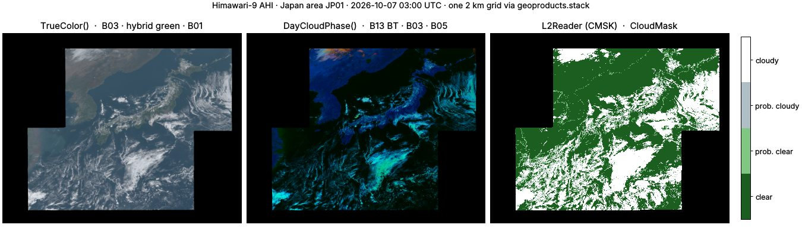

# Himawari AHI

`geoproducts.himawari` reads the Advanced Himawari Imager on Himawari-8
(2015–2022) and -9 (2022–), the 140.7°E view of East Asia, the Western
Pacific and Australia. It decodes JMA's binary HSD segments with numpy
alone, reads NOAA's L2 cloud products on the same grid, and builds the
standard RGBs. AHI has the 16-band design of [GOES-R ABI](goes.md), so
GOES workflows port with band renaming.



```bash
pip install geotoolz-products                          # HSD reader: no extra
pip install 'geotoolz-products[himawari]'              # + himawari.aws and L2 products (h5py)
pip install 'geotoolz-products[himawari,operators]'    # + presets and RGB operators
```

Every fence below that finds or downloads files uses `himawari.aws`, so
it needs `[himawari]`; reading a local HSD file does not.

## What a file is

An HSD file is **one segment of one band of one scan**. A header of
numbered binary blocks (satellite, size, projection, calibration,
position) precedes the `uint16` counts. Files are distributed
`bzip2`-compressed (`.DAT.bz2`).

| Area | `sector=` | Segments | Size (2 km bands) | Cadence |
|---|---|---|---|---|
| Full disk `FLDK` | `"FLDK"` | 10 horizontal strips | 5500 × 5500 | 10 min |
| Japan `JP01` … `JP04` | `"Japan"` | 1 | 1500 × 1200 | 2.5 min (4 per slot) |
| Target `R301` … `R304` | `"Target"` | 1 | 500 × 500 | 2.5 min (4 per slot) |

A 2 km full-disk band is 10 segments of 550 lines, about 3 MB each.
Bands keep their native resolution: B03 at 0.5 km; B01, B02 and B04 at
1 km; the rest at 2 km. `himawari.BANDS` is the 16-band table.

| Segment file | Lines (2 km) | Covers |
|---|---|---|
| `…_S0110.DAT.bz2` | 1 – 550 | the northern limb |
| `…_S0510.DAT.bz2` | 2201 – 2750 | the equator, north side |
| `…_S0610.DAT.bz2` | 2751 – 3300 | the equator, south side |
| `…_S1010.DAT.bz2` | 4951 – 5500 | the southern limb |

`himawari.Reader` takes any subset of a band's segments and places them
on the full `(1, 5500, 5500)` grid. Missing segments read as fill, and a
window decodes only the segments it overlaps. The grid is the CGMS
normalised geostationary projection of header block 3: evenly spaced
`+proj=geos` metres (`sweep=y`), with no per-pixel latitude/longitude.

## Find and download

File names parse offline:

```python
from geoproducts.himawari import aws

seg: aws.Segment = aws.parse_key(
    "AHI-L1b-FLDK/2026/10/07/0300/HS_H09_20261007_0300_B13_FLDK_R20_S0510.DAT.bz2"
)                                                    # 'H09' · 'B13' · segment 5 of 10 · 2 km
bucket: str = aws.bucket("H09")                      # 'noaa-himawari9'
```

```python
from datetime import datetime
from pathlib import Path

from geoproducts.himawari import aws

segments: list[aws.Segment] = aws.list_segments(
    start=datetime(2026, 10, 7, 3, 0),     # one 10-minute slot (naive → UTC)
    band=13,                               # clean longwave window, 10.4 µm
    segments=[5, 6],                       # the strips over 10°N – 10°S
)                                          # 2 segments, ~3 MB each
paths: list[Path] = [aws.download(s, "data/ahi") for s in segments]
stored: list[Path] = [aws.download(s, "data/ahi", decompress=True) for s in segments]  # .DAT, memory-mapped
```

`decompress=True` stores `.DAT` files (3–4× larger). They are
memory-mapped, so a window touches only its own lines: worth it when you
read many small windows of the full disk.

## Read and calibrate

```python
from datetime import datetime
from pathlib import Path

from georeader.geotensor import GeoTensor

from geoproducts import himawari
from geoproducts.himawari import aws

paths: list[Path] = [
    aws.download(s, "data/ahi")
    for s in aws.list_segments(start=datetime(2026, 10, 7, 3, 0), band=13, segments=[5, 6])
]
reader: himawari.Reader = himawari.Reader(paths, calibration="brightness_temperature")
segs: tuple[int, ...] = reader.segments              # (5, 6) · grid (1, 5500, 5500), 2000 m

aoi: tuple[float, float, float, float] = (110.0, -5.0, 120.0, 5.0)    # lon/lat box over Borneo
bt: GeoTensor = reader.read_from_bounds(aoi, crs_bounds="EPSG:4326")   # (1, 546, 477) float32 · K

jp: aws.Segment = aws.list_segments(
    start=datetime(2026, 10, 7, 3, 0), sector="Japan", band=3, area="JP01"
)[0]
red: himawari.Reader = himawari.Reader(aws.download(jp, "data/ahi"), calibration="reflectance")  # (1, 4800, 6000) · 0.5 km
gain: float = red.header.updated_gain                # 0.30901666 — the file's own coefficient
```

Every coefficient comes from the file being read:

| `calibration=` | Output | Formula |
|---|---|---|
| `"counts"` | `uint16` | the stored counts |
| `"radiance"` *(default)* | `float32`, W m⁻² sr⁻¹ µm⁻¹ | `counts · gain + offset` (B01–B06: the updated visible calibration when present) |
| `"reflectance"` | `float32` | `radiance · albedo coefficient` (B01–B06) |
| `"brightness_temperature"` | `float32`, K | Planck inversion at the central wavelength, then `c0 + c1 T + c2 T²` (B07–B16) |

These match JMA's definitions and an independent reference to float32
precision. Error pixels, pixels outside the scan and pixels off the
Earth's limb are `NaN` (`65535` for `"counts"`).

## L2 cloud products

NOAA runs its cloud algorithms on every full-disk scan. It publishes
NetCDF-4 files under `AHI-L2-FLDK-Clouds/`: `CMSK` (cloud mask),
`CHGT` (cloud-top height) and `CPHS` (cloud phase). They sit on the AHI
2 km full disk pixel for pixel, so `himawari.L2Reader` places them on it.

Reading them needs `[himawari]` (h5py).

```python
from datetime import datetime
from pathlib import Path

from geoproducts import himawari
from geoproducts.himawari import aws

cmsk: aws.L2File = aws.list_l2(start=datetime(2026, 10, 7, 3, 0))[0]  # one CMSK file, ~370 MB
path: Path = aws.download(cmsk, "data/ahi")
mask: himawari.L2Reader = himawari.L2Reader(path)            # (2, 5500, 5500) int8 · fill -128
bands: tuple[str, ...] = mask.variables                      # ('CloudMaskBinary', 'CloudMask')
codes: dict[int, str] = mask.flags("CloudMask")  # {0: 'clear', 1: 'probably_clear', 2: 'probably_cloudy', 3: 'cloudy'}
prob: himawari.L2Reader = himawari.L2Reader(path, variables="CloudProbability")  # (1, 5500, 5500) float32 · NaN fill
```

`mask.available_variables` lists the rest: `Dust_Mask`, `Smoke_Mask`,
`Fire_Mask`, …

## One grid

[`geoproducts.stack`](concepts.md#one-grid-stack) puts the 0.5 km, 1 km
and 2 km bands of the Japan area — and a full-disk L2 mask — on one grid.
This is the figure above:

```python
from datetime import datetime

from georeader.geotensor import GeoTensor

import geoproducts
from geoproducts import himawari
from geoproducts.himawari import aws

SLOT: datetime = datetime(2026, 10, 7, 3, 0)         # 12:00 in Japan


def jp01(band: int, calibration: str) -> himawari.Reader:
    """One band of the JP01 Japan area at ``SLOT``."""
    seg: aws.Segment = aws.list_segments(start=SLOT, sector="Japan", band=band, area="JP01")[0]
    return himawari.Reader(aws.download(seg, "data/ahi"), calibration=calibration)


cmsk: aws.L2File = aws.list_l2(start=SLOT)[0]       # ~370 MB
scene: GeoTensor = geoproducts.stack([
    jp01(13, "brightness_temperature"),                         # reference: the 2 km grid
    *(jp01(b, "reflectance") for b in (1, 2, 3, 4, 5)),         # 1 km / 0.5 km → averaged
    himawari.L2Reader(aws.download(cmsk, "data/ahi"), variables="CloudMask"),  # full disk → cut, mode
])                                                   # (7, 1200, 1500) float32
```

## RGB recipes and presets

`himawari.recipes` holds the RGBs as data: the GOES quick-guide
stretches on the matching AHI bands. With `[operators]` each preset is a
[`gz.viz.RGBRecipe`](../operators/api/viz.md) (see
[Recipes and presets](concepts.md#recipes-and-presets)).

```python
from datetime import datetime

from georeader.geotensor import GeoTensor

import geoproducts
import geotoolz as gz
from geoproducts import himawari
from geoproducts.himawari import aws

SLOT: datetime = datetime(2026, 10, 7, 3, 0)


def jp01(band: int, calibration: str) -> himawari.Reader:
    """One band of the JP01 Japan area at ``SLOT``."""
    seg: aws.Segment = aws.list_segments(start=SLOT, sector="Japan", band=band, area="JP01")[0]
    return himawari.Reader(aws.download(seg, "data/ahi"), calibration=calibration)


scene: GeoTensor = geoproducts.stack(
    [jp01(13, "brightness_temperature"), *(jp01(b, "reflectance") for b in (1, 2, 3, 4, 5))]
)                                                    # (6, 1200, 1500) float32 · B13, B01 … B05
true_color: GeoTensor = himawari.TrueColor()(scene)          # (6, 1200, 1500) → (3, 1200, 1500) float32 in [0, 1]
cloud_phase: GeoTensor = himawari.DayCloudPhase()(scene)     # (6, 1200, 1500) → (3, 1200, 1500) float32
ndvi: GeoTensor = himawari.NDVI()(scene)                     # (6, 1200, 1500) → (1200, 1500) float32 · B03, B04

# Parallax for clouds at an assumed 10 km top, on a lon/lat grid.
lonlat: GeoTensor = gz.geom.Reproject(dst_crs="EPSG:4326", resolution=(0.02, 0.02))(
    gz.spectral.SelectBands(bands=["B13"])(scene)
)                                                            # (1, 1200, 1500) → (1, h, w) float32
moved: GeoTensor = himawari.ParallaxCorrect(target_height_m=10_000.0)(lonlat)  # (1, h, w) float32 · 140.7°E view
```

| Preset | Bands | Recipe |
|---|---|---|
| `himawari.TrueColor()` | B01–B04 | red B03 · hybrid green `0.93 B02 + 0.07 B04` · blue B01, γ 2.2 |
| `himawari.NaturalColor()` | B03, B04, B05 | day land cloud |
| `himawari.DayCloudPhase()` | B03, B05, B13 | day cloud phase distinction |
| `himawari.FireTemperature()` | B05, B06, B07 | fire temperature |

AHI's green band (0.51 µm) sits below the vegetation peak, so vegetation
looks too dark. `himawari.HybridGreen()` mixes in a share of the
near-infrared (`nir_fraction=`, default 0.07). `MaskClouds` reads
`CloudMaskBinary` (or `conservative=True`), and `ParallaxCorrect` also
takes a same-grid cloud-top height array.

## Module layout

| Module | Contents |
|---|---|
| `himawari.reader` | `Reader` (counts / radiance / reflectance / BT), `Calibration` |
| `himawari.l2` | `L2Reader`, `full_disk_grid`, `product_code` |
| `himawari.aws` | `list_segments`, `list_l2`, `download` (`decompress=`), `parse_key`, `Segment`, `L2File`, `bucket`, `url` |
| `himawari.recipes` | `Recipe`, `RECIPES`, `TRUE_COLOR`, `NATURAL_COLOR`, `DAY_CLOUD_PHASE`, `FIRE_TEMPERATURE`, `HYBRID_GREEN` |
| `himawari.presets` | `NDVI`, `HybridGreen`, `MaskClouds`, `ParallaxCorrect`, `Recipe` and the four named recipes (`[operators]`) |
| `himawari.constants` | `BANDS`, `CHANNELS`, `FULL_DISK_GRIDS`, cloud-mask codes, `HIMAWARI_LON_DEG` |
| `himawari.HSDHeader`, `read_header` | the decoded segment header |
