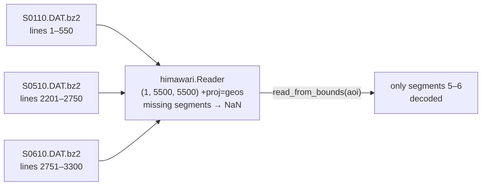

# Himawari AHI

`geoproducts.himawari` reads the Advanced Himawari Imager (AHI) on
Himawari-8 (2015–2022) and Himawari-9 (2022–), the 140.7°E geostationary
view of East Asia, the Western Pacific and Australia. It decodes JMA's
binary **Himawari Standard Data** (HSD) segments directly, with numpy and
the standard library. It also reads NOAA's L2 cloud products on the same
grid, finds both kinds of file in NOAA's public AWS buckets, and builds the
standard RGB composites. AHI has the same 16-band design as GOES-R ABI, so
GOES workflows port over with band-name renaming.

<p align="center"></p>

```bash
pip install geotoolz-products                          # HSD reader + bucket helpers: no extra
pip install 'geotoolz-products[himawari]'              # + L2 cloud products (h5py)
pip install 'geotoolz-products[himawari,operators]'    # + geotoolz presets and RGB recipes
```

## What a file is

An HSD file is **one segment of one band of one scan**. It starts with a
header of numbered binary blocks, followed by `uint16` counts:

- block 1: satellite, area and scan times;
- block 2: image size;
- block 3: projection;
- block 5: calibration;
- block 7: the segment's place in the image.

Files are distributed `bzip2`-compressed (`.DAT.bz2`).

| Area | `sector=` | Segments | Size (2 km bands) | Cadence |
|---|---|---|---|---|
| Full disk `FLDK` | `"FLDK"` | 10 horizontal strips | 5500 × 5500 | 10 min |
| Japan `JP01` … `JP04` | `"Japan"` | 1 | 1500 × 1200 | 2.5 min (4 per slot) |
| Target `R301` … `R304` | `"Target"` | 1 | 500 × 500 | 2.5 min (4 per slot) |

Bands keep their native resolution:

- B03 at 0.5 km;
- B01, B02 and B04 at 1 km;
- the rest at 2 km.

A 2 km full-disk band is 10 files of about 3 MB each. `himawari.BANDS` is
the 16-band table.



The **grid** is the CGMS normalised geostationary projection of block 3.
Pixel `(c, l)` sits at scan angles `(c − COFF)·2¹⁶/CFAC` and
`−(l − LOFF)·2¹⁶/LFAC` degrees. Scaled by the satellite height, those
angles are evenly spaced `+proj=geos` metres (`sweep=y`), so the reader
gives a clean affine grid with no per-pixel latitude/longitude. Pass any
subset of a band's segments:

- missing segments read as fill;
- a window decodes only the segments it overlaps;
- `.DAT` files are memory-mapped;
- `.bz2` files are decompressed once per segment.

## L1b segments

```python
from datetime import datetime
from pathlib import Path

from georeader.geotensor import GeoTensor

import geoproducts
from geoproducts import himawari
from geoproducts.himawari import aws

segments: list[aws.Segment] = aws.list_segments(
    start=datetime(2026, 10, 7, 3, 0),     # one 10-minute slot (naive → UTC)
    band=13,                               # clean longwave window, 10.4 µm
    segments=[5, 6],                       # the strips over 10°N – 10°S
)                                          # 2 segments, ~3 MB each
paths: list[Path] = [aws.download(s, "data/ahi") for s in segments]

reader = himawari.Reader(paths, calibration="brightness_temperature")
reader.shape                               # (1, 5500, 5500) · +proj=geos · 2000 m pixels
reader.segments                            # (5, 6)

aoi = (110.0, -5.0, 120.0, 5.0)            # lon/lat box over Borneo
bt: GeoTensor = reader.read_from_bounds(aoi, crs_bounds="EPSG:4326")  # (1, 546, 477) float32, K
```

Every calibration coefficient comes from the file being read:

| `calibration=` | Output | Formula |
|---|---|---|
| `"counts"` | `uint16` | the stored counts |
| `"radiance"` *(default)* | `float32`, W m⁻² sr⁻¹ µm⁻¹ | `counts · gain + offset` (bands 1–6: the updated visible calibration when present) |
| `"reflectance"` | `float32` | `radiance · albedo coefficient` (B01–B06) |
| `"brightness_temperature"` | `float32`, K | Planck inversion at the central wavelength, then `c0 + c1 T + c2 T²` (B07–B16) |

These match JMA's definitions and agree with an independent reference
implementation to float32 precision. Outputs carry `band_names=("B13",)`,
`wavelengths` (nm), `units` and `calibration` in `attrs`. Three kinds of
pixel are `NaN` in calibrated outputs (`65535` for `"counts"`):

- error pixels;
- pixels outside the scan;
- pixels off the Earth's limb, where PROJ cannot invert the projection.

For the full disk, **`decompress=True`** is worth it when reading many
small windows. It stores `.DAT` files (about 3–4× larger), which are
memory-mapped, so a window touches only its own lines:

```python
paths = [aws.download(s, "data/ahi", decompress=True) for s in segments]
```

The Japan and target areas are one segment each:

```python
(jp,) = aws.list_segments(
    start=datetime(2026, 10, 7, 3, 0), sector="Japan", band=3, area="JP01"
)
red = himawari.Reader(aws.download(jp, "data/ahi"), calibration="reflectance")
red.shape                                  # (1, 4800, 6000) · 0.5 km
red.header.updated_gain                    # 0.30901666 — the file's own coefficients
```

## L2 cloud products

NOAA runs its enterprise cloud algorithms on every Himawari full-disk scan
and publishes NetCDF-4 files under `AHI-L2-FLDK-Clouds/`:

- `CMSK`, the cloud mask;
- `CHGT`, cloud-top height;
- `CPHS`, cloud phase.

The files carry per-pixel latitude/longitude rather than a grid mapping.
Their grid is the AHI 2 km full disk, pixel for pixel, so `L2Reader` places
them on it and they stack directly onto L1b reads.

```python
(cmsk,) = aws.list_l2(start=datetime(2026, 10, 7, 3, 0))      # ~370 MB
mask = himawari.L2Reader(aws.download(cmsk, "data/ahi"))
mask.variables          # ('CloudMaskBinary', 'CloudMask') · (2, 5500, 5500) int8
mask.flags("CloudMask") # {0: 'clear', 1: 'probably_clear', 2: 'probably_cloudy', 3: 'cloudy'}
mask.available_variables  # + CloudProbability, Dust_Mask, Smoke_Mask, Fire_Mask, …
```

Masks stay `int8` (fill `-128`). Pass `variables=` to choose bands:
`himawari.L2Reader(path, variables="CloudProbability")` gives `float32`
with `NaN` fill.

## One grid, RGB recipes, clouds and parallax

`geoproducts.stack` puts any readers on one reference grid (the first
reader's by default):

- finer bands are averaged;
- masks are resampled with `mode`.

The figure above is this:

```python
SLOT = datetime(2026, 10, 7, 3, 0)          # 12:00 in Japan

def jp01(band: int, calibration: str) -> himawari.Reader:
    (seg,) = aws.list_segments(start=SLOT, sector="Japan", band=band, area="JP01")
    return himawari.Reader(aws.download(seg, "data/ahi"), calibration=calibration)

scene: GeoTensor = geoproducts.stack([
    jp01(13, "brightness_temperature"),                       # reference: the 2 km grid
    *(jp01(b, "reflectance") for b in (1, 2, 3, 4, 5)),       # 1 km / 0.5 km → averaged
    himawari.L2Reader(mask.path, variables="CloudMask"),      # full disk → cut and mode-resampled
])                                                            # (7, 1200, 1500) float32

true_color: GeoTensor = himawari.TrueColor()(scene)          # (3, 1200, 1500) in [0, 1]
cloud_phase: GeoTensor = himawari.DayCloudPhase()(scene)     # ice red/orange · liquid cyan
```

The recipes are data in `himawari.recipes`. With the `[operators]` extra,
each preset is a [`gz.viz.RGBRecipe`](../api/viz.md) with the GOES
quick-guide stretches on the equivalent AHI bands:

| Preset | Bands | Recipe |
|---|---|---|
| `himawari.TrueColor()` | B01–B04 | red B03 · hybrid green `0.93 B02 + 0.07 B04` · blue B01, γ 2.2 |
| `himawari.NaturalColor()` | B03, B04, B05 | day land cloud |
| `himawari.DayCloudPhase()` | B03, B05, B13 | day cloud phase distinction |
| `himawari.FireTemperature()` | B05, B06, B07 | fire temperature |

AHI does have a green band, but at 0.51 µm it sits below the vegetation
reflectance peak, so vegetation looks too dark. `himawari.HybridGreen()`
mixes in a share of the near-infrared (`nir_fraction=`, default 0.07). The
other presets bind geotoolz operators to AHI band names:

```python
ndvi: GeoTensor = himawari.NDVI()(scene)                       # red B03, nir B04
cloudy: GeoTensor = himawari.MaskClouds()(scene)               # CloudMaskBinary (or conservative=True)
moved: GeoTensor = himawari.ParallaxCorrect(target_height_m=cloud_top_m)(bt_lonlat)  # 140.7°E view
```

## Module layout

| Module | Contents |
|---|---|
| `himawari.reader` | `Reader` (counts / radiance / reflectance / BT), `Calibration` |
| `himawari.l2` | `L2Reader`, `full_disk_grid`, `product_code` |
| `himawari.aws` | `list_segments`, `list_l2`, `download` (`decompress=`), `parse_key`, `Segment`, `L2File`, `bucket`, `url` |
| `himawari.recipes` | `Recipe`, `TRUE_COLOR`, `NATURAL_COLOR`, `DAY_CLOUD_PHASE`, `FIRE_TEMPERATURE`, `HYBRID_GREEN` |
| `himawari.presets` | `NDVI`, `HybridGreen`, `MaskClouds`, `ParallaxCorrect`, `Recipe` and the four named recipes (`[operators]`) |
| `himawari.constants` | `BANDS`, `CHANNELS`, `FULL_DISK_GRIDS`, cloud-mask codes, the 140.7°E slot |
| `himawari.HSDHeader`, `read_header` | the decoded segment header |
