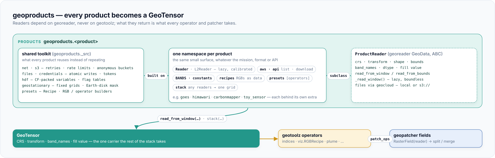

# geotoolz-products

> **Every Earth-observation product, read as a georeader `GeoTensor`.**
> One reader per mission or provider; what comes out is what every
> geotoolz operator and geopatcher field takes — imported as `geoproducts`.

## Where it comes from

Every mission ships its own format, band names and calibration tables.
Provider APIs add their own authentication and catalogue quirks. When
that churn leaks into analysis code, each notebook carries its own copy of
the decoder, and a format change breaks all of them.

`geoproducts` keeps the churn in one place: one namespace per product,
each with a reader that hides its format. Every reader is a
`ProductReader` — a georeader `GeoData` with a lazy windowed read, named
bands and calibrated values. The package depends on georeader only.
Readers release on their own schedule, and their output drops straight
into the operators, the patcher and the catalog loaders.



## Install

```bash
pip install geotoolz-products                    # readers (georeader only)
pip install 'geotoolz-products[goes]'            # GOES-R ABI reader + goes.aws
pip install 'geotoolz-products[himawari]'        # Himawari L2 products + himawari.aws
pip install 'geotoolz-products[carbonmapper]'    # Carbon Mapper plume catalogue + STAC
pip install 'geotoolz-products[operators]'       # sensor presets (geotoolz operators)
```

| Extra | Pulls in | Needed for |
|---|---|---|
| *(base)* | georeader, numpy, rasterio | `ProductReader`, `stack`, `toy_sensor`, `himawari.Reader` (HSD), the `recipes` tables |
| `[goes]` | geotoolz-cloud with h5py | `goes.Reader`, `goes.L2Reader` (local or `s3://`, ranged reads) and the `goes.aws` bucket helpers |
| `[himawari]` | geotoolz-cloud with h5py | `himawari.L2Reader` and the `himawari.aws` bucket helpers |
| `[carbonmapper]` | requests, pydantic, shapely, geopandas, pandas | `geoproducts.carbonmapper` |
| `[operators]` | geotoolz | every sensor's `presets` (RGB recipes, NDVI, cloud masks, parallax) |

## Quickstart

`toy_sensor` is the in-memory reference reader. It exercises the whole
`ProductReader` contract and runs offline.

```python
import numpy as np
from georeader.geotensor import GeoTensor
from rasterio.windows import Window

from geoproducts import ProductReader, toy_sensor

data: np.ndarray = np.random.default_rng(0).random((4, 256, 256), dtype=np.float32)  # (4, 256, 256) float32
reader: ProductReader = toy_sensor.Reader("scene", data=data)    # lazy · EPSG:4326

chip: GeoTensor = reader.read_from_window(Window(0, 0, 64, 64)).load()  # (4, 64, 64) float32
names: tuple[str, ...] = chip.attrs["band_names"]                # ('blue', 'green', 'red', 'nir')
```

Because `chip` names its bands, geotoolz operators resolve them by name:
`gz.NDVI(nir="nir", red="red")(chip)` gives `(64, 64) float32`. Because
`reader` is a `GeoData`, `geopatcher.RasterField(reader)` tiles it.

## Sensors

| Sensor | Products | Extra | Data source |
|---|---|---|---|
| [GOES-R ABI](goes.md) (GOES-16 … 19) | L1b radiances, every L2 product, RGB recipes | `[goes]` | NOAA `noaa-goes16` … `noaa-goes19` (public S3) |
| [Himawari AHI](himawari.md) (Himawari-8 / 9) | L1b HSD segments, NOAA L2 cloud products, RGB recipes | none (HSD) · `[himawari]` (L2, buckets) | NOAA `noaa-himawari8` / `noaa-himawari9` (public S3) |
| [Carbon Mapper](carbonmapper.md) | plume and source catalogue, L3A plume and L2B scene rasters | `[carbonmapper]` | Carbon Mapper REST + STAC API (account) |
| `toy_sensor` | in-memory reference reader | none | — |

## What's inside

| Namespace | Use it to… | Guide |
|---|---|---|
| `geoproducts.ProductReader` | build a reader: the georeader `GeoData` contract | [Concepts](concepts.md#the-productreader-contract) |
| `geoproducts.stack` | put several readers' bands on one grid | [Concepts](concepts.md#one-grid-stack) |
| `geoproducts.goes` | read GOES-R ABI L1b and L2, find files on NOAA's buckets | [GOES-R ABI](goes.md) |
| `geoproducts.himawari` | read Himawari AHI HSD segments and L2 cloud products | [Himawari AHI](himawari.md) |
| `geoproducts.carbonmapper` | query Carbon Mapper plumes and sources, read their rasters | [Carbon Mapper](carbonmapper.md) |
| `geoproducts.toy_sensor` | see the contract in the smallest reader | [Add a product reader](product-readers.md) |

## Next steps

- [Concepts](concepts.md) — the `ProductReader` contract, `stack`, recipes and presets.
- Sensors: [GOES-R ABI](goes.md) · [Himawari AHI](himawari.md) · [Carbon Mapper](carbonmapper.md).
- [Add a product reader](product-readers.md) — the subpackage layout and the shared toolkit.
- Tutorials: [GOES-19 mesoscale](notebooks/goes_mesoscale.ipynb) · [Himawari over Japan](notebooks/himawari_japan.ipynb).
- [API reference](api.md).
- The whole stack: [How the packages interlock](../geostack.md).
