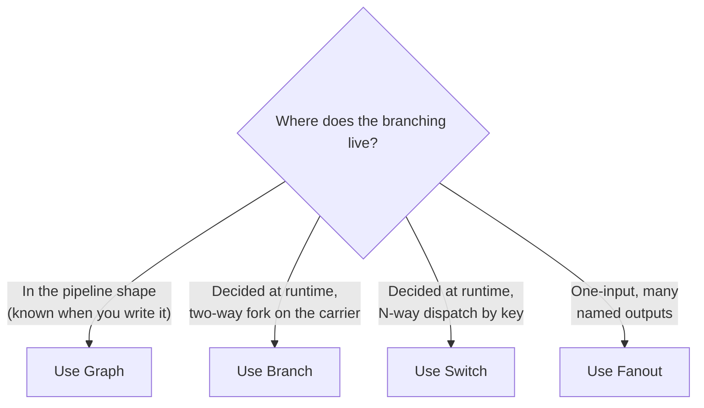
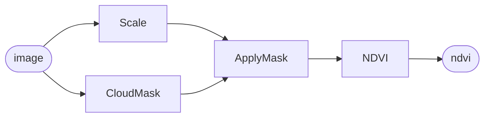
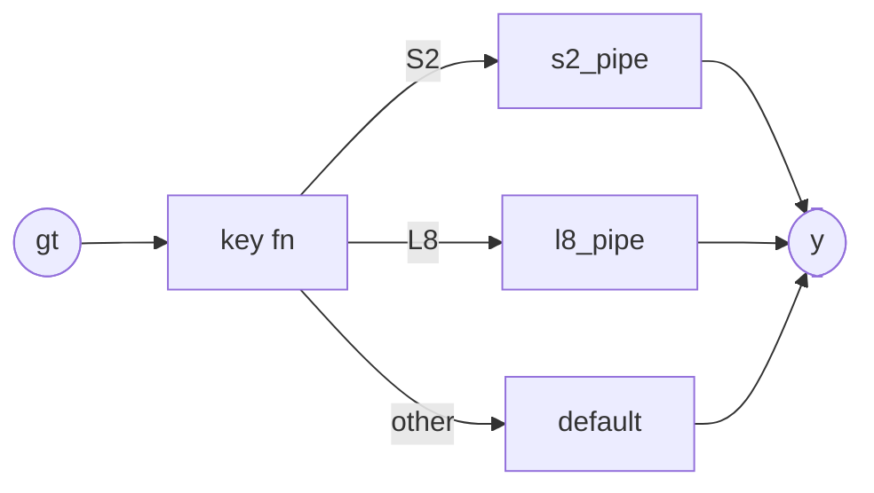
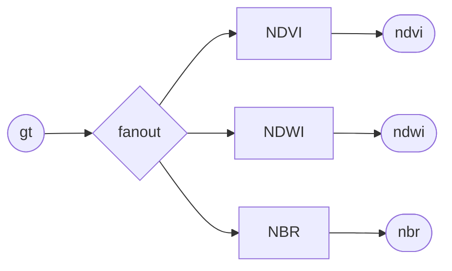

# Branching pipelines — Graph vs Branch vs Switch

`Sequential` covers most linear flows. When you need branching, fan-out,
fan-in, or runtime conditionals, reach for one of three primitives:
**`Graph`** (structural branching at build time), **`Branch`** (two-way
runtime fork), or **`Switch`** (N-way runtime dispatch).

## At-a-glance decision tree



## `Graph` — structural branching at build time

Reach for `Graph` when the *shape* of the pipeline has branches you
know about up-front: split a scene into reflectance and a mask, run
them through different ops, then fuse the results.



`Scale`, `CloudMask`, `ApplyMask`, and `NDVI` are the inline operators
from the [quickstart](../quickstart.md#2-define-three-operators-inline);
substitute the real `geotoolz.radiometry` / `geotoolz.qa` /
`geotoolz.indices` operators once you have them.

```python
import geotoolz as gz

img = gz.Input("image")
scaled = Scale(scale=1e-4)(img)
drop = CloudMask()(img)
clean = ApplyMask()(scaled, drop)        # Graph supplies args positionally
ndvi = NDVI(nir_idx=1, red_idx=0)(clean)

g = gz.Graph(inputs={"image": img}, outputs={"ndvi": ndvi})
result = g(image=gt)        # {"ndvi": GeoTensor}
```

**Construction-time guarantees.** `Graph` topologically sorts at
construction. Cycles, unreachable inputs, and unused nodes are caught
before you run any `_apply`. Each node evaluates exactly once even if
multiple downstream nodes consume it.

**Multiple inputs / outputs.** Pass more than one `Input` to handle
multi-scene fusion, and more than one node to `outputs` to return a
dict of named results.

**Nests.** A `Graph` is itself an `Operator`. Drop one into a
`Sequential` or wrap one in `Fanout` — it composes like any leaf op.

## `Branch` — runtime two-way fork

Use `Branch` when the predicate is decided *at runtime* from the
carrier itself, and there are only two paths.

```python
gz.Branch(
    predicate=lambda gt: gt.crs.is_geographic,
    if_true=ReprojectToUTM(),
    if_false=gz.Identity(),
)
```

**Anti-pattern.** Don't use `Branch` for per-pixel masking — the
predicate operates on the *whole carrier*, not per-element. For
per-pixel logic use `ApplyMask`, `numpy.where`, or a `_apply` that
does the masking directly.

**Round-trip.** `Branch` carries `forbid_in_yaml = True` because its
predicate is a closure. Use it freely in code; if you need a YAML
artefact, swap the closure for a named operator that returns a boolean.

## `Switch` — runtime N-way dispatch

When you have a finite, *named* set of sub-pipelines keyed off a scene
attribute (sensor, product level, season, …), reach for `Switch`.



```python
gz.Switch(
    key=lambda gt: gt.attrs["platform"],
    cases={
        "S2": Sequential([scale_s2, ndvi_s2]),
        "L8": Sequential([scale_l8, ndvi_l8]),
    },
    default=gz.Identity(),
)
```

**Pick this over `Branch` when** you have three or more named paths, or
when the matching key is a clean string. `Switch.default` defaults to
`Identity()` so unknown keys are no-ops; pass something else to fail
loud.

## `Fanout` — one input, many named outputs

Sugar over a single-input `Graph`. Use when you want to compute a few
derived products from a single scene and return them as a dict:



```python
gz.Fanout({
    "ndvi": NDVI(nir_idx=7, red_idx=3),
    "ndwi": NDWI(green_idx=2, nir_idx=7),
    "nbr":  NBR(nir_idx=7, swir_idx=11),
})(gt)
# {"ndvi": GeoTensor, "ndwi": GeoTensor, "nbr": GeoTensor}
```

## Combining shapes

A `Graph` is an `Operator`. A `Sequential` is an `Operator`. They
nest freely:

```python
preprocess = Sequential([Scale(scale=1e-4), DropBadPixels()])
postprocess = Sequential([SmoothNDVI(), WriteCOG(path="/tmp/ndvi.tif")])

img = gz.Input("image")
clean = preprocess(img)
ndvi = NDVI()(clean)

inner = gz.Graph(inputs={"image": img}, outputs={"ndvi": ndvi})

full = Sequential([inner, postprocess])
full(image=gt)
```

The same composition algebra all the way down.

## Quick reference

| Primitive | Branching decided | Inputs | Outputs |
|---|---|---|---|
| `Sequential` | n/a (linear) | 1 | 1 |
| `Graph` | At construction time | 1+ | 1+ (dict) |
| `Branch` | At runtime (2-way) | 1 | 1 |
| `Switch` | At runtime (N-way by key) | 1 | 1 |
| `Fanout` | At construction (1→N) | 1 | N (dict) |

## See also

- [Concepts — Graph](../concepts.md#graph-symbolic-multi-input-multi-output)
- [Composition core notebook](https://github.com/jejjohnson/research_notebook/blob/main/projects/geostack/notebooks/01_composition_core.ipynb) — every primitive against scalars.
- [Pipeline idioms notebook](https://github.com/jejjohnson/research_notebook/blob/main/projects/geostack/notebooks/02_pipeline_idioms.ipynb) — the full recipe gallery (observers, control flow, QC, caching).
- [Define an operator](define-an-operator.md)
