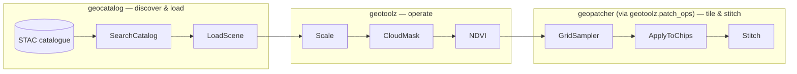

# Integration with `geocatalog` and `geopatcher`

`geotoolz` is the *operate* slice of a three-package stack. This recipe
shows how operators slot into a catalog → patch → operate flow without
ever leaving the `Operator` interface.



The full multi-repo walk-through (one Lake Tahoe scene end-to-end) lives
in the canonical notebook in `geocatalog`:
[`geocatalog/docs/notebooks/end_to_end_lake_tahoe.ipynb`](https://github.com/jejjohnson/geocatalog/blob/main/docs/notebooks/end_to_end_lake_tahoe.ipynb).
This page is the geotoolz-side reference.

## Upstream — `geocatalog`

`geocatalog` exposes STAC discovery and scene loading as operators that
return `GeoTensor`s. Their output is `geotoolz`'s input:

```python
import geocatalog as gc
import geotoolz as gz
from pipekit import Sequential

# Discover scenes (geocatalog)
items = gc.SearchCatalog(
    catalog_url="https://planetarycomputer.microsoft.com/api/stac/v1",
    collections=["sentinel-2-l2a"],
    bbox=(-120.25, 38.85, -119.85, 39.30),
    datetime="2024-06-01/2024-09-30",
    query={"eo:cloud_cover": {"lt": 20}},
)()

# Load one as a GeoTensor (geocatalog)
gt = gc.LoadScene(item=items[0], assets=["B04", "B08", "SCL"])()

# Operate (geotoolz)
ndvi_pipe = Sequential([Scale(scale=1e-4), NDVI(nir_idx=1, red_idx=0)])
ndvi = ndvi_pipe(gt)
```

The boundary is *just* the `GeoTensor` — nothing about geotoolz knows
where the scene came from. You can swap in `rioxarray.open_rasterio`,
a file on disk, or a synthetic test fixture without touching the
operator pipeline.

## Downstream — `geopatcher` via `geotoolz.patch_ops`

When the input raster is too big to fit in memory (or you're running a
patch-based ML model), `geopatcher` provides the four-axis Patcher
framework: a `Sampler` tiles the raster into chips, an `Apply` runs the
per-chip transform, and a `Stitch` re-assembles the output.

`geotoolz.patch_ops` wraps those three pieces as `Operator`s so a
tiled-inference flow composes inside a `Sequential`:

```python
import geopatcher as gp
from geotoolz import ModelOp, Sequential
from geotoolz.patch_ops import GridSampler, ApplyToChips, Stitch

patcher = gp.SpatialPatcher(
    domain=gt.domain,
    window=gp.SpatialWindow(width=512, height=512),
    stride=(256, 256),
)

infer = Sequential([
    GridSampler(patcher),
    ApplyToChips(ModelOp(my_torch_unet, batch_size=8)),
    Stitch(gp.SpatialOverlapAdd(), domain=gt.domain),
])

prediction = infer(gt)
```

Install with the `[patch]` extra: `uv pip install 'geotoolz[patch]'`.

The same wrappers are reachable as
`geopatcher.integrations.pipekit.{GridSampler, ApplyToChips, Stitch}` —
both module paths re-import the same classes. Use whichever reads
better in your code.

## The combined shape

A realistic end-to-end pipeline looks like a `Sequential` whose head
comes from `geocatalog`, whose middle is geotoolz operators, and whose
tail is a `patch_ops` tiled-inference block:

```python
pipe = Sequential([
    gc.LoadScene(item=item, assets=["B04", "B08", "SCL"]),  # geocatalog
    Scale(scale=1e-4),                                       # geotoolz
    CloudMask(scl_idx=2),                                    # geotoolz
    NDVI(nir_idx=1, red_idx=0),                              # geotoolz
    GridSampler(patcher),                                    # geotoolz.patch_ops → geopatcher
    ApplyToChips(ModelOp(model)),                            # geotoolz
    Stitch(gp.SpatialOverlapAdd(), domain=gt.domain),        # geotoolz.patch_ops → geopatcher
])
out = pipe()
```

Every step is an `Operator`. The whole thing round-trips via
`get_config()` for YAML / Hydra-zen. The carrier (`GeoTensor`) is
preserved from start to finish, with metadata propagating through every
hop.

## Where each package owns what

| Concern | Package | Surface |
|---|---|---|
| STAC discovery, asset loading, AOI windowing | [`geocatalog`](https://github.com/jejjohnson/geocatalog) | `SearchCatalog`, `LoadScene`, … |
| Per-scene radiometry, indices, masking, compositing | `geotoolz` | `radiometry`, `indices`, `cloud`, `compositing`, … |
| Sliding-window tiling, chunked inference, stitching | [`geopatcher`](https://github.com/jejjohnson/geopatcher) | `SpatialPatcher`, `Stitch`, exposed as `geotoolz.patch_ops` |
| The composition algebra itself | [`pipekit`](https://github.com/jejjohnson/pipekit) | `Operator`, `Sequential`, `Graph`, `Branch`, `Switch`, … |

## See also

- Canonical cross-repo notebook:
  [`geocatalog/docs/notebooks/end_to_end_lake_tahoe.ipynb`](https://github.com/jejjohnson/geocatalog/blob/main/docs/notebooks/end_to_end_lake_tahoe.ipynb).
- This repo's operator-composition slice:
  [`notebooks/operators_lake_tahoe.ipynb`](../notebooks/operators_lake_tahoe.ipynb).
- [Quickstart](../quickstart.md) and [Concepts](../concepts.md).
