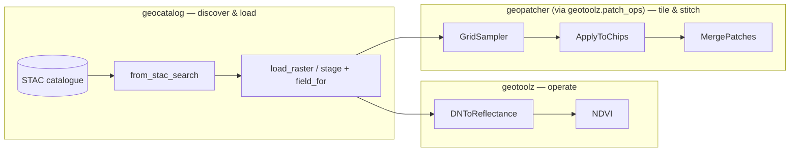

# Integration with `geocatalog` and `geopatcher`

`geotoolz` is the *operate* slice of a three-package stack. This recipe
shows how operators slot into a catalog → patch → operate flow without
ever leaving the `Operator` interface.


```mermaid
flowchart LR
    subgraph cat["geocatalog — discover &amp; load"]
        STAC[(STAC catalogue)] --> Search[from_stac_search]
        Search --> Load[load_raster / stage + field_for]
    end
    subgraph tools["geotoolz — operate"]
        Sc[DNToReflectance] --> Nv[NDVI]
    end
    subgraph patch["geopatcher (via geotoolz.patch_ops) — tile &amp; stitch"]
        GS[GridSampler] --> AC[ApplyToChips] --> St[MergePatches]
    end
    Load --> Sc
    Load --> GS
```

The full multi-package walk-through (one Lake Tahoe scene end-to-end)
lives in the canonical catalog notebook:
[`docs/catalog/notebooks/end_to_end_lake_tahoe.ipynb`](https://github.com/jejjohnson/geotoolz/blob/main/docs/catalog/notebooks/end_to_end_lake_tahoe.ipynb).
This page is the geotoolz-side reference.

## Upstream — `geocatalog`

`geocatalog` indexes STAC search results (or local files) as a
queryable catalog and loads a `GeoSlice` of it as a `GeoTensor`. That
`GeoTensor` is `geotoolz`'s input. The catalog indexes one asset per row
(`asset_key`), so a multi-band scene is one catalog per band, stacked:

```python
import geocatalog as gc
import geotoolz as gz
import pandas as pd

TAHOE_BBOX = (-120.25, 38.85, -119.85, 39.30)


def band_catalog(asset_key):
    return gc.from_stac_search(
        "https://planetarycomputer.microsoft.com/api/stac/v1",
        collections=["sentinel-2-l2a"],
        bounds=TAHOE_BBOX,
        datetime="2024-07-01/2024-07-31",
        asset_key=asset_key,
    )


aoi = gc.GeoSlice(
    bounds=TAHOE_BBOX,
    interval=pd.Interval(
        pd.Timestamp("2024-07-01", tz="UTC"), pd.Timestamp("2024-07-31", tz="UTC"), closed="both"
    ),
    resolution=(0.0001, 0.0001),
    crs="EPSG:4326",
)
red = gc.load_raster(band_catalog("B04").query(aoi), aoi)   # (1, H, W) GeoTensor
nir = gc.load_raster(band_catalog("B08").query(aoi), aoi)
scene = gz.StackBands()([red, nir])                          # (2, H, W)

ndvi = (gz.DNToReflectance(scale=1e-4) | gz.NDVI(nir=1, red=0))(scene)
```

The boundary is *just* the `GeoTensor` — nothing about geotoolz knows
where the scene came from. You can swap in `rioxarray.open_rasterio`,
a file on disk, or a synthetic test fixture without touching the
operator pipeline.

## Downstream — `geopatcher` via `geotoolz.patch_ops`

When the input raster is too big to fit in memory (or you're running a
patch-based ML model), `geopatcher` provides the four-axis Patcher
framework (Geometry × Sampler × Window × Aggregation): `split` tiles a
`Field` into chips, an operator runs per chip, and the aggregation
stitches the results back.

`geotoolz.patch_ops` exposes those pieces as `Operator`s so a
tiled-inference flow composes inside a `Sequential`:

```python
import geopatcher as gp
from geotoolz.patch_ops import ApplyToChips, GridSampler, MergePatches

patcher = gp.SpatialPatcher(
    geometry=gp.SpatialRectangular(size=(512, 512)),
    sampler=gp.SpatialRegularStride(step=(256, 256)),
    window=gp.SpatialHann(),
    aggregation=gp.SpatialOverlapAdd(),
)

infer = gz.Sequential([
    GridSampler(patcher=patcher),
    ApplyToChips(operator=gz.ModelOp(model=my_torch_unet, batch_size=8)),
    MergePatches(aggregation=gp.SpatialOverlapAdd(), domain=field.domain),
])

prediction = infer(field)
```

`ModelOp` hands the model a plain array and returns the model's output
as-is (never rewrapped into a `GeoTensor`); each chip's `Patch` keeps its
footprint, so `MergePatches` still places the predictions. It checks the
model at construction: a callable for the default `method="__call__"`, a
`pipekit.protocols.Predictor` for `method="predict"`. Fit any learned
preprocessing (`StandardScaler().fit(...)`, `MNF(...).fit(...)`) before
the pipeline so every chip uses the same statistics — see
[Fitted operators](../concepts.md#fitted-operators-fit-transform).

Install with the `[patch]` extra: `uv pip install 'geotoolz[patch]'`.

The same wrappers are reachable as
`geopatcher.integrations.pipekit.{GridSampler, ApplyToChips, Stitch}` —
`geotoolz.patch_ops` re-exports the same class objects, with `Stitch`
renamed `MergePatches` so it doesn't collide with `geotoolz.geom.Stitch`.

## The combined shape

The catalog → patcher seam is `staging`: `stage` caches a catalog's
assets locally and `field_for` mosaics the staged rows onto a `GeoSlice`
grid (in the slice CRS, whatever CRS the files are in) as one `geopatcher`
`RasterField`. `MergePatches` needs the output `domain` at construction time,
so build the `Field` first; then the whole flow is one `Sequential`:

```python
staged = gc.stage(band_catalog("B04").query(aoi), dest="./cache")
field = gc.field_for(staged, aoi)                   # one Field on the AOI grid

pipe = gz.Sequential([
    GridSampler(patcher=patcher),                    # geotoolz.patch_ops → geopatcher
    ApplyToChips(operator=gz.DNToReflectance(scale=1e-4)),  # geotoolz, per chip
    MergePatches(aggregation=gp.SpatialOverlapAdd(), domain=field.domain),
])
reflectance = pipe(field)
```

Every step is an `Operator`, so the pipeline's structure is inspectable
via `get_config()`. `GridSampler` and `MergePatches` hold runtime
objects (a patcher, a domain) and are flagged `forbid_in_yaml`, so a
pipeline that contains them is rebuilt in code rather than from YAML. The carrier
metadata (CRS, transform, fill) is preserved chip by chip and restored
by the aggregation.

## Where each package owns what

| Concern | Package | Surface |
|---|---|---|
| STAC discovery, asset loading, AOI windowing | [`geocatalog`](https://github.com/jejjohnson/geotoolz/tree/main/packages/geotoolz-catalog) | `from_stac_search`, `GeoSlice`, `load_raster`, `stage`, `field_for`, … |
| Per-scene radiometry, indices, masking, compositing | `geotoolz` | `radiometry`, `indices`, `qa`, `mask`, `compositing`, … |
| Sliding-window tiling, chunked inference, stitching | [`geopatcher`](https://github.com/jejjohnson/geotoolz/tree/main/packages/geotoolz-patcher) | `SpatialPatcher`, `Stitch` (exposed as `geotoolz.patch_ops.MergePatches`) |
| The composition algebra itself | [`pipekit`](https://github.com/jejjohnson/pipekit) | `Operator`, `Sequential`, `Graph`, `Branch`, `Switch`, … |

## See also

- Canonical end-to-end notebook:
  [`docs/catalog/notebooks/end_to_end_lake_tahoe.ipynb`](https://github.com/jejjohnson/geotoolz/blob/main/docs/catalog/notebooks/end_to_end_lake_tahoe.ipynb).
- This repo's operator-composition slice:
  [`notebooks/operators_lake_tahoe.ipynb`](../notebooks/operators_lake_tahoe.ipynb).
- [The geostack](../geostack.md), [Quickstart](../quickstart.md) and
  [Concepts](../concepts.md).
