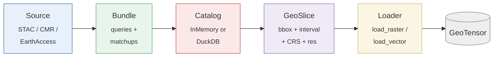

# geocatalog

[](https://github.com/jejjohnson/geocatalog/actions/workflows/ci.yml)
[](https://github.com/jejjohnson/geocatalog/actions/workflows/lint.yml)
[](https://github.com/jejjohnson/geocatalog/actions/workflows/typecheck.yml)
[](https://github.com/jejjohnson/geocatalog/actions/workflows/pages.yml)
[](https://codecov.io/gh/jejjohnson/geocatalog)
[](https://pypi.org/project/geocatalog/)
[](https://pypi.org/project/geocatalog/)
[](https://opensource.org/licenses/MIT)
[](https://github.com/astral-sh/ruff)
[](https://github.com/astral-sh/uv)

> **A spatiotemporal index over geospatial files.** Ask *"what overlaps this AOI between these dates?"* and get an answer in milliseconds — without opening a single file.



## 30-second pitch

You have thousands (or millions) of GeoTIFFs / NetCDFs / Zarrs / shapefiles
spread across local disk, S3, or a STAC API. You want to ask:

- *"Which scenes touch this bbox between June and September?"*
- *"Which label tiles overlap which Sentinel-2 chips?"*
- *"Stream me 10⁶+ files lazily, from a remote GeoParquet, without loading them all into RAM."*

`geocatalog` indexes them once and answers all three — fast. Two backends
share one `GeoCatalog` Protocol: `InMemoryGeoCatalog` (a GeoDataFrame +
R-tree, sub-millisecond queries up to ~10⁵ rows) and `DuckDBGeoCatalog`
(GeoParquet 1.1 with bbox-column predicate pushdown, scales to 10⁶+ rows
and queryable straight from `s3://` URIs).

## One working snippet

```python
import pandas as pd
import geocatalog as gc

catalog = gc.build_raster_catalog(
    filepaths=["scene1.tif", "scene2.tif", "scene3.tif"],
    filename_regex=r"scene(?P<id>\d+)\.tif",
    target_crs="EPSG:32629",
)

aoi = gc.GeoSlice(
    bounds=(500_000, 4_000_000, 540_000, 4_040_000),
    interval=pd.Interval(
        pd.Timestamp("2024-06-01"),
        pd.Timestamp("2024-06-30"),
        closed="both",
    ),
    resolution=(10.0, 10.0),
    crs="EPSG:32629",
)

hits = catalog.query(aoi)            # which files? (no I/O on the files themselves)
tensor = gc.load_raster(hits, aoi, band_indexes=[1, 2, 3])     # materialise the hits
```

## Install

```bash
pip install geocatalog
```

Or with `uv`:

```bash
uv add geocatalog
```

| Extra | Adds | When you need it |
| --- | --- | --- |
| *(base)* | InMemory backend, raster + vector loaders, GeoParquet roundtrip | Local files, <10⁵ rows |
| `[duckdb]` | `DuckDBGeoCatalog`, streaming `build_*` (`backend="duckdb"`) | 10⁶+ rows, remote artifacts |
| `[xarray-raster]` | `build_xarray_catalog`, `load_xarray` (NetCDF / Zarr) | xarray data |
| `[stac]` | `STACSource`, `from_stac_search`, `from_stac_items` | STAC API ingestion |
| `[fsspec]` | `s3://`, `gs://`, `az://`, `https://`, `hf://` URI support | Cloud object storage |
| `[patch]` | `geocatalog.staging.field_for` — bridge to `geopatcher` | Patcher / tiling workflows |
| `[full]` | All of the above | One-shot install |

## Next steps

- **[Docs site](https://jejjohnson.github.io/geocatalog/)** — concepts, quickstart, API
- **[Concepts](https://jejjohnson.github.io/geocatalog/concepts/)** — mental model, backend comparison, set algebra
- **[Quickstart](https://jejjohnson.github.io/geocatalog/quickstart/)** — 15-minute Lake Tahoe Sentinel-2 walkthrough
- **[Recipes](https://jejjohnson.github.io/geocatalog/recipes/large-archives/)** — large archives, STAC ingestion, staging & bundles
- **[End-to-end notebook](https://jejjohnson.github.io/geocatalog/notebooks/end_to_end_lake_tahoe/)** — discover → query → load → patch → stitch (cross-repo with [geotoolz](https://github.com/jejjohnson/geotoolz) and [geopatcher](https://github.com/jejjohnson/geopatcher))
- **[API reference](https://jejjohnson.github.io/geocatalog/api/reference/)** — full mkdocstrings-generated reference

## Bridging to a patcher

`CatalogDomain` adapts a catalog into a `Domain` shape (bounds + an
iterable of `GeoSlice`s) so a tiling patcher can walk a multi-file
archive. The canonical consumer is
[`geotoolz.patch.SpatialPatcher`](https://github.com/jejjohnson/geotoolz),
but any code that iterates `domain.slices()` works.

## Development

```bash
make install   # uv sync --all-groups + pre-commit
make test      # pytest
make format    # ruff format + ruff check --fix
make lint      # ruff check .
make typecheck # ty check src/geocatalog
make docs-serve # MkDocs preview
```

## License

MIT — see `LICENSE`.
