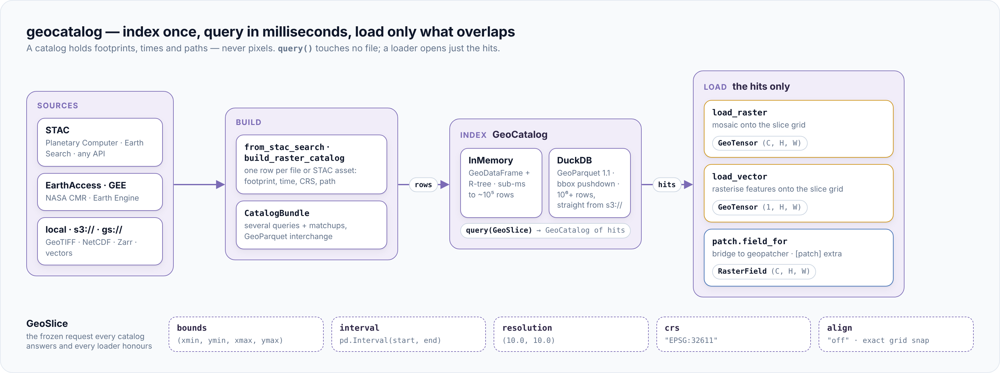

# geocatalog
> Part of the [geotoolz monorepo](https://github.com/jejjohnson/geotoolz) — ships as the `geotoolz-catalog` distribution; the import name is unchanged.

[](https://github.com/jejjohnson/geotoolz/actions/workflows/ci.yml)
[](https://github.com/jejjohnson/geotoolz/actions/workflows/lint.yml)
[](https://github.com/jejjohnson/geotoolz/actions/workflows/typecheck.yml)
[](https://github.com/jejjohnson/geotoolz/actions/workflows/pages.yml)
[](https://codecov.io/gh/jejjohnson/geotoolz)
[](https://pypi.org/project/geotoolz-catalog/)
[](https://pypi.org/project/geotoolz-catalog/)
[](https://opensource.org/licenses/MIT)
[](https://github.com/astral-sh/ruff)
[](https://github.com/astral-sh/uv)

> **A spatiotemporal index over geospatial files.** Ask *"what overlaps this AOI between these dates?"* and get an answer in milliseconds — without opening a single file.

<p align="center"></p>

## 30-second pitch

You have thousands (or millions) of GeoTIFFs / NetCDFs / Zarrs / shapefiles
spread across local disk, S3, or a STAC API. You want to ask:

- *"Which scenes touch this bbox between June and September?"*
- *"Which label tiles overlap which Sentinel-2 chips?"*
- *"Stream me 10⁶+ files lazily, from a remote GeoParquet, without loading them all into RAM."*

`geocatalog` indexes them once and answers all three — fast. Two backends
share one `GeoCatalog` Protocol: `InMemoryGeoCatalog` (a GeoDataFrame +
R-tree, sub-millisecond queries up to ~10⁵ rows) and `DuckDBGeoCatalog`
(GeoParquet 1.1 with bbox-column predicate pushdown, scales to 10⁶+ rows
and queryable straight from `s3://` URIs).

## Quickstart

```python
import pandas as pd
from georeader.geotensor import GeoTensor

from geocatalog import GeoSlice
from geocatalog.backends import InMemoryGeoCatalog
from geocatalog.build import build_raster_catalog
from geocatalog.load import load_raster

catalog: InMemoryGeoCatalog = build_raster_catalog(
    filepaths=["s2_20240605.tif", "s2_20240612.tif", "s2_20240801.tif"],  # 4-band uint16, EPSG:32611
    filename_regex=r"s2_(?P<date>\d{8})\.tif",                          # time from the file name
    crs="EPSG:32611",
)                                                                        # 3 rows · footprints, times, paths

aoi = GeoSlice(
    bounds=(502_000, 4_302_000, 507_000, 4_307_000),                     # 5 km × 5 km, UTM 11N metres
    interval=pd.Interval(pd.Timestamp("2024-06-01"), pd.Timestamp("2024-06-30"), closed="both"),
    resolution=(10.0, 10.0),                                             # → grid (H, W) = (500, 500)
    crs="EPSG:32611",
)

hits: InMemoryGeoCatalog = catalog.query(aoi)                            # 2 rows — no file opened
tensor: GeoTensor = load_raster(hits, aoi, band_indexes=[1, 2, 3])       # (3, 500, 500) uint16, mosaicked
```

`hits` is itself a catalog, so queries chain and set-combine; only
`load_raster` (or `load_vector`) opens files, and only the ones that
overlap. From STAC, the same flow starts with
`geocatalog.sources.from_stac_search(client, collections=["sentinel-2-l2a"], bounds=..., datetime="2024-06", asset_key="B04")`.

## Where things live

The root holds `GeoCatalog`, `GeoSlice`, `open_catalog` and
`query` / `intersect` / `union`; everything else has exactly one home,
named for the step it serves:

| Step | Namespace | Main names |
|---|---|---|
| discover | `geocatalog.sources` | `STACSource`, `CMRSource`, `EarthAccessSource`, `GEESource`, `from_stac_search` |
| index | `geocatalog.build` | `build_raster_catalog`, `build_xarray_catalog`, `build_vector_catalog`, `append_files` |
| hold | `geocatalog.backends` | `InMemoryGeoCatalog`, `DuckDBGeoCatalog`, `CatalogRow`, the errors |
| join | `geocatalog.matchup` | `matchup`, `MatchupRow`, the spatial / temporal strategies |
| read | `geocatalog.load` | `load_raster`, `aload_raster`, `load_raster_timeseries`, `load_xarray`, `load_vector` |
| save / share | `geocatalog.storage` | `to_geoparquet` / `from_geoparquet`, `StreamingParquetWriter`, `to_stac_collection`, `CatalogBundle` |
| stage | `geocatalog.staging` | `stage`, `LocalCache` |
| patch | `geocatalog.patch` | `field_for`, `CatalogDomain` |
| grids | `geocatalog.grid` | `slice_to_window`, `is_grid_aligned`, `count_steps` |
| helpers | `geocatalog.utils` | `parse_uri`, `retry_transient_io`, UTC time helpers |

## Bridging to a patcher

`geocatalog.patch.field_for` (the `[patch]` extra) mosaics the rows a
`GeoSlice` selects into one `geopatcher.RasterField`, which
`geopatcher.SpatialPatcher` chips with `split` and reassembles with
`merge`:

```python
import geopatcher as gp

field: gp.RasterField = gc.patch.field_for(hits, aoi)      # domain (4, 500, 500) uint16, the slice grid
patches: list[gp.Patch] = list(patcher.split(field))       # see the geopatcher quickstart
```

`CatalogDomain` is the lighter option: it walks a catalog as one
`GeoSlice` per row (`domain.slices()`) for code that loads each slice
itself.

## Install

```bash
pip install geotoolz-catalog
```

Or with `uv`:

```bash
uv add geotoolz-catalog
```

| Extra | Adds | When you need it |
| --- | --- | --- |
| *(base)* | InMemory backend, raster + vector loaders, GeoParquet roundtrip | Local files, <10⁵ rows |
| `[duckdb]` | `DuckDBGeoCatalog`, streaming `build_*` (`engine="duckdb"`) | 10⁶+ rows, remote artifacts |
| `[streaming]` | Same as `[duckdb]` (the streaming writer itself is pyarrow) | Streaming builds |
| `[xarray-raster]` | `build_xarray_catalog`, `load_xarray` (NetCDF / Zarr) | xarray data |
| `[stac]` | `STACSource`, `from_stac_search`, `from_stac_items` | STAC API ingestion |
| `[earthaccess]` / `[gee]` | `EarthAccessSource` / `GEESource` | NASA Earthdata / Earth Engine ingestion |
| `[sources-all]` | `[earthaccess]` + `[stac]` + `[gee]` | Every source adapter |
| `[fsspec]` | `s3://`, `gs://`, `az://`, `https://`, `hf://` reads in the builders and loaders (fsspec, its cloud filesystems, `huggingface_hub`) | Cloud object storage |
| `[cloud]` | `stage()` of remote URIs, through `geocloud.files` and `geocloud.credentials` (geotoolz-cloud) | Local caches of cloud assets |
| `[patch]` | `geocatalog.patch.field_for` — bridge to `geopatcher` | Patcher / tiling workflows |
| `[full]` | All of the above | One-shot install |

## Next steps

- **[Docs site](https://jejjohnson.github.io/geotoolz/catalog/)** — concepts, quickstart, API
- **[Concepts](https://jejjohnson.github.io/geotoolz/catalog/concepts/)** — mental model, backend comparison, set algebra
- **[Quickstart](https://jejjohnson.github.io/geotoolz/catalog/quickstart/)** — 15-minute Lake Tahoe Sentinel-2 walkthrough
- **[Recipes](https://jejjohnson.github.io/geotoolz/catalog/recipes/large-archives/)** — large archives, STAC ingestion, staging & bundles
- **[End-to-end notebook](https://jejjohnson.github.io/geotoolz/catalog/notebooks/end_to_end_lake_tahoe/)** — discover Sentinel-2 over Lake Tahoe, query it and load it onto one grid (with [geotoolz](https://github.com/jejjohnson/geotoolz) and [geopatcher](https://github.com/jejjohnson/geotoolz/tree/main/packages/geotoolz-patcher))
- **[API reference](https://jejjohnson.github.io/geotoolz/catalog/api/reference/)** — full mkdocstrings-generated reference

## Development

```bash
make install   # uv sync --all-groups + pre-commit
make test      # pytest
make format    # ruff format + ruff check --fix
make lint      # ruff check .
make typecheck # ty check src/geocatalog
make docs-serve # MkDocs preview
```

## License

MIT — see `LICENSE`.
