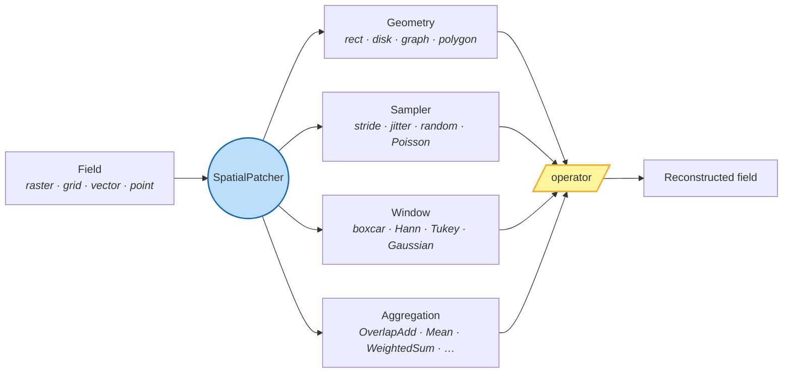

# geopatcher

[](https://github.com/jejjohnson/geopatcher/actions/workflows/ci.yml)
[](https://github.com/jejjohnson/geopatcher/actions/workflows/lint.yml)
[](https://github.com/jejjohnson/geopatcher/actions/workflows/typecheck.yml)
[](https://github.com/jejjohnson/geopatcher/actions/workflows/pages.yml)
[](https://codecov.io/gh/jejjohnson/geopatcher)
[](https://pypi.org/project/geopatcher/)

> **Split a geospatial field into local patches, run an operator per patch, and stitch the outputs back into a global result — along four independently composable axes.**

`geopatcher` is the *locality layer* between **catalogs**
([geocatalog](https://github.com/jejjohnson/geocatalog)) and **operators**
([geotoolz](https://github.com/jejjohnson/geotoolz)). It answers a single
question: *what slice of the data does my operator see at once, and how do
local outputs become a global field?*



## 30-second elevator pitch

Sliding-window inference, tile-based training, hierarchical patching,
COG/zarr streaming — all the same four-axis composition. Pick a
**Geometry** (shape of the neighborhood), a **Sampler** (where anchors
go), a **Window** (boundary treatment), and an **Aggregation** (local →
global merge). Plug in any `Field` (raster, xarray grid, GeoPandas
polygons, xvec points) and any per-patch callable. `patcher.split`
returns an iterator and `SpatialOverlapAdd` defaults to an in-memory
accumulator; flip `streaming=True` + `target_path=…` to back the
accumulator with disk-resident zarr for >1 TB outputs.

## Install

```bash
pip install geopatcher                       # base — RasterField only
pip install 'geopatcher[grid]'               # XarrayField
pip install 'geopatcher[vector]'             # GeoPandasField
pip install 'geopatcher[point]'              # XvecField
pip install 'geopatcher[xarray-raster]'      # RioXarrayField
pip install 'geopatcher[streaming]'          # disk-backed OverlapAdd
pip install 'geopatcher[patch-full]'         # all of the above
pip install 'geopatcher[pipekit]'            # pipekit operator-graph bridge
```

> `pipekit` isn't on PyPI yet; the `[pipekit]` extra resolves via `uv sync
> --extra pipekit` against the GitHub source. Plain `pip install` of that
> extra will start working once `pipekit` ships to PyPI.

## Quickstart

```python
import dataclasses
import numpy as np
import rasterio
from georeader.geotensor import GeoTensor

import geopatcher as gp

# 1. Wrap any array as a Field.
arr = np.outer(np.linspace(0, 1, 64), np.linspace(0, 1, 64)).astype(np.float32)
field = gp.RasterField(
    GeoTensor(values=arr, transform=rasterio.Affine.identity(), crs="EPSG:32630")
)

# 2. Compose the four axes.
patcher = gp.SpatialPatcher(
    geometry    = gp.SpatialRectangular(size=(16, 16)),
    sampler     = gp.SpatialRegularStride(step=(8, 8)),  # 50 % overlap
    window      = gp.SpatialHann(),                       # feather the seams
    aggregation = gp.SpatialOverlapAdd(),
)

# 3. Split → operate per patch → merge.
out = []
for patch in patcher.split(field):                        # Iterator[Patch]
    new_data = np.asarray(patch.data) * 2.0               # your operator here
    out.append(patch.with_data(new_data))

stitched = patcher.merge(out, field.domain)               # global ndarray
```

For independent local jobs, swap the loop for the bundled
`runners.parallel_map`; for global-context operators, use the codified
`reduce` / `two_pass` helpers. See the
[concepts page](https://jejjohnson.github.io/geopatcher/concepts/) for the
full mental model.

## Next steps

- **Concepts:** [docs/concepts.md](docs/concepts.md) — the four-axis abstraction with diagrams.
- **15-min walkthrough:** [docs/quickstart.md](docs/quickstart.md) — Lake Tahoe Sentinel-2 NDVI inference.
- **Recipes:** streaming OverlapAdd, on-error policies, PatchJournal resume.
- **Demo notebook:** [docs/notebooks/patcher_lake_tahoe.ipynb](docs/notebooks/patcher_lake_tahoe.ipynb) — patcher slice of the Lake Tahoe scenario.
- **See the full end-to-end story:** [`geocatalog/docs/notebooks/end_to_end_lake_tahoe.ipynb`](https://github.com/jejjohnson/geocatalog/blob/main/docs/notebooks/end_to_end_lake_tahoe.ipynb) — catalog → operators → patcher.
- **API reference:** [docs site](https://jejjohnson.github.io/geopatcher/api/reference/).

## License

MIT — see [LICENSE](LICENSE).
