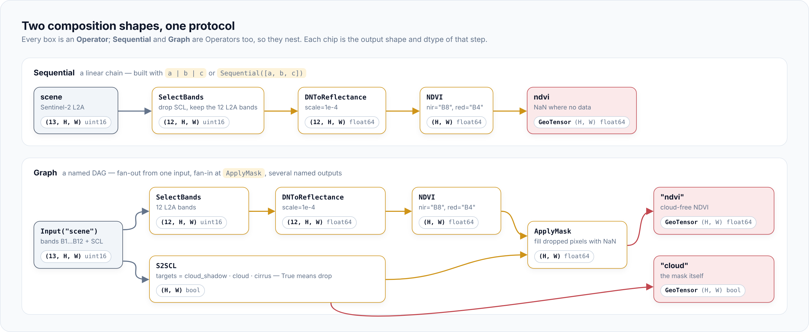

# geotoolz

[](https://github.com/jejjohnson/geotoolz/actions/workflows/ci.yml)
[](https://github.com/jejjohnson/geotoolz/actions/workflows/lint.yml)
[](https://github.com/jejjohnson/geotoolz/actions/workflows/typecheck.yml)
[](https://github.com/jejjohnson/geotoolz/actions/workflows/docs.yml)
[](https://opensource.org/licenses/MIT)

> **Compose remote-sensing pipelines like you compose functions.**
> Sentinel-2 to cloud-free NDVI in a handful of small operators, the same code shape as your unit tests.

`geotoolz` is the *compute* package of the
[geotoolz monorepo](https://github.com/jejjohnson/geotoolz), next to
[`geotoolz-catalog`](https://github.com/jejjohnson/geotoolz/tree/main/packages/geotoolz-catalog)
(*find*, `import geocatalog`),
[`geotoolz-products`](https://github.com/jejjohnson/geotoolz/tree/main/packages/geotoolz-products)
(*read*, `import geoproducts`) and
[`geotoolz-patcher`](https://github.com/jejjohnson/geotoolz/tree/main/packages/geotoolz-patcher)
(*cut*, `import geopatcher`). Docs: <https://jejjohnson.github.io/geotoolz/>.

<p align="center"></p>

## 30-second pitch

Remote-sensing code tends to grow into long functions that mix band
indexing, nodata handling, rescaling and georeferencing, so nothing can
be reused or tested on its own. `geotoolz` cuts each step into an
**Operator** — a typed callable with a keyword-only constructor — that
takes a georeader `GeoTensor` (or a plain `ndarray`) and returns the same
kind of carrier with its CRS, transform, band names and fill value
intact. Chain operators with `|` into a `Sequential`, or wire them into a
named `Graph` when the pipeline branches. Both are operators themselves,
so pipelines nest; and `get_config()` round-trips every pipeline to YAML.
About 275 operators ship across `radiometry`, `indices`, `qa`,
`mask`, `spectral`, `geom` (incl. `geom.coregister`), `compositing`,
`restore`, `segment`, `measure`, `feature`, `plume`, `matched_filter`,
`augment`, `normalize`, `learn`, `einx`, `viz` and `io`.

- **One protocol.** Every step — a band-math index, a cloud mask, a write
  to COG — is an `Operator`: a keyword-only constructor plus `_apply`.
- **Two composition shapes.** `Sequential` for linear chains, `Graph` for
  branches and fan-in. Both are themselves `Operator`s, so they nest.
- **Carrier-preserving.** Outputs keep the input's CRS, transform,
  attrs and a fill value that matches the output; plain arrays in give
  plain arrays out, so tests run on small ndarrays.
- **Round-trips to YAML.** `get_config()` is derived from the
  constructor, so pipelines serialise for Hydra-zen, audit, and
  reproducibility.

## Status

Pre-1.0 (`0.x`; the current release is in [`CHANGELOG.md`](CHANGELOG.md)).
Every family above is implemented and tested, but a minor release can
still carry breaking changes — renames and removals are outright, with
no deprecated aliases — and each one is called out in the changelog.
Not yet on PyPI.

## Quickstart

A Sentinel-2 L2A scene with its 12 reflectance bands plus the SCL
classification layer, named through `attrs["band_names"]` (what the
geoproducts readers and the geocatalog loaders write). Bands are
referenced by name, so the pipeline does not care about band order.

```python
import geotoolz as gz
from georeader.geotensor import GeoTensor

scene: GeoTensor = ...   # (13, H, W) uint16 — band_names = B1 … B12 (no B10), SCL

L2A: list[str] = ["B1", "B2", "B3", "B4", "B5", "B6", "B7", "B8", "B8A", "B9", "B11", "B12"]

# Sequential — a linear chain, built with |
ndvi_pipeline: gz.Sequential = (
    gz.SelectBands(bands=L2A)                 # (13, H, W) uint16 → (12, H, W) uint16
    | gz.DNToReflectance(scale=1e-4)          # (12, H, W) uint16 → (12, H, W) float64
    | gz.NDVI(nir="B8", red="B4")             # (12, H, W)        → (H, W) float64
)
ndvi: GeoTensor = ndvi_pipeline(scene)        # (H, W) float64 · NaN fill · scene's CRS and transform
```

The same steps as a `Graph`, with a cloud mask built from the SCL band
on a second branch and fanned back in by `ApplyMask`:

```python
import geotoolz as gz

x: gz.Input = gz.Input("scene")
reflectance: gz.Node = gz.DNToReflectance(scale=1e-4)(gz.SelectBands(bands=L2A)(x))  # (12, H, W) float64
ndvi_node: gz.Node = gz.NDVI(nir="B8", red="B4")(reflectance)                        # (H, W) float64
cloud: gz.Node = gz.S2SCL(targets=["cloud_shadow", "cloud", "cirrus"])(x)          # (H, W) bool, True = drop
clean: gz.Node = gz.ApplyMask()(ndvi_node, cloud)                                   # (H, W) float64, NaN under cloud

graph: gz.Graph = gz.Graph(inputs={"scene": x}, outputs={"ndvi": clean, "cloud": cloud})
out: dict[str, GeoTensor] = graph(scene=scene)  # {"ndvi": (H, W) float64, "cloud": (H, W) bool}

config: dict = ndvi_pipeline.get_config()       # {"operators": [{"class": "SelectBands", "config": {...}}, ...]}
```

## Write your own operator

A keyword-only constructor that stores each argument under its own name
(so `get_config()` comes for free) and an `_apply` that rewraps its
result with `wrap_like`:

```python
import numpy as np
from georeader.geotensor import GeoTensor

from geotoolz import Operator, Sequential
from geotoolz.carrier import wrap_like


class Scale(Operator):
    """Multiply DN by a scale factor — toy radiometric correction."""

    def __init__(self, *, scale: float = 1e-4) -> None:
        self.scale = scale

    def _apply(self, gt: GeoTensor) -> GeoTensor:                  # (C, H, W) → (C, H, W) float32
        # wrap_like keeps the input's transform / CRS / attrs / fill.
        return wrap_like(gt, np.asarray(gt, dtype=np.float32) * self.scale)


class NormalizedDifference(Operator):
    """(a - b) / (a + b + eps); collapses the band axis."""

    def __init__(self, *, a: int = 3, b: int = 2, eps: float = 1e-10) -> None:
        self.a, self.b, self.eps = a, b, eps

    def _apply(self, gt: GeoTensor) -> GeoTensor:                  # (C, H, W) → (H, W) float32
        arr: np.ndarray = np.asarray(gt, dtype=np.float32)
        a, b = arr[self.a], arr[self.b]                            # (H, W) each
        # A new float quantity declares NaN as its nodata fill.
        return wrap_like(gt, (a - b) / (a + b + self.eps), fill_value_default=np.nan)


pipeline: Sequential = Sequential([Scale(scale=1e-4), NormalizedDifference(a=7, b=3)])
index: GeoTensor = pipeline(scene)            # (H, W) float32
pipeline.get_config()                         # {"operators": [{"class": "Scale", "config": {"scale": 0.0001}}, ...]}
```

The same shape with the `|` pipe operator: `Scale(scale=1e-4) | NormalizedDifference(a=7, b=3)`.
See [Define an operator](https://jejjohnson.github.io/geotoolz/operators/how-to/define-an-operator/)
for the full conventions (parameter vocabulary, fill values, terminal
operators).

## Tile → operate → stitch

`geotoolz.patch_ops` (the `[patch]` extra) runs any operator patch by
patch through a `geopatcher.SpatialPatcher`, as one more `Sequential`:

```python
import geopatcher as gp
import geotoolz as gz
from geotoolz.patch_ops import ApplyToChips, GridSampler, MergePatches

patcher: gp.SpatialPatcher = gp.SpatialPatcher(
    geometry=gp.spatial.geometry.Rectangular(size=(256, 256), boundary="pad"),
    sampler=gp.spatial.sampler.RegularStride(step=(192, 192)),
    window=gp.spatial.window.Hann(),
    aggregation=gp.spatial.aggregation.OverlapAdd(),
)
field: gp.RasterField = gp.RasterField(scene)
tiled: gz.Sequential = gz.Sequential([
    GridSampler(patcher=patcher),                                  # field → list[Patch], (13, 256, 256) each
    ApplyToChips(operator=ndvi_pipeline),                          # → list[Patch], (256, 256) each
    MergePatches(aggregation=gp.spatial.aggregation.OverlapAdd(), domain=field.domain),
])
stitched: GeoTensor = tiled(field)                                 # (H, W) float64, on the scene's grid
```

`MergePatches` places the chips on the domain's grid and keeps the band
axes the chips carry, so a band-collapsing operator such as NDVI merges
into a one-band result.

## Installation / extras

`geotoolz` depends on [`pipekit`](https://github.com/jejjohnson/pipekit),
which is also pre-PyPI. The workspace root `pyproject.toml` pins its git
source, so the simplest install is a clone of the monorepo:

```bash
git clone https://github.com/jejjohnson/geotoolz.git
cd geotoolz
make install        # uv sync --all-packages --all-groups --all-extras + pre-commit hooks
```

Outside the workspace, install pipekit from git alongside geotoolz (and
`geotoolz-patcher` the same way for the `[patch]` extra):

```bash
uv pip install \
  "pipekit @ git+https://github.com/jejjohnson/pipekit#subdirectory=packages/pipekit" \
  "geotoolz @ git+https://github.com/jejjohnson/geotoolz@main#subdirectory=packages/geotoolz"
```

Optional extras. The base install imports every operator family and runs
everything built on numpy / rasterio / geopandas / scikit-image. Backends
that only a few operators use are extras: those operators still import on
a base install and raise an `ImportError` naming the extra when called.

<!-- extras-table: one row per [project.optional-dependencies] entry in pyproject.toml -->
| Extra | Pulls in | Needed for |
|---|---|---|
| `viz` | `matplotlib` | `viz.ApplyColormap` (named matplotlib colormaps) |
| `learn` | `scikit-learn`, `joblib` | `learn.SklearnOp` / `Pixelwise*` imputer NaN strategies and `save_state` / `load_state` / `state_path=`; `plume` DBSCAN clump counting |
| `zarr` | `zarr>=3` | `io.WriteZarr` |
| `cloud` | geotoolz-cloud | `io.WriteCOG` (validated COGs, local or to a bucket) |
| `hdf5` | geotoolz-cloud with `h5py` | `io.ReadHDF` on HDF5, local or remote |
| `hdf4` | geotoolz-cloud with `pyhdf` | `io.ReadHDF` on HDF4 |
| `netcdf` | geotoolz-cloud with `netCDF4` | `io.ReadNetCDF` |
| `vector-cube` | `xvec` (+ `xarray`) | `geom.coregister.RasterToPoints` / `PointsToRaster`, bilinear point sampling |
| `hydra` | `hydra-zen` | YAML `builds()` / `instantiate()` round-trips |
| `patch` | `geotoolz-patcher[pipekit]` | `geotoolz.patch_ops` (tile → map → stitch, label-aware samplers) |
<!-- /extras-table -->

Product readers (`ProductReader`, `toy_sensor`, `carbonmapper`) and their
cloud byte-range `[obstore]` extra live in
[`geotoolz-products`](https://github.com/jejjohnson/geotoolz/tree/main/packages/geotoolz-products).

From a clone (`make install` already installs every extra):

```bash
uv sync --package geotoolz --extra viz --extra learn
```

## Development

Run from the repository root (see the root [`Makefile`](../../Makefile)):

```bash
make install     # uv sync --all-packages --all-groups --all-extras + pre-commit hooks
make test        # fast tier of all four packages (geotoolz: -m "not slow and not integration")
make test-all    # + geotoolz slow / integration tiers
make lint        # ruff check .   (entire repo)
make format      # ruff format . && ruff check --fix .
make typecheck   # ty check, per package
make docs-serve  # local MkDocs server for the whole site
```

geotoolz's own tests run from this directory, so its pytest config
(markers, coverage gate) applies:

```bash
cd packages/geotoolz
uv run pytest -m "not slow and not integration"   # fast tier, as in CI
uv run pytest tests/test_indices.py -v            # one file
```

Pre-commit checklist (mirrors CI), from the repository root:

```bash
make test
uv run --group lint ruff check .
uv run --group lint ruff format --check .
make typecheck
uv run --group docs mkdocs build --strict
```

## Next steps

- **Docs site:** [concepts](https://jejjohnson.github.io/geotoolz/operators/concepts/),
  [quickstart](https://jejjohnson.github.io/geotoolz/operators/quickstart/),
  [API reference](https://jejjohnson.github.io/geotoolz/operators/api/core/).
- **End-to-end Lake Tahoe notebook (catalog → patch → operate):**
  [`docs/catalog/notebooks/end_to_end_lake_tahoe.ipynb`](https://github.com/jejjohnson/geotoolz/blob/main/docs/catalog/notebooks/end_to_end_lake_tahoe.ipynb).
- **Operator-composition slice:**
  [`docs/notebooks/operators_lake_tahoe.ipynb`](https://github.com/jejjohnson/geotoolz/blob/main/docs/notebooks/operators_lake_tahoe.ipynb).

## License

MIT — see [LICENSE](../../LICENSE).
