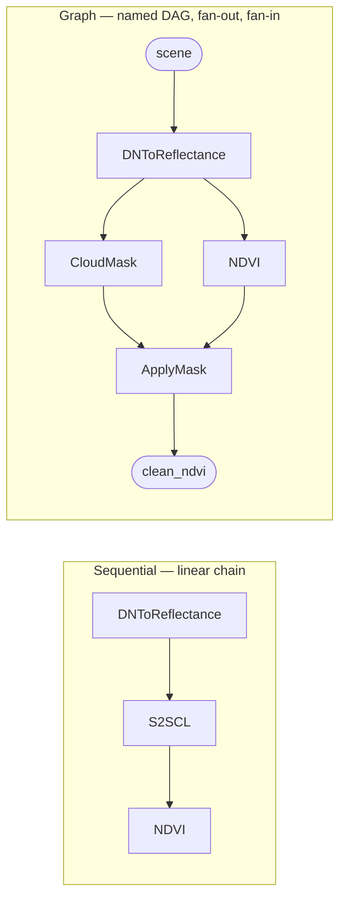

# geotoolz

[](https://github.com/jejjohnson/geotoolz/actions/workflows/ci.yml)
[](https://github.com/jejjohnson/geotoolz/actions/workflows/lint.yml)
[](https://github.com/jejjohnson/geotoolz/actions/workflows/typecheck.yml)
[](https://github.com/jejjohnson/geotoolz/actions/workflows/docs.yml)
[](https://opensource.org/licenses/MIT)

> **Compose remote-sensing pipelines like you compose functions.**
> Sentinel-2 to NDVI in a couple of small operators, the same code shape as your unit tests.

`geotoolz` is one of the three packages of the
[geotoolz monorepo](https://github.com/jejjohnson/geotoolz) — the
*operate* slice, next to
[`geotoolz-patcher`](https://github.com/jejjohnson/geotoolz/tree/main/packages/geotoolz-patcher)
(`import geopatcher`) and
[`geotoolz-catalog`](https://github.com/jejjohnson/geotoolz/tree/main/packages/geotoolz-catalog)
(`import geocatalog`). Docs: <https://jejjohnson.github.io/geotoolz/>.



## What is it

`geotoolz` is a library of **Operators** for remote-sensing rasters.
Each operator is a typed function from one carrier (a
`georeader.GeoTensor`, or a plain `np.ndarray`) to another; pipelines
are `Sequential` chains or `Graph` DAGs of those operators. The
composition core lives in [`pipekit`](https://github.com/jejjohnson/pipekit);
`geotoolz` adds the RS operator families on top: `radiometry`,
`indices`, `qa`, `mask`, `spectral`, `geom` (incl. `geom.coregister`),
`compositing`, `restore`, `segment`, `measure`, `feature`, `plume`,
`matched_filter`, `augment`, `normalize`, `learn`, `einx`, `viz`, `io`
and the sensor `readers`.

- **One protocol.** Every step — a band-math index, a cloud mask, a write
  to COG — is an `Operator`: a keyword-only constructor plus `_apply`.
- **Two composition shapes.** `Sequential` for linear chains, `Graph` for
  branches and fan-in. Both are themselves `Operator`s, so they nest.
- **Carrier-preserving.** Outputs keep the input's CRS, transform,
  attrs and a fill value that matches the output; plain arrays in give
  plain arrays out, so tests run on small ndarrays.
- **Round-trips to YAML.** `get_config()` is derived from the
  constructor, so pipelines serialise for Hydra-zen, audit, and
  reproducibility.

## Status

Pre-1.0 (`0.x`; the current release is in [`CHANGELOG.md`](CHANGELOG.md)).
Every family above is implemented and tested, but a minor release can
still carry breaking changes — renames and removals are outright, with
no deprecated aliases — and each one is called out in the changelog.
Not yet on PyPI.

## A working snippet

With the built-in operators:

```python
import geotoolz as gz

pipeline = gz.DNToReflectance(scale=1e-4) | gz.NDVI(nir="B08", red="B04")
ndvi = pipeline(sentinel2_geotensor)  # GeoTensor in, GeoTensor out
```

Writing your own operator takes a keyword-only constructor that stores
each argument under its own name (so `get_config()` comes for free) and
an `_apply` that rewraps its result with `wrap_like`:

```python
import numpy as np
from geotoolz import Operator, Sequential
from geotoolz._src.wrap import wrap_like


class Scale(Operator):
    """Multiply DN by a scale factor — toy radiometric correction."""

    def __init__(self, *, scale: float = 1e-4) -> None:
        self.scale = scale

    def _apply(self, gt):
        # wrap_like keeps the input's transform / CRS / attrs / fill.
        return wrap_like(gt, np.asarray(gt, dtype=np.float32) * self.scale)


class NDVI(Operator):
    """(NIR - Red) / (NIR + Red + eps); collapses the band axis."""

    def __init__(self, *, nir: int = 3, red: int = 2, eps: float = 1e-10) -> None:
        self.nir, self.red, self.eps = nir, red, eps

    def _apply(self, gt):
        a = np.asarray(gt, dtype=np.float32)
        nir, red = a[self.nir], a[self.red]
        # A new float quantity declares NaN as its nodata fill.
        return wrap_like(gt, (nir - red) / (nir + red + self.eps), fill_value_default=np.nan)


pipeline = Sequential([Scale(scale=1e-4), NDVI(nir=7, red=3)])
ndvi = pipeline(sentinel2_geotensor)
pipeline.get_config()  # {"operators": [{"class": "Scale", "config": {"scale": 0.0001}}, ...]}
```

The same shape with the `|` pipe operator: `Scale(scale=1e-4) | NDVI(nir=7, red=3)`.
See [Define an operator](https://jejjohnson.github.io/geotoolz/recipes/define-an-operator/)
for the full conventions (parameter vocabulary, fill values, terminal
operators).

## Installation / extras

`geotoolz` depends on [`pipekit`](https://github.com/jejjohnson/pipekit),
which is also pre-PyPI. The workspace root `pyproject.toml` pins its git
source, so the simplest install is a clone of the monorepo:

```bash
git clone https://github.com/jejjohnson/geotoolz.git
cd geotoolz
make install        # uv sync --all-packages --all-groups --all-extras + pre-commit hooks
```

Outside the workspace, install pipekit from git alongside geotoolz (and
`geotoolz-patcher` the same way for the `[patch]` extra):

```bash
uv pip install \
  "pipekit @ git+https://github.com/jejjohnson/pipekit#subdirectory=packages/pipekit" \
  "geotoolz @ git+https://github.com/jejjohnson/geotoolz@main#subdirectory=packages/geotoolz"
```

Optional extras. The base install imports every operator family and runs
everything built on numpy / rasterio / geopandas / scikit-image. Backends
that only a few operators use are extras: those operators still import on
a base install and raise an `ImportError` naming the extra when called.

<!-- extras-table: one row per [project.optional-dependencies] entry in pyproject.toml -->
| Extra | Pulls in | Needed for |
|---|---|---|
| `viz` | `matplotlib` | `viz.ApplyColormap` (named matplotlib colormaps) |
| `learn` | `scikit-learn`, `joblib` | `learn.SklearnOp` / `Pixelwise*` imputer NaN strategies and `save_state` / `load_state` / `state_path=`; `plume` DBSCAN clump counting |
| `zarr` | `zarr>=3` | `io.WriteZarr` |
| `hdf5` | `h5py` | `io.ReadHDF` on HDF5 |
| `hdf4` | `pyhdf` | `io.ReadHDF` on HDF4 |
| `netcdf` | `netCDF4` | `io.ReadNetCDF` |
| `vector-cube` | `xvec` (+ `xarray`) | `geom.coregister.RasterToPoints` / `PointsToRaster`, bilinear point sampling |
| `obstore` | `obstore` | pooled object-store client for cloud-backed sensor reads |
| `hydra` | `hydra-zen` | YAML `builds()` / `instantiate()` round-trips |
| `patch` | `geotoolz-patcher[pipekit]` | `geotoolz.patch_ops` (tile → map → stitch, label-aware samplers) |
<!-- /extras-table -->

From a clone (`make install` already installs every extra):

```bash
uv sync --package geotoolz --extra viz --extra learn
```

## Development

Run from the repository root (see the root [`Makefile`](../../Makefile)):

```bash
make install     # uv sync --all-packages --all-groups --all-extras + pre-commit hooks
make test        # fast tier of all three packages (geotoolz: -m "not slow and not integration")
make test-all    # + geotoolz slow / integration tiers
make lint        # ruff check .   (entire repo)
make format      # ruff format . && ruff check --fix .
make typecheck   # ty check, per package
make docs-serve  # local MkDocs server for the whole site
```

geotoolz's own tests run from this directory, so its pytest config
(markers, coverage gate) applies:

```bash
cd packages/geotoolz
uv run pytest -m "not slow and not integration"   # fast tier, as in CI
uv run pytest tests/test_indices.py -v            # one file
```

Pre-commit checklist (mirrors CI), from the repository root:

```bash
make test
uv run --group lint ruff check .
uv run --group lint ruff format --check .
make typecheck
uv run --group docs mkdocs build --strict
```

## Next steps

- **Docs site:** [concepts](https://jejjohnson.github.io/geotoolz/concepts/),
  [quickstart](https://jejjohnson.github.io/geotoolz/quickstart/),
  [API reference](https://jejjohnson.github.io/geotoolz/api/core/).
- **End-to-end Lake Tahoe notebook (catalog → patch → operate):**
  [`docs/catalog/notebooks/end_to_end_lake_tahoe.ipynb`](https://github.com/jejjohnson/geotoolz/blob/main/docs/catalog/notebooks/end_to_end_lake_tahoe.ipynb).
- **Operator-composition slice:**
  [`docs/notebooks/operators_lake_tahoe.ipynb`](https://github.com/jejjohnson/geotoolz/blob/main/docs/notebooks/operators_lake_tahoe.ipynb).

## License

MIT — see [LICENSE](../../LICENSE).
